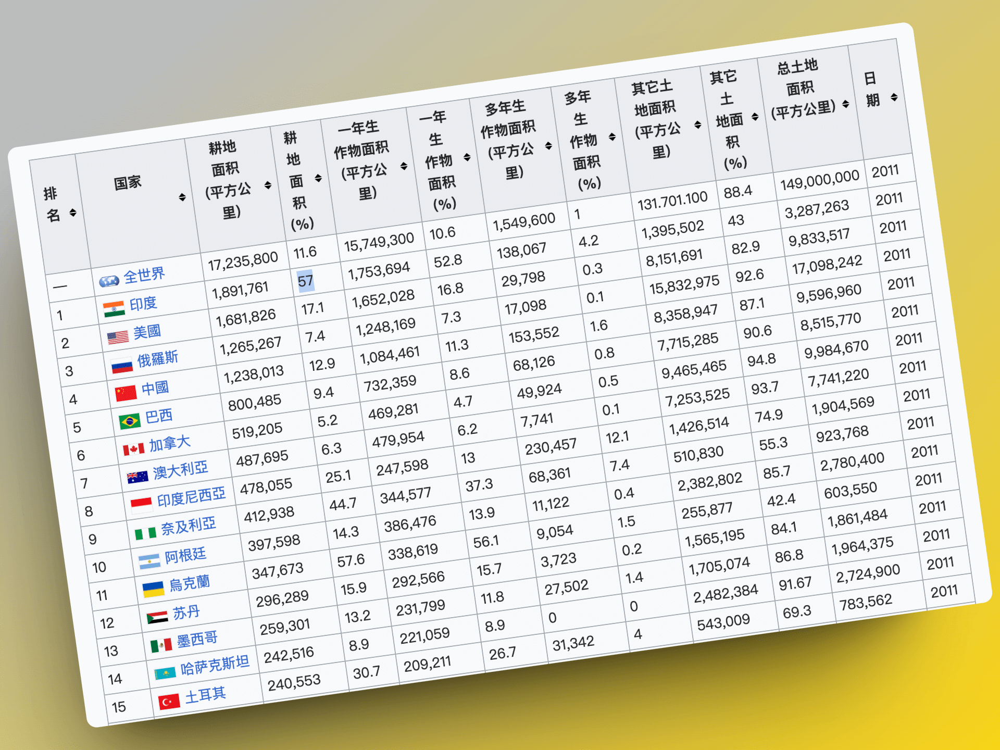
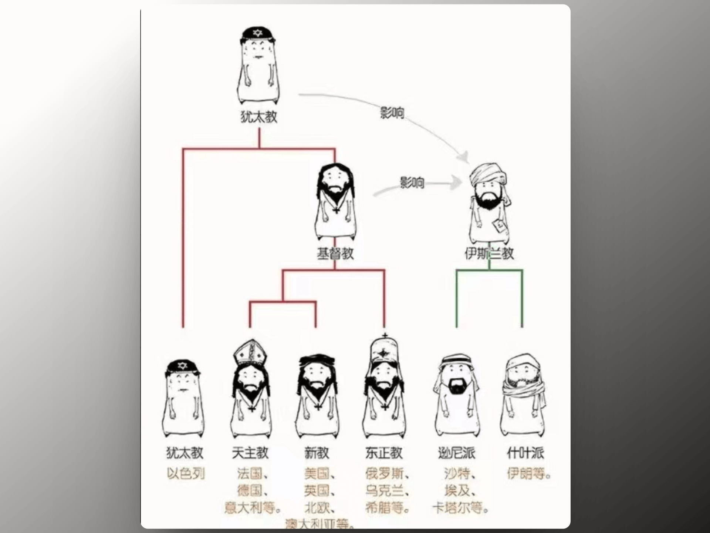

## 封面图 : 拍摄于 WeWork

## 本周新闻

### 1. 日本结束长达 17 年的负利率政策

日本银行（央行）在 3 月 19 日的货币政策会议上决定解除负利率政策。将此前定为-0.1%的政策利率上调至 0 ～ 0.1%左右(无担保隔夜拆借利率)。

不过，可能和预期不同，日本股市并没有因此而下跌，日经指数以及美元兑日元汇率都有所上涨。

## 效率工具

### 1. AI 音乐生成工具：Suno.ai

有网友把周杰伦的 `夜曲` 和 `青花瓷` 的歌词喂给 Suno.ai 生成的歌曲，效果还不错。大家评价一下 😄。

> Ref: [CoooolXyh@X](https://twitter.com/CoooolXyh/status/1771345890806304868)
> Ref: [MonkeyKing_Coin@X](https://twitter.com/MonkeyKing_Coin/status/1771352398008906018)

### 2. 国风插画大模型 AWPlashing

基于 AWPainting1.3 训练，画风相当有东方韵味。

> Ref: [dynamicwangs@X](https://twitter.com/dynamicwangs/status/1771238562467381692)

### 3. 剪映新增“AI 克隆音色” 功能

[剪映](https://www.capcut.cn/)新增了 AI 克隆音色功能，只需要 10 秒，就可以将音频中的人声克隆出来，用来生成新音频。

手机端和 PC 端都支持。

> Ref: [hzlzh@X](https://twitter.com/hzlzh/status/1771104766329757782)

## 技术知识

### 1. 未来软件开发的思考

[Thoughts on the Future of Software Development](https://www.sheshbabu.com/posts/thoughts-on-the-future-of-software-development) 这篇文章讨论了未来软件开发的一些趋势。

作者认为在可预见的未来，软件开发人员仍然会有市场。

有人担心 AI 能程序员将慢慢从人类手中夺走“市场份额”，

但大多数焦虑都假设软件开发的市场规模保持不变, 实际上，软件开发的市场规模会增大。

### 2. [书籍]《动手学深度学习》

《[动手学深度学习](https://github.com/d2l-ai/d2l-zh)》是一本面向中文读者的深度学习教科书。

每一小节都是可以运行的 Jupyter 记事本，你可以自由修改代码和参数来获取及时反馈，从而积累深度学习的实战经验。而且有配套视频。

这本书含有 PyTorch、NumPy/MXNet、TensorFlow 和 PaddlePaddle 实现，被全球 70 多个国家的 500 多所大学用于教学。教程宗旨就是通过实践来教授深度学习的基础和进阶知识。

> Ref: [knowledgefxg@X](https://twitter.com/knowledgefxg/status/1770451584700305640)

## 语言学习

### 1. [日语] 丱角【かんかく】

丱角【かんかく】有 2 个意思：

1. 发型： 哪吒头？😄
2. 幼儿，小孩

## 生活趣味

### 1. [音乐] 原来周杰伦在油管上也有自己的频道

周杰倫 Jay Chou【夜曲 Nocturne】-Official Music Video

<iframe width="560" height="315" src="https://www.youtube.com/embed/6Q0Pd53mojY?si=D9aOxMzQr6yrFVhD" title="YouTube video player" frameborder="0" allow="accelerometer; autoplay; clipboard-write; encrypted-media; gyroscope; picture-in-picture; web-share" referrerpolicy="strict-origin-when-cross-origin" allowfullscreen></iframe>

### 2. 世界耕地面积前 10 的国家

印度 🇮🇳 的耕地面积是总国土面积的 57%！
仓廪实而知礼节，文明从耕地开始。

### 3. 犹太教和基督教以及伊斯兰教的关系

> Ref: [hu_lalalalala@X](https://twitter.com/hu_lalalalala/status/1770470984719729052)

### 4. 间歇性禁食导致心血管疾病死亡率风险大增?

上海交通大学医学院钟文泽教授团队在美国心脏协会（AHA）2024 年 EPI 生活方式科学会议上发布一个研究报告（如下图），纳入约 2 万美国成年人，采用间歇性禁食（16+8 日内断食法）的人（包括普通人、心血管疾病患者、癌症患者）心血管疾病死亡风险几乎增加一倍。

> Ref: [HotmailfromSH@X](https://twitter.com/HotmailfromSH/status/1770336039590391849)
