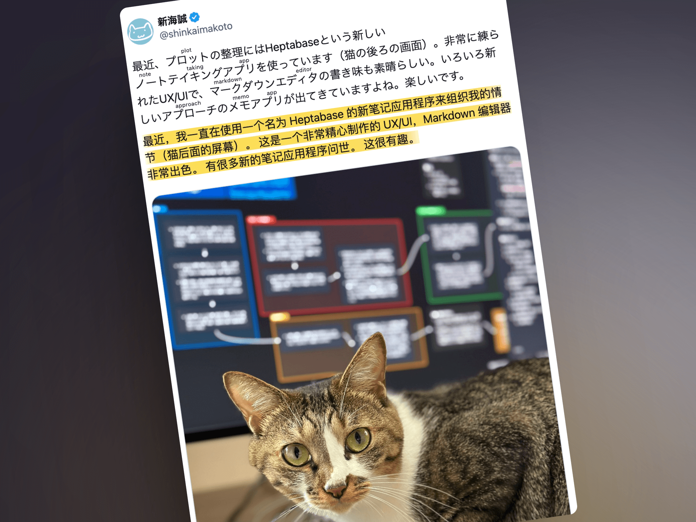
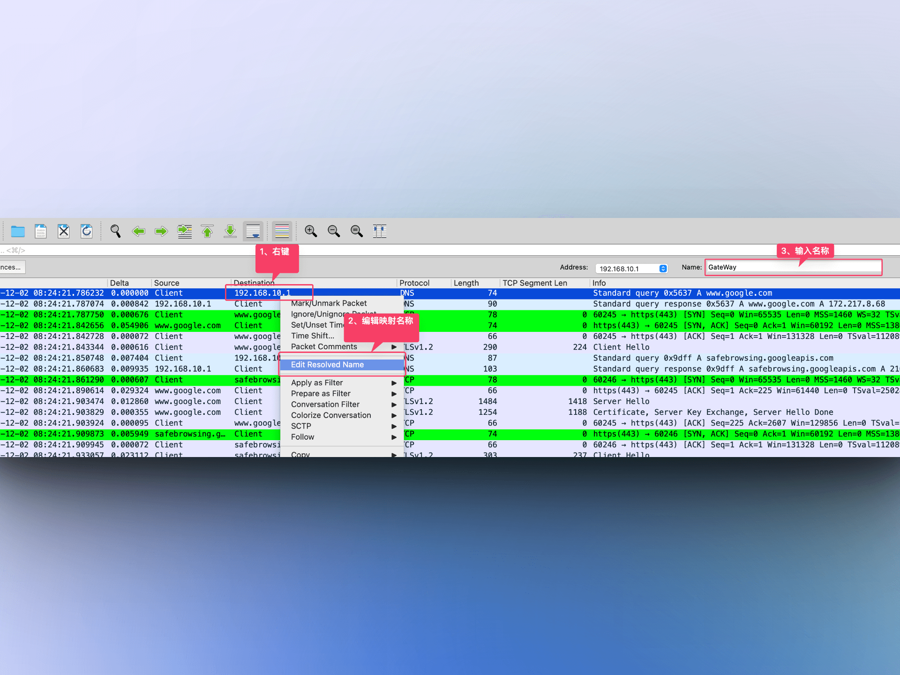

## 封面图 : 3 月 29 日气象局宣布东京樱花开花

3 月 29 日气象局宣布，东京的樱花已经开花。

这是东京樱花开花的宣言。东京的樱花开花时间通常在 3 月下旬到 4 月上旬。

今年的樱花开花时间**比往年晚了 5 天**左右。图中是东京晴空塔点亮了「舞」为主题的灯光秀。

> Reference: [@chiyodaisan](https://twitter.com/chiyodaisan/status/1773655039191507033)

## 本周新闻

[Reddit](https://ja.wikipedia.org/wiki/Reddit) 上市了，股票代码为 `RDDT`。

顺便买了点股票，支持一下。😄

## 效率工具

### 1. 腾讯和华为发布了 [AniPortrait](https://github.com/Zejun-Yang/AniPortrait)：使用音频+参考肖像图生成高质量动画/视频

已经有人把它的 [ComfyUI 插件](https://github.com/chaojie/ComfyUI-AniPortrait)做好了。

> Reference: [@ZHOZHO672070](https://twitter.com/ZHOZHO672070/status/1773619013072859429)

### 2. [Monolith](https://github.com/Y2Z/monolith): 一个可以将网页保存为单个 HTML 文件的 CLI 工具

与传统的“页面另存为”不同，它下载的 HTML 文件包括所有的资源，

如 CSS 样式和 JavaScript 脚本等，生成一个易于存储和共享的 HTML5 文档。

> Reference: [geekbb@X](https://twitter.com/geekbb/status/1772766733088244099)

### 3. 开源 PDF 工具 [Stirling-PDF](https://github.com/Stirling-Tools/Stirling-PDF)

支持拆分 PDF，压缩 PDF，PDF 转换等等，

大家可以部署一个自己的 PDF 工具站。

> Reference: [ezshine@X](https://twitter.com/ezshine/status/1772409490895147392)

### 4. 笔记工具 [Heptabase](https://heptabase.com/)

连 新海诚(@shinkaimakoto) 都在推特上推荐这个工具了。😄

> Reference: [@shinkaimakoto](https://twitter.com/shinkaimakoto/status/1691726541028532706)

## 技术知识

### 1. Wireshark 常用功能笔记

[Wireshark 常用功能笔记](https://www.ilikejobs.com/posts/wireshark/) 这篇文章介绍了 Wireshark 的常用功能。

其中的【设置私有 IP 名称】功能，如果在截图分享的时候不想每次都打马赛克，可以使用这个功能。

### 2. [书籍] 动画算法与数据结构

图灵出品的《[动画算法与数据结构](https://www.ituring.com.cn/book/2954)》这本书，是一本用动画的方式讲解算法和数据结构的书。

## 语言学习

### 1. [日语] 假名“の”的汉字原型是什么？

假名「の」的汉字原型是「乃」。

> Reference: [平假名@WIKI](https://ja.wikipedia.org/wiki/平仮名)

### 2. [日语] 遣らずの雨

「遣らずの雨」是指突然下起来的雨，让客人不得不留下来。

「遣らず」是「遣らう」的否定形，意思是「不赶走」。

搜索了一下，发现还有一首歌叫「遣らずの雨」，歌手是「[川中美幸](<https://ja.wikipedia.org/wiki/遣らずの雨_(川中美幸の曲)>)

> 【やらずのあめ】(連語)まるで来客を帰さないためであるかのように降って来る雨。
