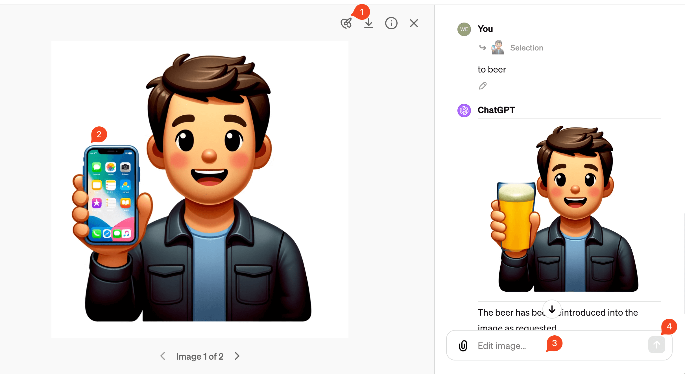
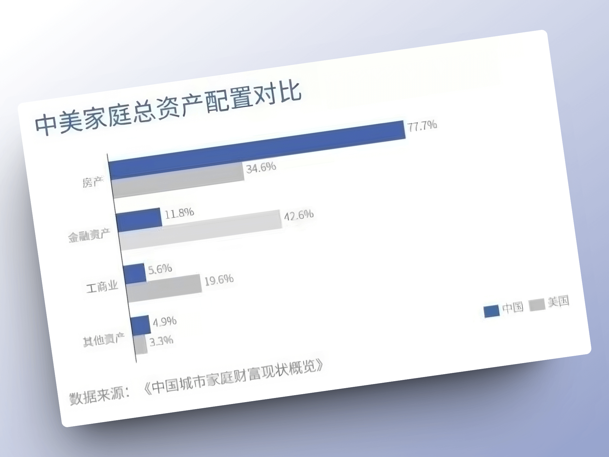
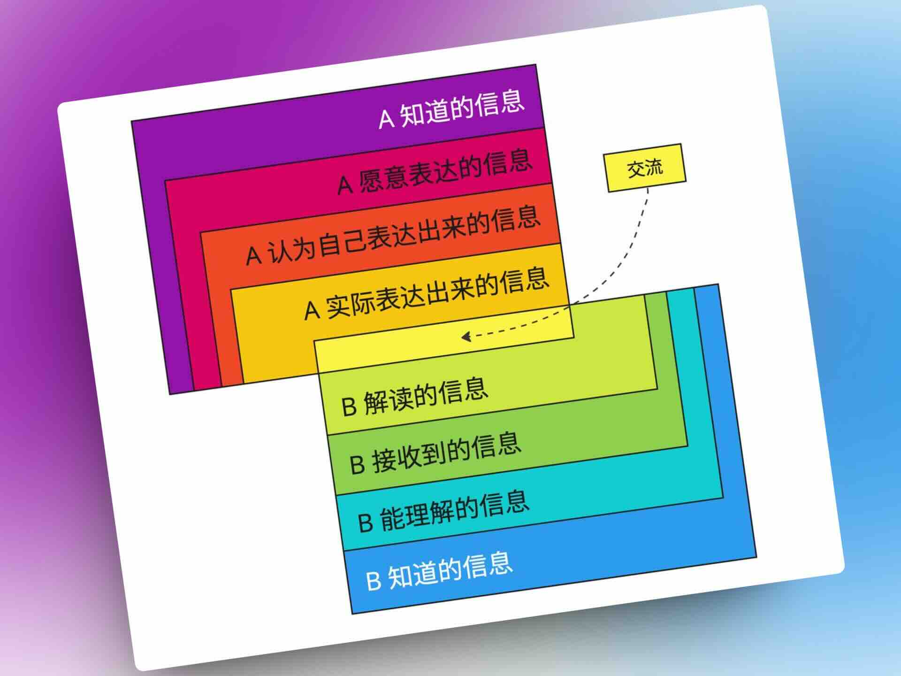

## 封面图 : 又是 4 月樱花季，拍摄于九段下千鸟之池（千鳥ヶ淵）

> Reference: [@haskap1017](https://twitter.com/haskap1017/status/1776169191349092771)

## 效率工具

### 1. 推特（X）导出工具：twitter-web-exporter

[twitter-web-exporter](https://github.com/prinsss/twitter-web-exporter) 是一个可以导出推特（Twitter）数据的浏览器扩展脚本。

🚚 将任何用户的推文、回复和点赞导出为 JSON/CSV/HTML

🔖 导出您的书签（没有最大 800 个的限制！）

💞 导出任何用户的关注者和粉丝列表

👥 导出列表成员和订阅者

📦 批量下载推文中的图片和视频，以原始大小

🚀 无需开发者账号或 API 密钥

🛠️ 作为一个用户脚本发布，所有操作在您的浏览器中完成

💚 完全免费且开源

### 2. 一款开源的 SaaS 模板，非常适合构建自己的 SaaS 应用

使用 React+Tailwind CSS + ShadCn UI
包括身份验证，多租户，角色权限，MFA，用户登录，数据库和日志记录

> Reference: [@Yangyixxxx](https://twitter.com/Yangyixxxx/status/1776132447492812805)

### 3. 微信朋友圈导出工具

[WechatMoments](https://github.com/tech-shrimp/WechatMoments)是一款运行在 Windows 上的，备份导出朋友圈为网页的工具。

### 4. ChatGPT 中可以用 DALL·E 编辑图片了

去年，OpenAI 将 DALL・E 3 集成进 ChatGPT，现在支持对生成的图片进行编辑了。(需要 chatGPT Pro 订阅)

1️⃣. 点击圈选工具

2️⃣. 圈选图片中需要编辑的部分

3️⃣. 输入编辑提示（prompt）：比如例子中把手机 📱 换成啤酒 🍺

4️⃣. 确定等待生成新图片

> Reference: [DALL·E 推出编辑功能](https://waytoagi.feishu.cn/wiki/MpzFw6p3tiw5lNkvlOUc6XHqnlb)

## 技术知识

### 1. 【李自然说】如何搭建一个属于自己的大模型？AI 模型定制指南

这个视频讲述了大模型的一些基础知识，简单易懂，推荐。

<iframe width="560" height="315" src="https://www.youtube.com/embed/q3YJ6YK07_0?si=ZgdZW5yOTs5BoxRB" title="YouTube video player" frameborder="0" allow="accelerometer; autoplay; clipboard-write; encrypted-media; gyroscope; picture-in-picture; web-share" referrerpolicy="strict-origin-when-cross-origin" allowfullscreen></iframe>

### 2. 简明易懂的分片原理教程: Database Sharding Explained

来自 Architecture Notes，里面有很多带有漂亮手绘图的技术文章。

### 3. 介绍了 LLM 的核心 Transformer 架构的原理的视频

这个视频 "什么是 GPT？通过图形化的方式来理解 Transformer 架构"

来自于鼎鼎大名的 python 动画引擎 Manim 的作者 3Blue1Brown，这个视频通过可视化简单易懂地介绍了 LLM 的核心 Transformer 架构的原理。

[有网友](https://twitter.com/op7418/status/1775376278843191296)把这个视频翻译成了中文，

英文没有问题的可以直接看原版（[But what is a GPT? Visual intro to Transformers | Deep learning](https://www.youtube.com/watch?v=wjZofJX0v4M)）。

<iframe width="560" height="315" src="https://www.youtube.com/embed/wjZofJX0v4M?si=1Aoj92WCW-H4GQf_" title="YouTube video player" frameborder="0" allow="accelerometer; autoplay; clipboard-write; encrypted-media; gyroscope; picture-in-picture; web-share" referrerpolicy="strict-origin-when-cross-origin" allowfullscreen></iframe>

## 生活趣味

### 1. 中美资产配置差异

> Reference: [@fuzzyface](https://twitter.com/fuzzyface/status/1776078635017150555)

### 2. 一张图看懂：沟通为什么这么难？😄

沟通为何如此之难，为什么要从一开始就避免争论？因为所有交流都可以被看作是一种形式的映射（All communication is a form of Projection），而映射永远是有损失的。

我们每个人都通过一个独特的视角来看待世界。意识到这一点后，你可能会理解，当我们与人交流时，我们自然会把自己的心理模型映射到对方身上。

所以，实际上所有的交流都可以被看作是一种形式的映射。

> Reference: [@beihuo](https://twitter.com/beihuo/status/1776150456747938131)
