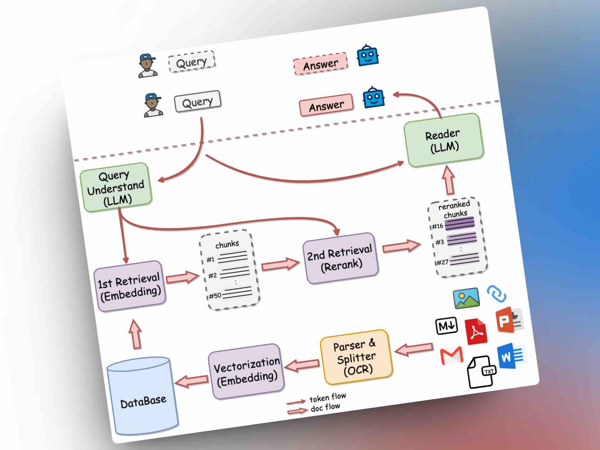

## 封面图 : 春の四重奏@富山県の朝日町舟川べり

每年这个时候，可以一次看到残雪的立山连峰，盛开的樱花树，郁金香田和油菜花田，所以被称为“春天的四重奏”。

> Reference: [奇跡が重なった瞬間でした](https://twitter.com/inagakiyasuto/status/1778747414247313759)

## 效率工具

### 1. 网易开源的 local-first 的本地知识库问答系统： QAnything

[QAnything](https://github.com/netease-youdao/QAnything) 是网易开源的 local-first 的本地知识库问答系统。

可离线安装和使用，目前已经有 6K Star ⭐️

### 2. Github 中国名人排行榜查看工具

[GitHub China User Ranking](https://wangchujiang.com/github-rank/users.china.html) 是一个可以查看 GitHub 中国名人排行榜的工具，可以查看中国的 GitHub 用户的 followers 数排名。

### 3. macOS 的强大菜单栏管理器：Ice

[Ice](https://github.com/jordanbaird/Ice) 是 macOS 的强大菜单栏管理器，可以帮助你：

✦ 隐藏菜单栏项
✦ 自定义菜单栏的外观

## 技术知识

### 1. 微软开源的生成式 AI 课程

通过 [18 节课](https://github.com/Microsoft/generative-ai-for-beginners)讲解构建 Generative AI 应用所需要的所有知识，该课程目前 40.2K Star ⭐️

### 2. 傅里叶变换的动画演示

傅里叶变换是信号处理中的重要概念，学理科的同学不可不知。

[Fourier series of square wave](https://www.geogebra.org/m/xayfmmvw) 的 geogebra [动画演示](http://dmentrard.free.fr/GEOGEBRA/Maths/Export5/FouriersqursMD.html)，可以帮助你更直观地理解傅里叶变换。

### 3. 3Blue1Brown 出了关于 Transformer 的解说视频，推荐

[3Blue1Brown](https://www.youtube.com/c/3blue1brown) 出了关于 [Transformer 的视频](https://www.youtube.com/watch?v=wjZofJX0v4M)，用动画直观地讲解了 Transformer 的原理和工作方式。

## 语言学习

### 1. [日语学习频道]： 小点玩日语

[小点玩日语](https://www.youtube.com/@Playapanesealittlebit) 在[推特上被日本人](https://twitter.com/maoshengkai8964/status/1778045787093803254)发现了，这下要火了 😄。

确实语言天赋太强了，我反正是已经分辨不出是中国人还是日本人了。niubility！🐂

B 站上也有她的[频道](https://space.bilibili.com/306069957)。

## 生活趣味

### 1. 勇气就是优雅地面对压力。 by 海明威

