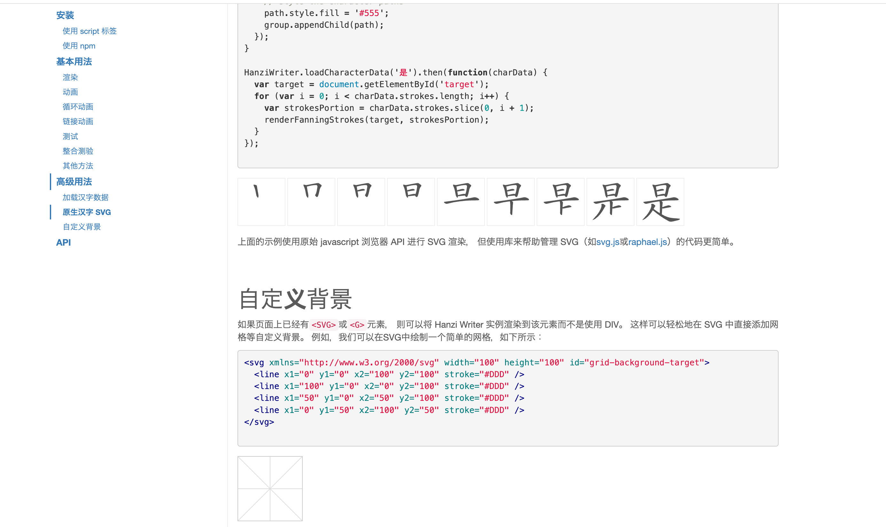
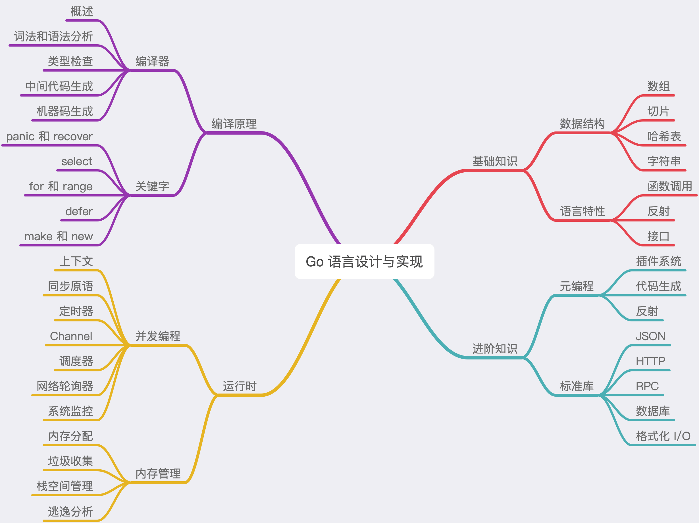
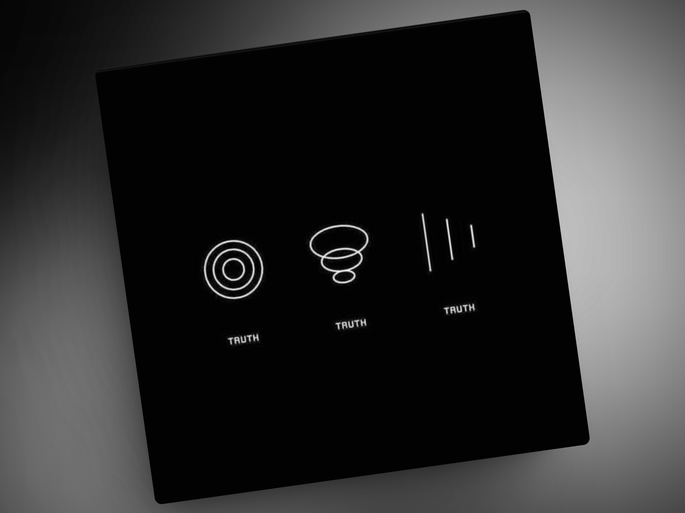

## 封面图 : 樱花 @拍摄于东京

2024 年的樱花季 🌸 也已经快结束了。

## 本周新闻

## 效率工具

### 1. Hanzi Writer

[Hanzi Writer](https://hanziwriter.org/cn/) 是 javascript 免费开源库，

根据汉字书写时按照笔画顺序的特征，可以播放正确笔画顺序的描边动画和练习测试。 支持简体字和繁体字。

家里有小朋友的朋友可以试试，对于练习汉字有一定的帮助。

### 2. 终端录制的工具: vhs

[vhs](https://github.com/charmbracelet/vhs) 是一个用于终端录制的工具，

支持多种格式和设置，如 MP4、GIF、WebM 等。用户可以通过命令行工具进行录制和管理，支持录制终端操作、窗口和整个屏幕。同时，也支持录制音频和设置录制区域。

### 3. 制作商品图片的工具: Flair AI

[Flair AI](https://flair.ai/) 是一个 AI 在线工具，可以帮助用户快速制作商品图片。

> Reference: [X@mickeyxfriedman](https://twitter.com/mickeyxfriedman/status/1671272935410245638)

## 技术知识

### 1. [书籍] Go 语言设计与实现

偏重于 Go 语言基础和实战的书籍。

本书的主要内容可以分成四个主要部分，分别是编译原理、运行时、基础知识和进阶知识。

这四部分几乎可以覆盖 Go 语言从编译到运行的方方面面，让我们对 Go 语言有更加整体和深刻的认识。

下图的思维导图中展示了本书的主要内容：

作者公开了书籍的[电子版](https://draveness.me/golang/)，纸质版图书已经[上架京东](https://item.jd.com/13521160.html)，有需要的朋友可以支持下他。

## 语言学习

### 1. [日语] 斉一性の原理

统一性原则：人类的心理倾向之一。

一个特定的群体朝着某个方向前进，而不能容忍群体内存在异议或反驳。

它不会发生在以多数票做出决定的地方，而是发生在一致做出决定的情况下。

### 2. [日语] 一円玉天気【いちえんだまてんき】

一元硬币天气：指的晴朗的天气。:sun_with_face:

因为一元（円） 在日币中是最小的面额，不能再分割或者换成更小的币值（破钞）。

"破钞"在日语中是 「お金(紙幣)を崩す・崩れる」，用动词「崩す・崩れる」来表达。

而 「崩す・崩れる」也能用来表达天气，比如说「天気が崩れる」，表示天气变坏。

所以，一元硬币天气就是指天气不会变坏，也就是晴朗的天气的意思了 😄。

## 生活趣味

### 1. The Truth

> Reference: [The Truth](https://twitter.com/Rainmaker1973/status/1781279073081369007)
