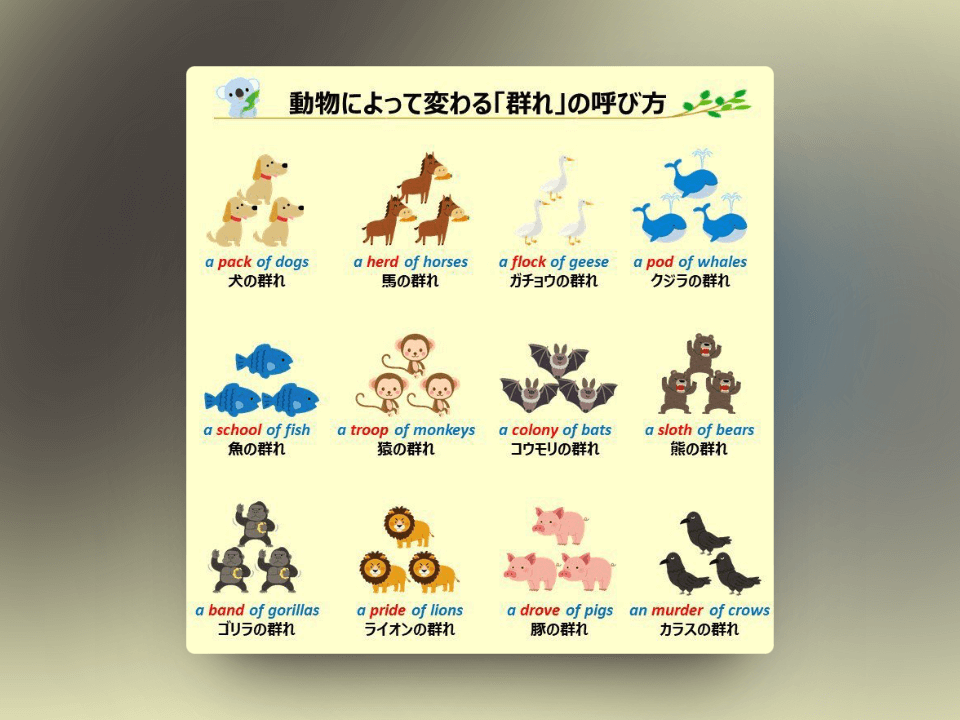

## 封面图 : 家门前的月季花 🌹 开了

## 本周新闻

### 1. IBM 以 64 亿美元收购 HashiCorp

IBM 宣布以 64 亿美元收购 HashiCorp，这将使 IBM 的云计算业务更加强大，预计 Terraform 和 Ansible 之间将产生协同效应。

> Ref: [IBM to Acquire HashiCorp, Inc. Creating a Comprehensive End-to-End Hybrid Cloud Platform](https://newsroom.ibm.com/2024-04-24-IBM-to-Acquire-HashiCorp-Inc-Creating-a-Comprehensive-End-to-End-Hybrid-Cloud-Platform)

## 效率工具

### 1. 虚拟试穿服装: IDM-VTON

IDM-VTON 是一个虚拟试穿服装的 AI 工具，可以将服装的图片放到模型上，看起来就像是真的穿在身上一样。

- [项目地址](https://github.com/yisol/IDM-VTON)
- [Demo](https://huggingface.co/spaces/yisol/IDM-VTON)

### 2. 在线字帖生成网站: Z2H 字帖

[Z2H 字帖](https://paper.z2h.cn)是一个在线字帖生成网站，

提供对中文汉字、词组和段落，以及英文字母、单词和段落的生成模式支持。

## 技术知识

### 1. SEO 初学者书籍

Ahrefs 入门教程的[中文翻译版](https://ahrefs.com/zh/seo)，适合初学者学习 SEO。

### 2. 如何构建一个 MVP

Y Combinator 集团合伙人迈克尔·塞贝尔解释了如何为您的创业想法构建一个最小可行产品（MVP）。

迈克尔使用真实的 YC 公司示例，详细介绍了如何确定您的 MVP 功能集，为用户测试构建原型和演示，并向早期客户或投资者展示您的 MVP。

> Ref: [How to Build an MVP](https://twitter.com/belliedmonkey/status/1783141276336222496)

## 语言学习

### 1. [日语] 寸善尺魔【すんぜんしゃくま】

意思是：这个成语直译为"一寸的善行，一尺的恶念"，世界上好事很少，坏事却很多。即使有好事，也会被坏事所阻碍。

> 小さな善と大きな魔。世の中には、よいことはほんの少ししかなく、悪いことのほうがずっと多いこと。また、よいことが少しあっても、悪いことに邪魔されること。

### 2. [英语] 动物的"一群"的各种说法

## 生活趣味

### 1. 光的折射的美

> Ref: [Physics of light](https://twitter.com/gunsnrosesgirl3/status/1783364297336164538)
