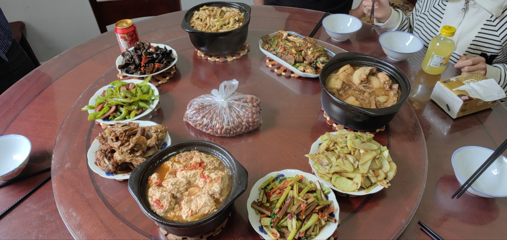
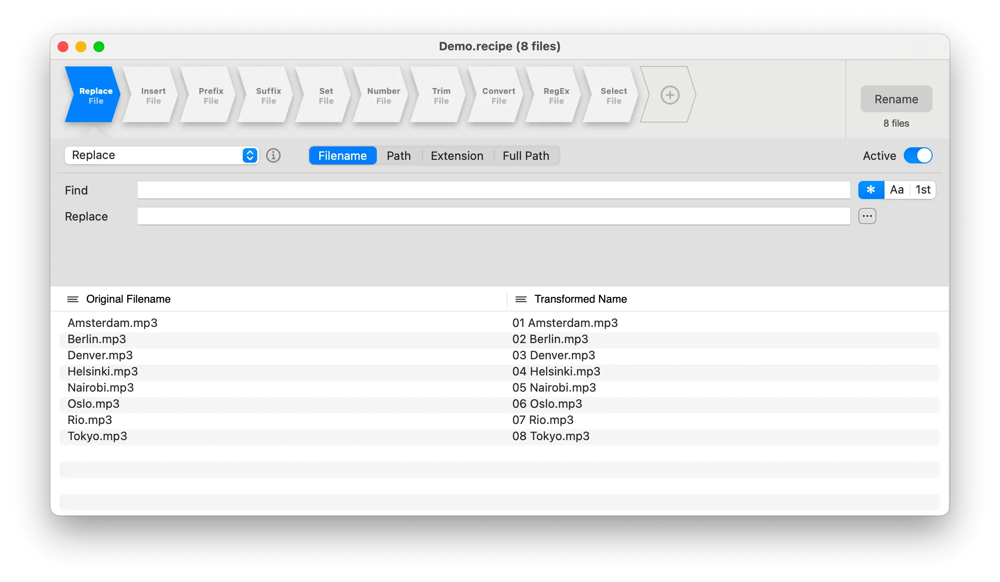
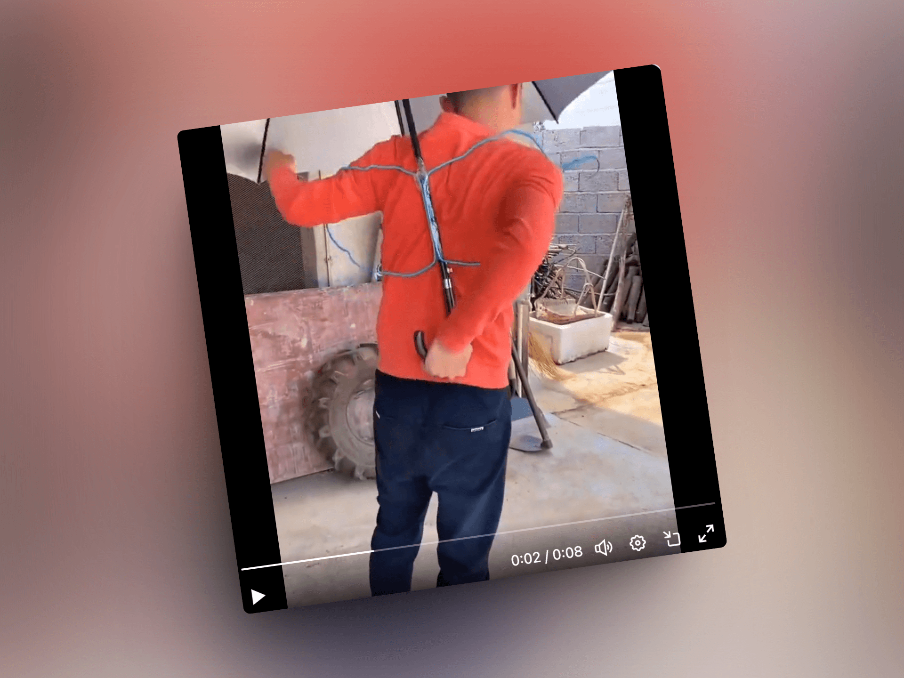
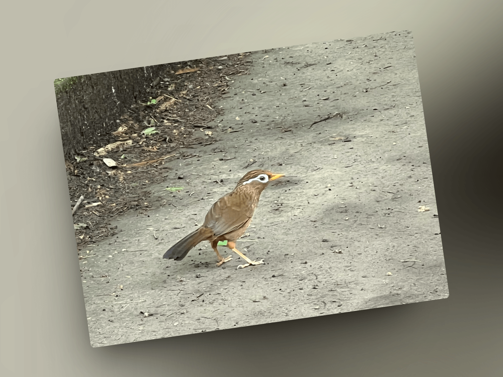

## 封面图 : 老哥五一回家发来的照片 😄

## 本周新闻

### 1. 苹果回购了一个美团 😄

5 月 2 日周四美股盘后，苹果公布 2024 财年第二财季业绩并宣布了美国史上最大的股票回购计划 1100 亿美元，同时将股息提高 4%至每股 25 美分。苹果股价盘后涨 7%。

如果按市值计算，1100 亿美元相当于一个美团（975 亿美元）、一个波音（1097 亿美元）、两个本田（555 亿美元）。

> Reference: [1100 亿美元回购，4%股息率，苹果“壕无人性”！](https://wallstreetcn.com/articles/3714127)

## 效率工具

### 1. 开源的批量重命名工具 Transnomino

Transnomino 是一个免费的批量重命名工具，支持将常用工作流保存成文件, 现在仅支持 macOS。

### 2. Python 表格生成包 Great Tables

[Great Tables](https://posit-dev.github.io/great-tables/articles/intro.html) 是一个 [Python 包](https://github.com/posit-dev/great-tables)，

旨在从 Python 轻松生成信息丰富、达到出版质量的表格。它支持多种数据源，包括 Pandas 和 Polars DataFrame。

## 技术知识

### 1. 吴恩达老师的新公开课：视觉模型的提示词工程（Prompt Engineering for Vision Models）

[课程地址](https://www.deeplearning.ai/short-courses/prompt-engineering-for-vision-models/)

课程将会详细讲解提示词和微调技术，以精确控制其输出：

1）如何提示和微调视觉模型，以实现个性化图像生成、图像编辑、对象检测和分割

2）学习调整超参数以塑造输出，用于视觉模型的提示可能是文本、点坐标或边界框，具体取决于模型，使用到的模型包括 Segment-Anything 模型 (SAM)、OWL-ViT 和 Stable Diffusion

3）如何微调 Stable Diffusion 以生成个性化图像（如特定人物的图像），并使用少量图像进行训练

> Reference: [吴恩达公开课又又又上新了！这期必看了！《视觉模型的提示词工程》@ZHOZHO672070](https://twitter.com/ZHOZHO672070/status/1785967360060572063)

### 2. 使用 RN 还是 swift 开发 iOS 应用？

[React Native vs Swift: Which One to Choose for iOS Development?](https://radixweb.com/blog/react-native-vs-swift) 可以帮助你做一些选择。

## 语言学习

### 1. [日语] 已己巳己【いこみき】

指互相相似的事物。

### 2. [日语] 鯨/勇魚【いさな】

日语中以前把鲸鱼称作勇鱼 🤔。

> 鯨/勇魚【いさな】クジラの古名。

## 生活趣味

### 1. 不用手拿伞的终极方案 😄

### 2. 画眉鸟真的是鸟如其名啊 😄

### 3. 美国著名鼻喉科专家为您解决鼻塞快速通气的方法

不知道有没有效，我改天等鼻塞了试试看 😄。

