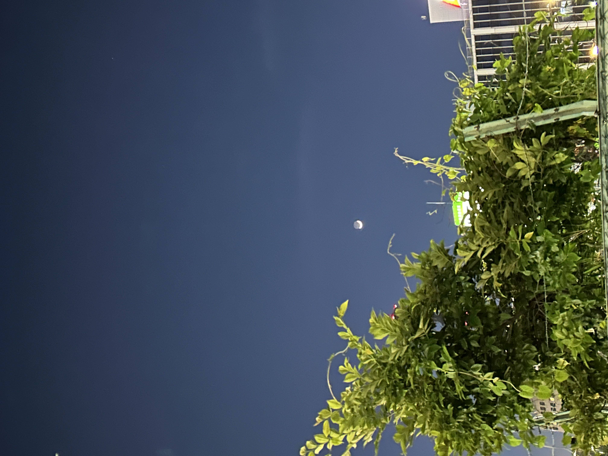
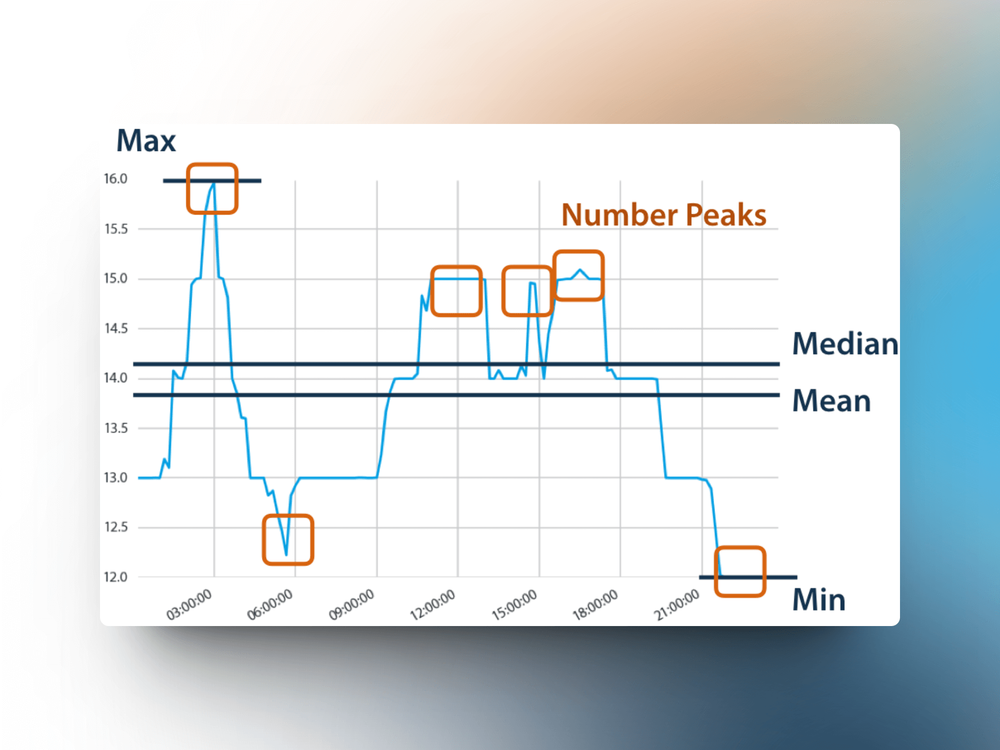
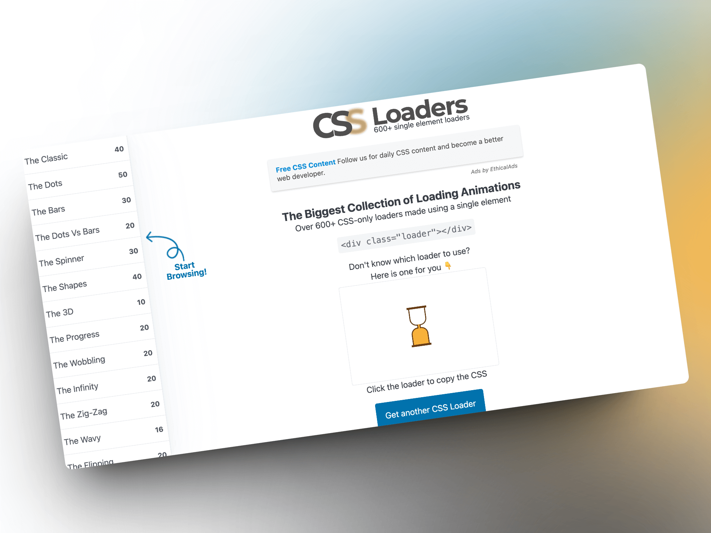

## 封面图 : 回家路上看到月牙一般的月亮 🌙

用 iPhone14 拍出来的月牙，看起来和浓眉一样。😄

## 效率工具

### 1. Meta(Facebook) 开源的 prophet

[prophet](https://github.com/facebook/prophet) 是 Facebook 开源的一个时间序列预测工具，可以用于发现和预测时间序列数据的周期性特征。 #python #math

### 2. 去除数据噪声的 python 工具：tsfresh

tsfresh 是一个用于时间序列数据的特征提取工具，可以用于去除数据噪声。 #python #math

### 3. 2 个 CSS Loaders 的生成网站

- [CSS Loaders](https://css-loaders.com/) 是一个收集了各种 CSS 加载动画的网站，可以用于网页加载时的动画效果。

- [Loading.io](https://loading.io/) 是一个在线生成各种加载动画的网站，可以自定义颜色、大小、速度等参数。 还能选择 icon 生动加载动画，不过有些需要付费。

### 4. Airtable 的开源替代: Teable

- 基于 postgres 存储数据，

- 低代码 database，支持 API

- 易于上手，就像处理 excel 表格一样处理数据

- 提供多种视图，Grid、Form、Kanban、Gallery 等

## 技术知识

### 1. 大模型解决不了英伟达的难题，AI 新范式必将出现：专访安克创新 CEO 阳萌

[老石谈芯](https://www.youtube.com/@laoshi_tec) 采访安克创新 CEO 阳萌，梳理了人工智能的过去、现在的大模型的局限性，以及未来的发展方向。

现在的大模型是把存储和计算分开的，这样的架构是非常低效的。

而人类的大脑是存储和计算一体的，每个神经元既能运存又能运算，这样的架构架构是非常高效的。

所以阳萌认为在可遇见的未来，可能是 10 年 20 年以后，会出现一种新的 AI 范式，这种范式会是存储和计算一体的。

### 2. Netflix's Overall Architecture

[Bytebytego](https://twitter.com/bytebytego) 整理的 Netflix 的整体架构，包括了 Netflix 的整体架构、数据流、数据存储、数据处理、数据查询、数据分析等方面。

> Reference: [Netflix's Overall Architecture](https://twitter.com/bytebytego/status/1789161538496176552)

## 语言学习

### 1. [English] go bananas

`go bananas` 是一个英语习语，意思是变得疯狂、发疯。

例如： When I told my parents I wanted to be an artist, they went bananas. (当我告诉父母我想成为一名艺术家时，他们都疯了。)

### 2. [Japanese] 东京日本語免费教室

[东京日本語免费教室](https://nihongo.tokyo-tsunagari.or.jp/)是一个由志愿者组织的日语教室，主要是由志愿者老爷爷老奶奶为主的日语老师，为附近居住的外国人提供免费日语课程 部分需要教材费。

## 生活趣味

### 1. [书籍推荐] 《The Mountain Is You》

这本书是一本心理学书籍，作者是 Brianna Wiest，书中讲述了如何翻越自己的心理障碍。

中文书名叫《[翻越你的山](https://weread.qq.com/web/bookDetail/2fb322e0811e7ec82g015f7d)》。

### 2. 芦笋炒口蘑 😋

> Reference: [芦笋炒口蘑](https://twitter.com/Vicky22955256/status/1789051485420245350)
