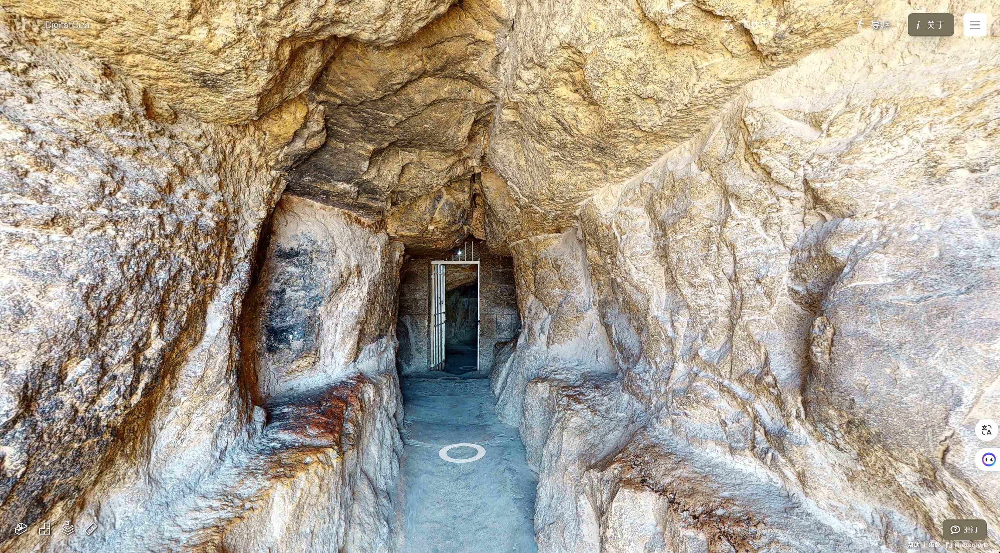
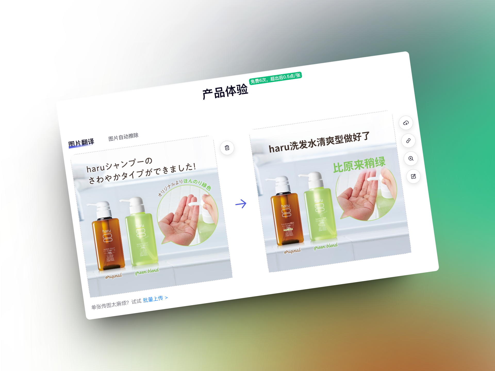
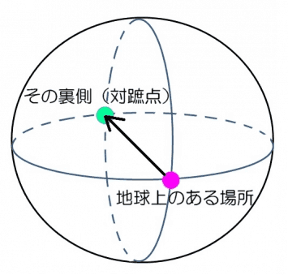
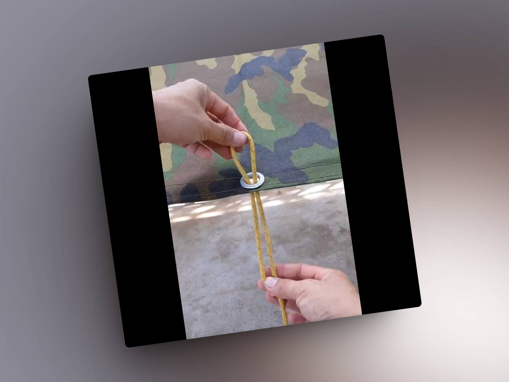

## 封面图 : 公司楼下的绣球花，夏天的气息

## 本周新闻

### 1. Nvidia 财报炸裂，股价突破 1000 美元

## 效率工具

### 1. [教育资源] 在线大金字塔内部全景导游: 数字吉萨

[数字吉萨](https://giza.mused.com/zh-hans/guided/335/zou-jin-3d-ji-sa-da-jin-zi-ta) 是一个在线的全景导游，可以让你在家里就能够参观埃及金字塔。

有娃的朋友可以给小孩子看看 😄 感觉戴个 Apple Vision Pro 的话效果会很赞 👍。

### 2. 商品图片翻译工具：GhostCut

[GhostCut](https://cn.jollytoday.com/Image_Translation/) 是一个商品图片翻译工具，可以帮助你快速翻译商品图片上的文字并生成新的图片。

对于翻译不满意的地方，你可以直接在图片上进行修改文字。

## 技术知识

### 1. PostgreSQL 17 Beta1 发布

PostgreSQL 全球开发组宣布，PostgreSQL 17 的首个 Beta 版本现已[开放下载](https://www.postgresql.org/docs/17/release-17.html)。

这一版本包含了 PostgreSQL 17 正式发布时所有功能的预览，但在 Beta 测试期间，某些细节可能会有所调整。

> Reference: [PostgreSQL 17 Beta1 发布 @隔壁老冯](https://www.postgresql.org/docs/17/release-17.html)

### 2. Andrew Ng 推荐的多 AI 智能体系统(Multi AI Agent Systems) 的课程

这门课程由 [@crewAIInc](https://x.com/crewAIInc) 的创始人兼 CEO [@joaomdmoura](https://x.com/joaomdmoura)打造。

在这门课程中，你将学习如何将复杂任务分解为多个 AI 智能体的子任务，每个智能体都扮演一个特定的角色并执行相应的任务。

例如，生成一份研究报告时，你可能会有研究员智能体、撰写智能体和质量保证智能体进行协作。你需要像管理团队一样，定义这些智能体的角色、期望和交互方式。

课程将涵盖关键的 AI 智能体技术，包括角色扮演、工具使用、记忆管理、保护机制以及跨智能体协作。

你还将学习如何构建自己的多智能体系统，以便解决复杂任务。我相信你会发现设计智能体并观察它们协作完成任务既高效又有趣。

多智能体架构将在推动 AI 系统的发展方面起到重要作用。

课程地址在这里：[Multi AI Agent Systems](https://deeplearning.ai/short-courses/multi-ai-agent-systems-with-crewai/)

> Reference: [Andrew Ng 推荐的多 AI 智能体系统(Multi AI Agent Systems) 的课程 @dotey](https://x.com/dotey/status/1793804148518883832)

## 语言学习

### 1. [日语] JTF 日本語標準スタイルガイド

[日本語標準スタイルガイド](https://jtf.jp/pdf/jtf_style_guide.pdf) 是由日本語標準制定委員会制定的日本語写作规范。

### 2. [日语] 対蹠地【たいせきち/たいしょち】

`対蹠地` 是指地球的对面的地方，也就是地球的另一边。

> Reference: [対蹠地](https://x.com/BotHakase/status/1794194213795750255)

### 3. 漫符【まんぷ】

漫符【まんぷ】是漫画中特有的符号表现。

例如，通过在人物脸上画汗滴标记来表现焦虑，通过画出三到四条曲线使血管凸显，表现愤怒。

> Reference: [漫符 @BotHakase](https://x.com/BotHakase/status/1793605327616881117)

## 生活趣味

### 1. 润日本的 Pro & Con

[润日本的 Pro & Con](https://x.com/KK_CNJP/status/1794007953990963401) 这个推文列出了润日本的优点和缺点。以我在东京的经历来看，还是比较客观的。

---

来日本 20 年，在这里生活了 16 年。写出 Pro & Con 各七条，供参考。

#### Pro

- 一、医疗条件好。日本最吸引人的地方之一就是医疗条件，很多国家没法比。
- 二、契约精神。做生意 19 年，没遇到一例钱没收上来的情况。有三起付账不痛快，最后也付了。
- 三、安全。晚上在外面随便晃荡，没有安全上的担忧。许多地方依然可以夜不闭户。
- 四、饮食。种类多、干净、服务好。
- 五、人文环境好。文化氛围浓，艺术活动多。
- 六、如果你多金、有趣，日本姑娘欢迎你，还挺热烈。
- 七、物价相对便宜。

#### Con

- 一、做好永远是外国人的准备。加入日本国籍，日本人也不会把你当日本人看，你还是归化人，元中国人。
- 二、对中国人接受度差。你必须先证明你不是个奇怪的人，是个可以相处的人，日本人才会接受你。
- 三、社会环境因循守旧、墨守成规，很难活出个性张扬。
- 四、赋税重。在日本生活超过 180 天，就全球追税。遗产税和赠与税尤重。
- 五、自然灾害频发。地震是家常便饭。不过还算安全。
- 六、很难把父母办过来养老。
- 七、收入和一些国家差距在拉大。推上有人说有的美国大学生刚毕业就能拿到 25 万多美元年薪，在日本合 4000 万日元，这是很多日本上班族一辈子也难以达到的天花板。

### 2. [Knot] 一种搭帐篷时用得到的绳结

> Reference: [Knot @X](https://x.com/gunsnrosesgirl3/status/1793535746168783299)
