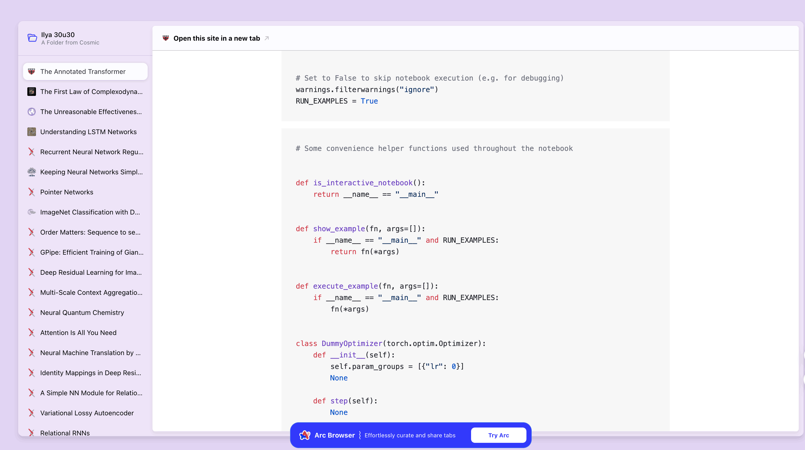
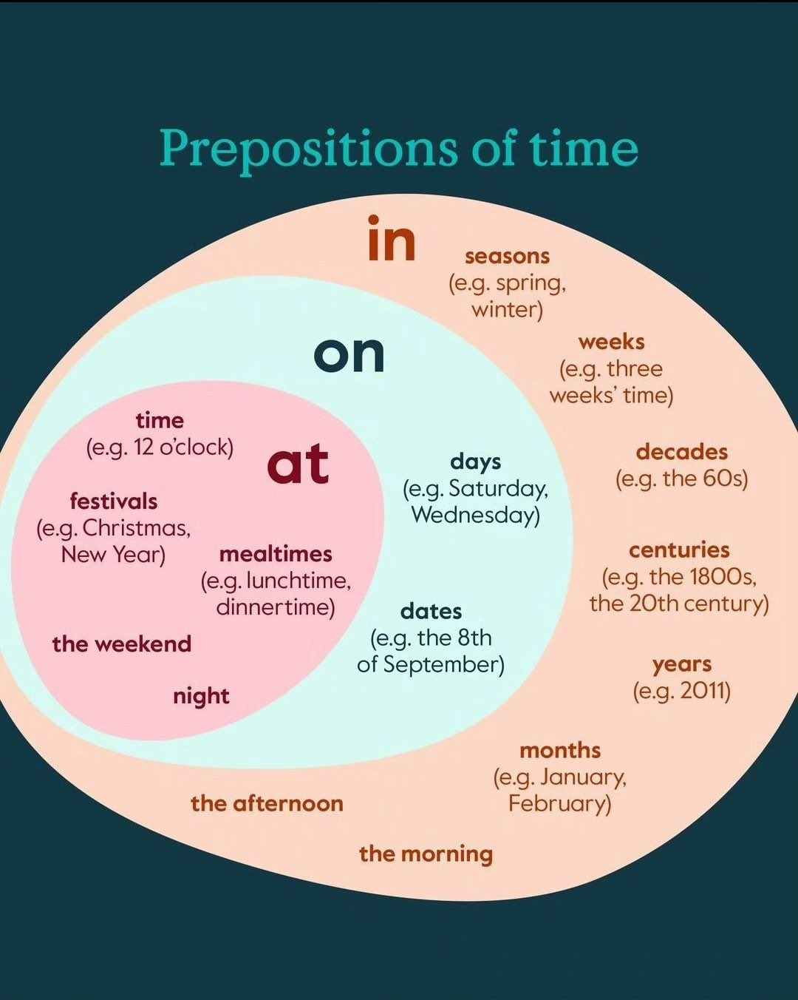

## 封面图 : 拍摄于东京日比谷公园附近的[市政会館](https://ja.wikipedia.org/wiki/市政会館)

## 效率工具

### 1. ChatTTS: 炸裂的 TTS(文字转语音)工具

- 有人 fork 了下改成了更便于[使用的版本](https://github.com/yihong0618/ChatTTS)。

- 还有人直接把它做成了 [Docker 版本](https://github.com/ultrasev/ChatTTS)，便于本地使用。

- [Google Colab Demo](https://colab.research.google.com/drive/1Eqxn3-aXXxAqJ7EYA2elpOHsXRPEbUlZ?usp=sharing)

### 2. 微信公众号 Markdown 排版编辑器

这个微信公众号 Markdown 排版编辑器 (https://quail.ink/tools/markdown-to-wx/) 可以帮助你用 markdown 编写微信公众号文章。

### 3. 美图开源的 lmstfy - 具有 REST API 的任务队列

基于 redis 存储，使用 golang 开发，资源占用少，轻量级，并且经受美图线上环境大流量验证多年，较适合用来做延迟队列。

Github: https://github.com/bitleak/lmstfy

> Reference: [美图开源的 lmstfy](https://x.com/qloog/status/1796063194064068685)

### 4. 一个开源知识库管理工具: Outline

高颜值、支持实时协作、功能丰富且兼容 Markdown。

Github: https://github.com/outline/outline

## 技术知识

### 1. [物理] 形象地解释电流电压电阻间的关系 😄

> Reference: [electricity explained](https://x.com/PhysInHistory/status/1796014841385083382)

### 2. [AI] OpenAI 的前联合创始人 [Ilya Sutskever @X](https://x.com/ilyasut) 给出一份大约 30 篇 AI 研究论文的阅读清单

阅读清单: https://arc.net/folder/D0472A20-9C20-4D3F-B145-D2865C0A9FEE

> Reference: [30 篇 AI 研究论文的阅读清单 by Ilya Sutskever](https://x.com/HiTw93/status/1796701445015879704)

## 语言学习

### 1. 英语中的时间介词

### 2. 英语中的短信（SMS）用语缩写

## 生活趣味

### 1. 白头鹰的故事

白头鹰(Bald eagle)可以活到 70 岁因为它们的意志非常顽强。当它们活过 40 岁时，每只鹰必须作出一个艰难的选择。

猎物时它们的爪子变得不再足够锋利，它们的喙变得弯曲且钝，羽毛也变厚重。这时它们有两个选择：要么就这样子死去，要么通过一个痛苦的转变。

这个痛苦的转变是鹰必须飞到群山之上，用它的喙击打岩石许多天，

直到旧的喙脱落，新的喙长出。之后，它用喙啄掉旧爪，旧爪脱落，新爪长出。

它再啄掉旧的厚羽毛。这个痛苦的过程可能要持续 150 天之久，经历这些之后，这只鹰获得了新的生命。有时候我们需要舍弃掉我们能些老旧的自己，好使我们得到一个更新更好的自己。

> Reference: [白头鹰的故事](https://x.com/2022Rrzt/status/1796421221510463791)
