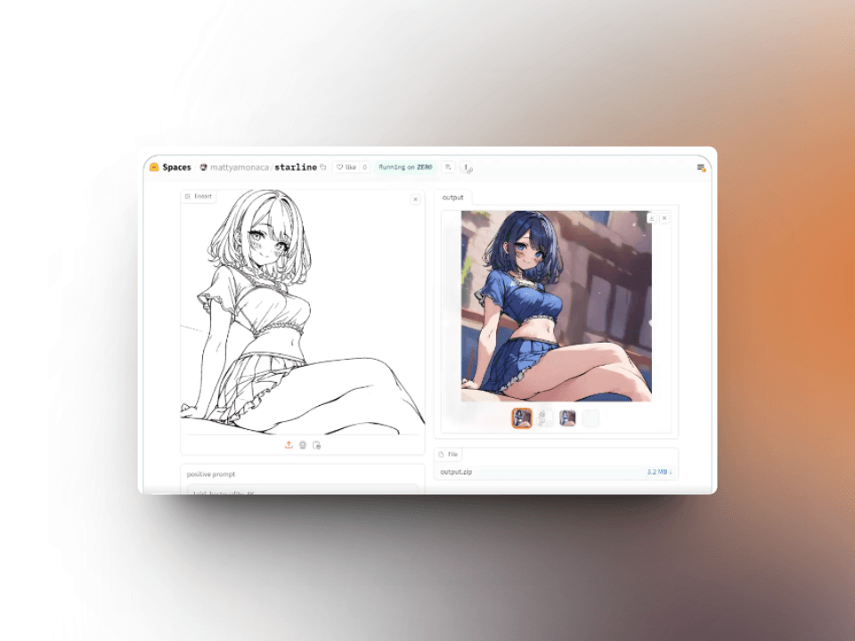
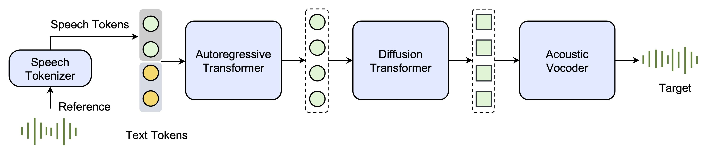
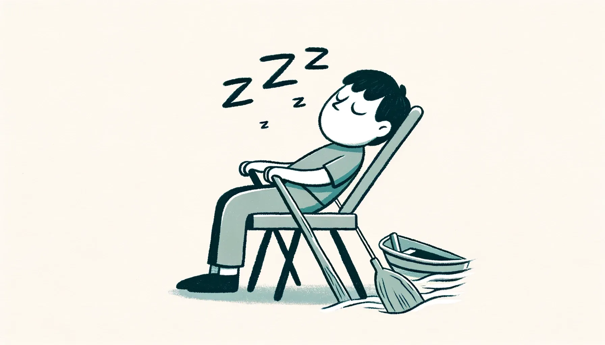
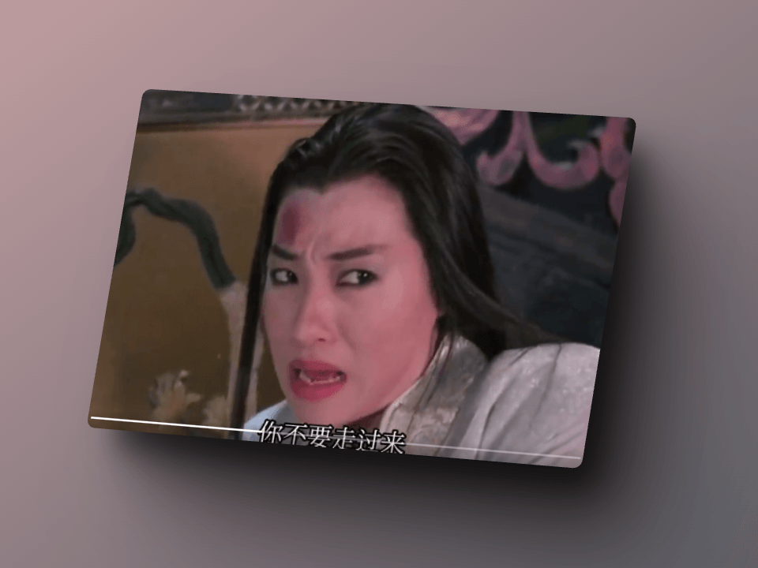
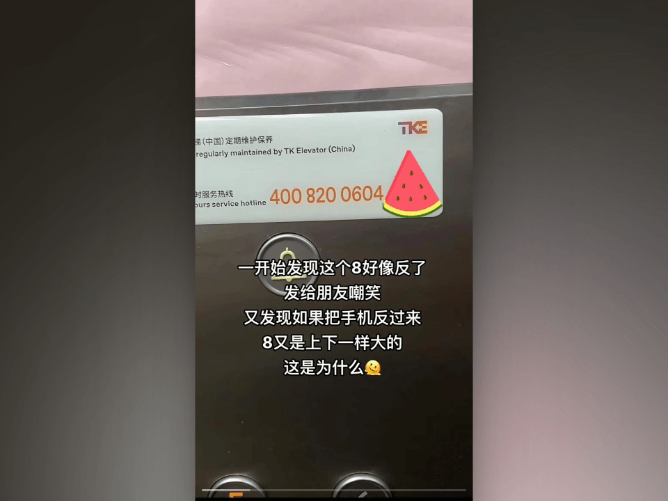

## 封面图 :　有三种颜色的心形紫阳花

> Ref: [片柳弘史さん@X](https://x.com/hiroshisj/status/1799216662530724213)

## 本周新闻

### 1. SpaceX Starship 第四次飞行测试成功

> Ref: [Watch Starship’s fourth flight test@X](https://x.com/SpaceX/status/1798689697184764071)

### 2. 英伟达市值超过 3 万亿美元（＄ 3 trillion）

英伟达市值超过 3 万亿美元，成为全球第 3 家市值超过 3 万亿美元的公司。

截止 2024 年 6 月 7 日，英伟达市值为 3.01 万亿美元。

| 排名 | 公司   | 市值           |
| ---- | ------ | -------------- |
| 1    | 微软   | 3.151 万亿美元 |
| 2    | 英伟达 | 3.012 万亿美元 |
| 3    | 苹果   | 3.003 万亿美元 |

## 效率工具

### 1. Shopify 出品的测试工具 Toxiproxy

[Toxiproxy](https://github.com/shopify/toxiproxy) 一个基于 Go 语言的 TCP 代理，用于模拟网络和系统条件以进行混沌和可靠性测试。

提供以下语言的客户端：

- toxiproxy-ruby
- toxiproxy-go
- toxiproxy-python
- toxiproxy.net
- toxiproxy-php-client
- toxiproxy-node-client
- toxiproxy-java
- toxiproxy-haskell
- toxiproxy-rust
- toxiproxy-elixir

### 2. [AI] 漫画上色工具 starline

starline 这个工具可以将黑白漫画自动上色，并且忠实于输入的线条。

> Ref: [starline@X](https://x.com/GianMattya/status/1798555503611765125)

### 3. 字节跳动推出的 AI 语音合成工具

上周 [ChatTTS](https://github.com/2noise/ChatTTS) 刚刚爆火，一夜涨星 1W+ Star ⭐️。

这周字节跳动就带来了基于自回归和扩散架构的 Seed-TTS，核心在于：“指令遵循、支持上下文学习的高质量拟人声音、情感丰富度以及多样化的语音”。

AI 这块，虽然个人是掰不过公司的。不是大公司不会，只是没拿出来而已，毕竟人家有资源有技术。

不过，这也是一个好的现象，个人的开源促使大公司的跟进，对整个行业的发展是有推动作用的。

论文、技术报告、Demo 体验地址：[Seed-TTS](https://bytedancespeech.github.io/seedtts_tech_report/)

> Ref: [字节跳动语音合成工具 Seed-TTS@X](https://x.com/tuturetom/status/1798535325930926548)

## 技术知识

### 1. Don't DRY Your Code Prematurely 不要过早地 DRY（优化） 你的代码

[Don't DRY Your Code Prematurely @Google Testing Blog](https://testing.googleblog.com/2024/05/dont-dry-your-code-prematurely.html)

这篇文章介绍了 为什么不要过早地 DRY（Don't Repeat Yourself）你的代码的情况和原因。

我觉得抽象化的目的，一个目的是为了保持代码简单为了维护。（但从具体到抽象，同时也会带来了理解的难度。）

上面的文章的点，过早的 DRY 固然不好，还有就是不要把不同的 entity 的表面上相关的 behavior 抽象到一起吧 😄

道理虽然简单，但是在实际的开发中，很容易忽略。还是要多思考，多实践。熟能生巧吧。

## 语言学习

### 1. [日语] 船を漕ぐ【ふねをこぐ】

本意是划船 🚣‍♀️，因为坐着打瞌睡时前后摇晃身体的样子很像划船 🚣‍♀️ 的样子，所以也有打瞌睡 😪 的意思。

## 生活趣味

### 1. 中国股市之鬼不可近身篇 😄

笑死，纯当一乐。 希望股市越来越好，大家都能赚钱。💰

> Ref: [动画在这里@X](https://x.com/66567848787A/status/1798661424283353092)

### 2. 8 其实上下不对称很多人知道，但是把它倒过来就感觉很奇怪

说明了什么呢？😄 我们的大脑对不协调的感知比较强？

> Ref: [引用自这里@X](https://x.com/Noira_M2F/status/1798648321990619346)

### 3. 花是怎么开的(117 种花)

牛人用 6 万 5 千多个小时，用实践来告诉世人，花是怎么开的(117 种花)。

> Ref: [动画：花是怎么开的(117 种花)@X](https://x.com/Morris_LT/status/1798225827404153000)
