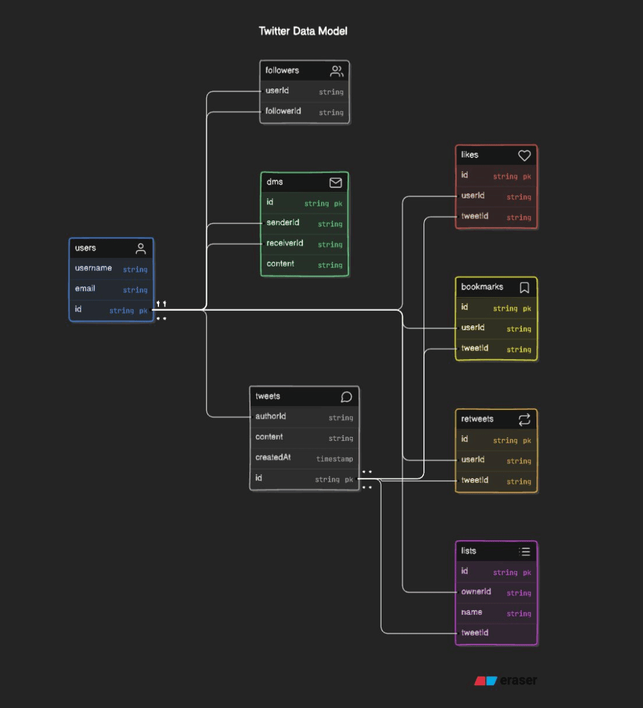
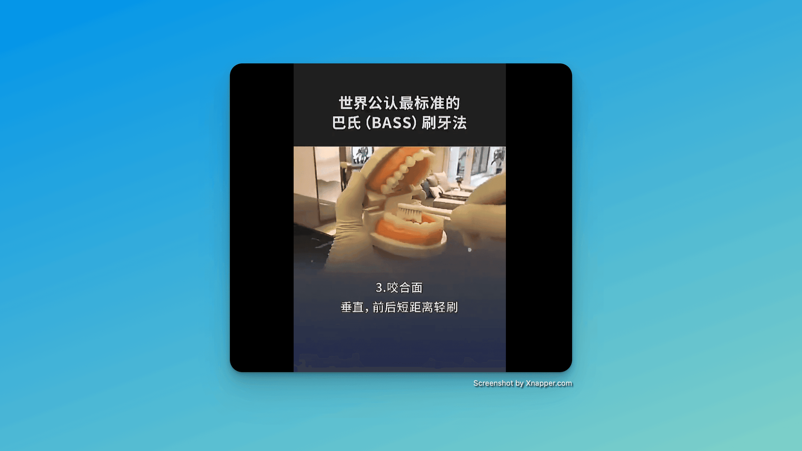

## 封面图 : 绣球花

手机不小心掉进泳池里打不开了，这周就借用推友的图片吧。🙏

<<<<<<< HEAD

=======

>>>>>>> 3ccb338 (add weekly post)

> Ref: [绣球花](https://x.com/haskap1017/status/1804290801893281844)

## 本周新闻

### 1. 英伟达超越微软，成为全球市值最高公司

周二(2024 年 6 月 18 日)，英伟达的股价上涨了 3.6%，市值升至 3.34 万亿美元。

微软和苹果双双下跌，收盘落后于这家硅谷芯片制造商。


## 效率工具

### 1. 9000 个汉字的笔顺动画: Hanzi Writer

[Hanzi Writer](https://github.com/chanind/hanzi-writer) 是一个免费且开源的 JavaScript 库，用于中文汉字笔画顺序动画和笔画顺序练习测试。支持简体和繁体汉字。

### 2. 自动生成 RDB 的 ER 图的工具: SchemaSpy

还能导出成 CSV，PDF 格式。

https://github.com/wifecooky/schemaspy-sample


### 3. Diagram GPT: 用 AI 自动生成流程图, 网络拓扑图等等

https://www.eraser.io/diagramgpt

直接看例子。

#### 例子 1

- 输入：
  Data model for Twitter that includes users, followers, DMs, likes, bookmarks, retweets, tweets, lists

- 输出：



#### 例子 2

- 输入：

```sql
// SQL schema creation script

CREATE TABLE CART
(
  ID INTEGER PRIMARY KEY NOT NULL,
  CUSTOMER_ID INTEGER NOT NULL,
  NAME VARCHAR(50) NOT NULL
);
.... 省略
```

- 输出：


## 技术知识

### 1. 左耳朵耗子哥的“科学上网”总结

不是鼓励你翻墙干坏事，而是为了更好的学习和工作。😄

https://github.com/haoel/haoel.github.io


### 2. 吴恩达老师的 「[翻译 Agent](https://github.com/andrewyng/translation-agent)」

支持语气，区域，基于词汇表确保术语一致性，在部分场景 BLEU 优于很多商业翻译产品，Prompt + Workflow 设计非常值得学习。

> Ref: [吴恩达老师的翻译 Agent](https://x.com/tuturetom/status/1800910616888303859)

## 生活趣味

### 1. 有史以来航班最多的一天？ 23158 架飞机 ✈️

2024 年 6 月 8 日下午世界标准时间 14:30 左右，Flightradar24 网站观测到同时有 23158 架飞机在天空中飞翔，这是他们观测以来航班最多的一天。

图中两个没有飞机飞的“洞”，一个是青藏高原，一个是乌克兰。

<<<<<<< HEAD

=======

>>>>>>> 3ccb338 (add weekly post)

> Ref: [Flightradar24](https://x.com/hu_lalalalala/status/1803012865777172494/photo/1)

### 2. 巴氏刷牙法 - 你刷牙的方式对了吗？



### 3. 学习的最终目的是什么？

by 左耳朵耗子哥

- 学习是为了找到方法
- 学习是为了找到原理
- 学习是为了了解自己
- 学习是为了改变自己

> Ref: [学习的最终目](https://x.com/feltanimalworld/status/1800936113030480111)
