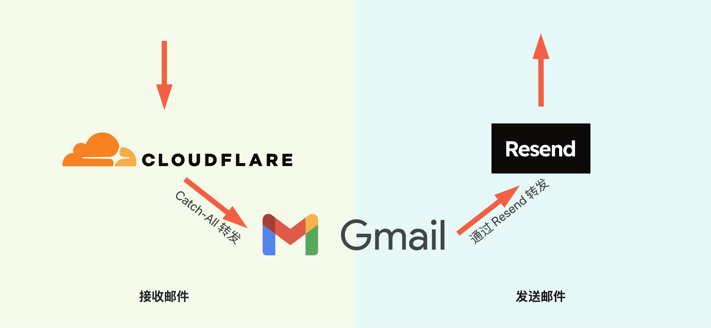
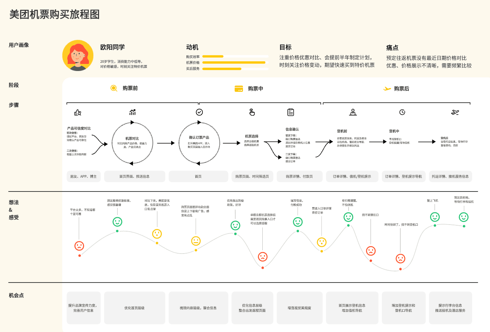

## 封面图 : 拍摄于家附近的某户人家门口 😄

这户人家的门口一年都布置着各种各样的花花草草，赏心悦目。


## 效率工具

### 1. 免费拥有企业邮箱的方法

Cloudflare + Gmail + Resend



具体实现的文档链接：[免费拥有企业邮箱的方法](https://cleanclip.cc/zh/developer/cloudflare-worker-gmail-resend-enterprise-email)

### 2. Observable Plot

[Observable Plot](https://observablehq.com/plot/) 是一个 D3.js 团队推出的新的图表库，简化了 D3.js 的语法。

### 3. AI 学习网站 Emergent Mind

[Emergent Mind](https://www.emergentmind.com/) 通过抓取 arXiv 上 AI 最新研究论文，再用 GPT 去总结，通过分类、趋势流行度、时间来筛选，很适合学术研究，需静下心来看看。

> Reference: [AI 学习网站 Emergent Mind](https://x.com/HiTw93/status/1806113714522804259)

## 技术知识

### 1. 什么是用户旅程图？（User Journey Map）

用户旅程图（User Journey Map）是一种可视化工具，用于描述用户在使用某一特定产品或服务时所经历的各个阶段、触点和情感体验。

它通过从用户的角度出发，以叙述故事的方式展示用户的使用过程，帮助产品团队发现用户在整个使用过程中的痛点和满意点，从而优化产品设计和用户体验。

用户旅程图的构成要素

- 用户角色（Persona）：基于用户研究创建的虚拟用户形象，包含用户的基本信息、需求、期望和痛点。
- 时间轴（Timeline）：将用户的行为和体验按时间顺序排列，通常分为不同的阶段。
- 行为（Actions）：用户在每个阶段所采取的具体行为。
- 想法（Thoughts）：用户在不同阶段的想法、问题和信息需求。
- 情感（Emotions）：用户在整个过程中情感的波动，通常用情感曲线表示。
- 触点（Touchpoints）：用户与产品或服务互动的具体点。
- 痛点（Pain Points）：用户在使用过程中遇到的问题和不满。
- 机会点（Opportunities）：从用户体验中提炼出的改进和优化机会.



> Reference: [什么是用户旅程图？](https://x.com/seclink/status/1806333408995618881)

### 2. [Golang] 线程安全的 Map，Slice，Stack 等数据结构的实现

[threadsafe](https://github.com/hayageek/threadsafe) 是一个 Go 语言包，提供了线程安全的数组、切片、映射、栈和队列的实现，使用了泛型和类型约束。

```go
package main

import (
    "fmt"
    "github.com/hayageek/threadsafe"
)

func main() {
    // Create a new thread-safe map
    m := threadsafe.NewMap[string, int]()
    // Set values in the map
    m.Set("one", 1)

    // Create a new thread-safe slice
    slice := threadsafe.NewSlice[int]()
    // Append values to the slice
    for i := 0; i < 5; i++ {
        slice.Append(i * 10)
    }

    // Create a new thread-safe stack
    stack := threadsafe.NewStack()
    stack.Push(10)
```

### 3. [JS] `new URL()` 的问题

JS 的 `URL()` 用来解析网址，遇到非法字符串会抛错。作者认为这是一个非常糟糕的设计，并给出了解决办法。

一般来说，我们会使用 `try-catch` 来捕获错误，但是这样会导致代码变得臃肿。

```js
const urlstring = "this is not a URL";
let not_a_url;

try {
  not_a_url = new URL(urlstring);
} catch {
  // we catch and ignore the error
  // not_a_url is already undefined so no need to actually do anything.
}
```

作者给出了一个更好的解决办法。

```js
const urlstring = "this is not a URL";

const not_a_url = URL.canParse(urlstring) && new URL(urlstring);
// not_a_url = false
```

> Reference: [The problem with new URL(), and how URL.parse() fixes that](https://kilianvalkhof.com/2024/javascript/the-problem-with-new-url-and-how-url-parse-fixes-that/)

## 语言学习

### 1. [日语] 曠日【こうじつ】

一整天什么也不做，虚度光阴。

> 何もしないで、むなしく日を過ごすこと。


## 生活趣味

### 1. 小孩子的情绪表达 - 碰痛测试

测试：假装不小心碰到硬物，看孩子的反应。

很多时候，小孩子哭不是因为疼痛，而是一种情绪的表达。

> Reference: [小孩子的情绪表达](https://x.com/newsNZcn/status/1806015904763052343)

### 2. 为什么要盖着盖子冲抽水马桶？ 😄

因为脏水会飞溅得到处都是。

这个视频用激光照射的方式，以及用紫外线灯照射荧光液体的方式，直接把马桶冲水的飞溅效果 show 给你看。

> Reference: [为什么要盖着盖子冲抽水马桶？](https://x.com/nishuang/status/1806541108601851910)

### 3. "你吼她，是因为爱她" - 一个关于父母教育方式的反思

每一次你告诉你的女儿：你吼她，是因为爱她。便是教她混淆了愤怒与好意。

等她长大后便会信任伤害她的男人。因为，他们看起来跟你好像。

by 露比·考尔


> Generated by DALL·E

### 3. 乌合之众


群众从未渴求过真理，他们对不合口味的证据视而不见。假如谬误对他们有诱惑力，他们更愿意崇拜谬误。

谁向他们提供幻觉，谁就可以轻易地成为他们的主人；谁摧毁他们的幻觉，谁就会成为他们的牺牲品。

by 勒庞《乌合之众》

> Generated by DALL·E
