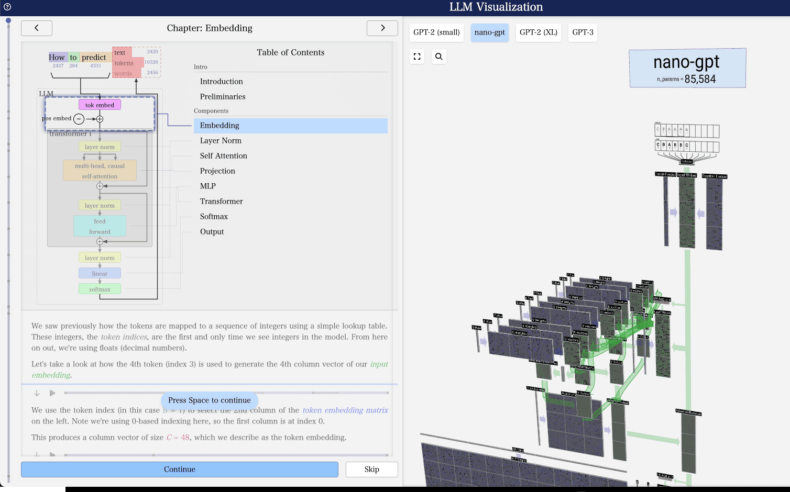
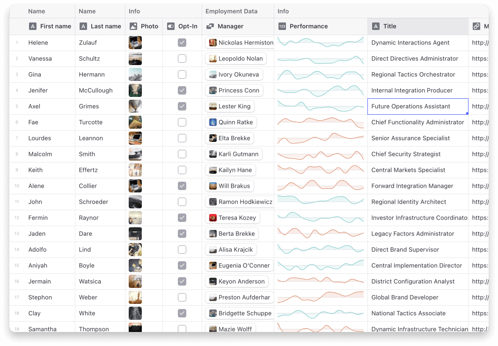

## 封面图 : 今年的莲花 🪷

图片来自于 [国営昭和記念公園@X](https://x.com/showakinenpark/status/1808724597732429939) 。

哎，iPhone14 掉水里好像显示屏烧坏了， 在东京修理要好几千 RMB，考虑买个 iPhone15 了。

## 效率工具

### 1. 支持 10+ 翻译器的漫画或图片翻译神器 - Image/Manga Translator

- [Image/Manga Translator](https://github.com/zyddnys/manga-image-translator) 支持

- 上传图片即可原地翻译文字
- 主要支持日语，韩语，英语翻译
- 后续开放 Editor 支持人工干预修正
- 支持 Docker 私有化部署

> Reference: [Image/Manga Translator](https://x.com/tuturetom/status/1808549893822370297)

### 2. 用最简单的方式，自己出版一本书

[WriteBook](https://once.com/writebook) 是来自 37signals 的个人写作、出版工具。

非常有趣的工具，一如他们公司的风格，什么高级编辑工具、出版平台、发行商…统统没有。你自己租一个服务器、设置 dns、运行一行安装指令。

> Reference: [用最简单的方式，自己出版一本书](https://x.com/nishuang/status/1808565592674423293)

### 3. 无内购、无广告、无订阅、无试用、100% 免费的 Mac 应用程序收集网站

[thriftmac](https://www.thriftmac.com/) 是一个 Mac 应用程序收集网站，所有应用程序都是无内购、无广告、无订阅、无试用、100% 免费的。

## 技术知识

### 1. 可视化讲解 LLM 原理

[这个网站](https://bbycroft.net/llm)可以可视化讲解 LLM 原理，可以帮助理解 LLM 的工作原理。

### 2. [JS] 表格组件 - Glide Data Grid

[Glide Data Grid](https://github.com/glideapps/glide-data-grid) 是一个基于 Canvas 的数据表格，支持数百万行，快速更新和原生滚动。

在 [Storybook](https://glideapps.github.io/glide-data-grid/) 中有很多的例子。

## 语言学习

### 1. [英语] fungi 和 fungus 的区别

- fungus [ˈfʌŋɡəs] n. 这个词用于指代包括蘑菇、酵母和霉菌在内的整个真菌界。因为是复数形式，所以在谈论多个真菌生物或整个真菌群时使用。
- fungi [ˈfʌŋɡaɪ] n. 这个词用于指代真菌界中的单个生物。例如，你可能会说，“This mushroom is a fungus. 这个蘑菇是一个真菌。”。

是不是可以这样记忆： fung`i` → fung`us` 。 `us` (我们) 反而是单数，`i` （我）反而是复数 😄。

BTW, 我问了下 ChatGPT 和 DeepSeek，他们也没能给出好的记忆方法 😄

### 2. [日语] 棄教【ききょう】

- 棄教【ききょう】是一个日语词汇，意思是“放弃宗教信仰”。

> それまで信じていた信仰を捨てること。

## 生活趣味

### 1. 韧性在成功中很重要

黄仁勋：伟大不是智力，伟大来自于性格，性格是由受过痛苦的聪明人形成的。
期望值很高的人通常韧性很低。不幸的是，韧性在成功中很重要。我不知道如何教你们，除了我希望痛苦发生在你们身上。

(痛苦让人成长吗 😄)

> Reference: [韧性在成功中很重要](https://x.com/435hz/status/1808306664522846316)

### 2. 只要不是彻底的懒惰，悠闲地生活绝非罪过

by 阿瑟·克拉克《童年的终结》
