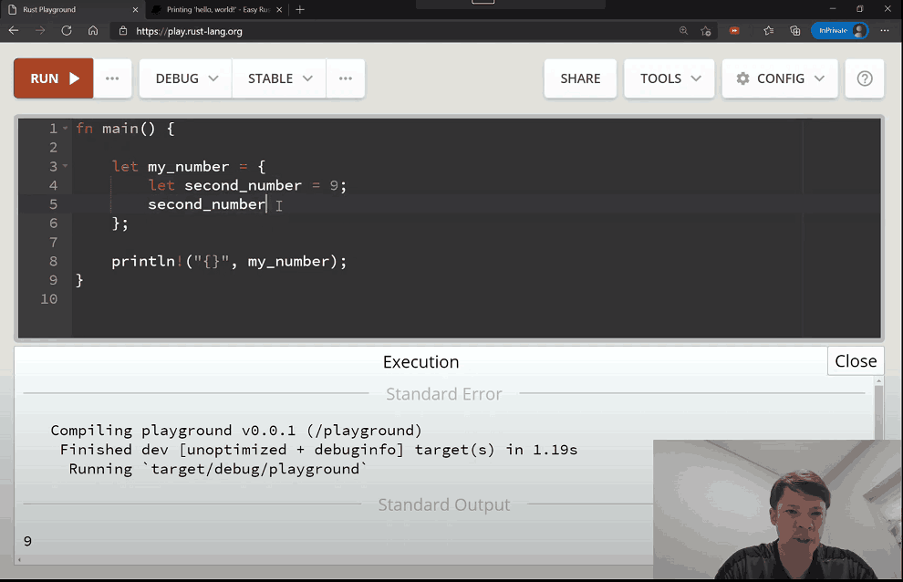
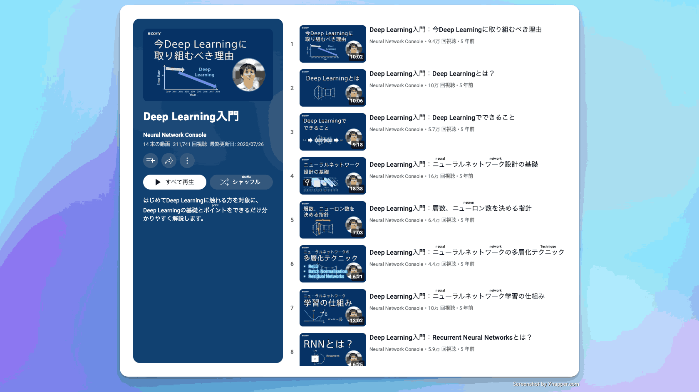
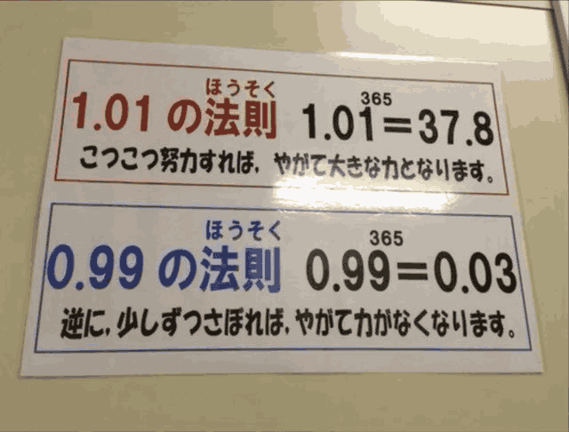

## 封面图 : 少数与多数

> Ref: [引用自于这里](https://x.com/Moral_Wisdom_/status/1809972676930261117)
> 图片是用 ChatGPT 基于引用中的图片生成的。

## 效率工具

### 1. 浏览器扩展开发的模板

wxt 的扩展开发框架的模板: https://github.com/mefengl/wxt-starter

里面还集成了 `antfu's eslint config`，然后 `shadcn/ui`。

### 2. Facebook 开源的监控文件变化工具 watchman

[watchman](https://facebook.github.io/watchman/) 是 Facebook 开源的监控文件变化工具，它可以监控文件变化，及时通知你，自动触发操作，如资源重建，还支持对接 makefile。

> Ref: [watchman](https://x.com/alswl/status/1809936157175943260)

### 3. 一个高质量的开源手绘插图库

[CocoMaterial](https://cocomaterial.com/) 中的插图属于 CC0 1.0 Universal (CC0 1.0) Public Domain Dedication。

这意味着在 CocoMaterial 上发布的所有插图都可以免费使用。您可以将它们用于商业和非商业目的。您不需要征得 CocoMaterial 的许可或向 CocoMaterial 提供信用。

具体请查看 [CocoMaterial License](https://cocomaterial.com/license)

## 技术知识

### 1. Rust 的教程「Rust explained using easy English」

[Rust explained using easy English](https://github.com/Dhghomon/easy_rust) 是一个用简单英语解释 Rust 的教程。

### 2. 基于交互式，可实操的 Demo 理解 CNN/Transformer 的工作原理

[cnn-explainer](https://github.com/poloclub/cnn-explainer) 是一个基于交互式，可实操的 Demo，用于理解 CNN/Transformer 的工作原理。

- 清晰易懂了解每一层的工作原理
- 可以细调每一层参数，查看效果
- 提供 5+ 示例解决实际场景下的模型组成

Live Demo: [cnn-explainer](https://poloclub.github.io/cnn-explainer/)

> Ref: [cnn-explainer](https://x.com/tuturetom/status/1810704272151163316)

### 3. Sony 的关于深度学习的教程: Deep Learning 入门

油管（YouTube）视频地址: [Deep Learning 入门](https://www.youtube.com/playlist?list=PLg1wtJlhfh23pjdFv4p8kOBYyTRvzseZ3)

## 生活趣味

### 1. やりたい時が見つからない時は、取り敢えずお金を稼ぎなさい

当你迷茫的时候，不妨先去赚钱。😄

> Ref: [やりたい時が見つからない時は、取り敢えずお金を稼ぎなさい](https://x.com/hodoyoihaitoku/status/1810061730816688630)

### 2. 复利的力量

复利是个很神奇的东西。如果每天坚持一点点，最后会有很大的收获。

有娃的朋友们可以把图片中的公式给孩子看看，让他们明白复利的力量。😄

> Ref: [复利的力量](https://x.com/100manbird/status/1809908720920367474)

### 3. 凡是令我倾心的书，都分辨不清是我在理解它呢还是它在理解我 by 木心

当你读到一本让你倾心或者你觉得易懂的书时，只是因为你已经有了这方面的知识，那本书用你容易理解的表达方式表达出来了。

