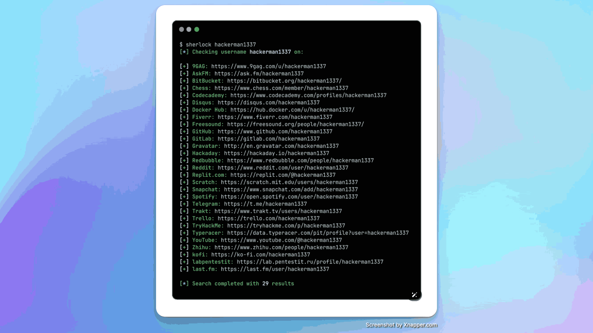
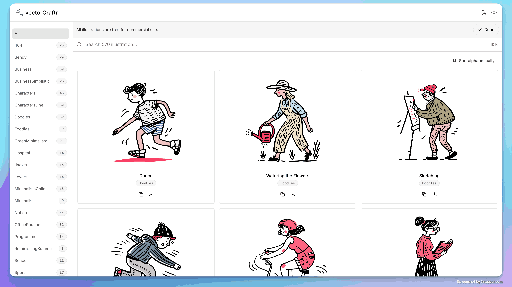

## 封面图 : 我养的百日红和木槿花开了，年复一年，花开花落

## 效率工具

### 1. 查看你的用户名有没有被注册

[sherlock](https://github.com/sherlock-project/sherlock) 是一个用 Python 编写的工具，可以同时搜索 400 多个社交网站，查看你的用户名有没有被注册。

### 2. 免费可用于商业用途的矢量插图网站 vectorCraftr

[vectorCraftr](https://vectorcraftr.com/) 是一个免费的矢量插图网站，所有插图都可以免费用于商业用途。

### 3. 全球健身资源网站 Darebee

[Darebee](https://darebee.com/) 是一个全球健身资源网站。

它是一个非营利组织，也是一个没有广告和产品植入的网站。这里的所有信息都经过了深入的研究和测试，并免费提供。您可以下载和打印任何内容——所有内容都是无条件提供的。

## 技术知识

### 1. 产品设计 - 决定不做的事情 (日文资料)

[やらない事を決めるプロダクト設計](https://speakerdeck.com/rukiadia/yaranaishi-wojue-meru-purodakutoshe-ji) 是一份关于产品设计的日文资料，讲述了决定不做的事情的重要性。

### 2. 东京大学出品的 Python 编程入门

[Python プログラミング入門](https://utokyo-ipp.github.io/index.html) 是东京大学出品的 Python 编程入门教程。

Python 初学者可以看看这个教程。

### 3. 《从零开始学习 LLM/大模型》

[《从零开始学习 LLM/大模型》](https://github.com/rasbt/LLMs-from-scratch) 是一个关于 LLM/大模型的教程, 实战教学从零实现一个 LLM。

> Ref: [从零开始学习 LLM/大模型](https://x.com/tuturetom/status/1812467490443919689)

## 语言学习

### 1. 经济学人、纽约客等英语外刊杂志下载

[awesome-english-ebooks](https://github.com/hehonghui/awesome-english-ebooks) 是一个收集了经济学人、纽约客、卫报、连线、大西洋月刊等英语杂志的仓库。

## 生活趣味

### 1. 日本牛郎必读日经 😄

[日本牛郎必读日经](https://www.bilibili.com/video/BV1Q64y1U7Zz) 是一个关于日本牛郎培训的视频。😄

培训的前辈牛郎们要求新人牛郎们必须阅读《日经》（日本经济新闻报纸），做笔记，然后用自己的语言表达出来。

牛郎重视的表达能力的学习方法，其实和学习英语是一个道理：要多读、多写、多说。

同时，选择学习资料也很重要。日经是日本的权威性报纸，有点类似《人民日报》，是一个非常好的学习资料。

> Ref: [全ての企業の新入社員研修にこれ導入して欲しい](https://x.com/tousigatizei/status/1811965406703419535)
