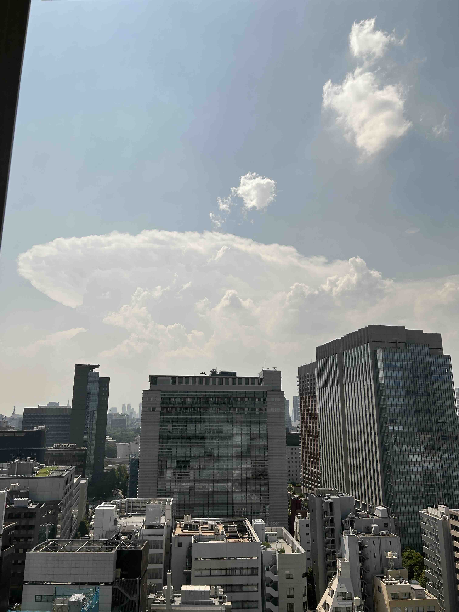
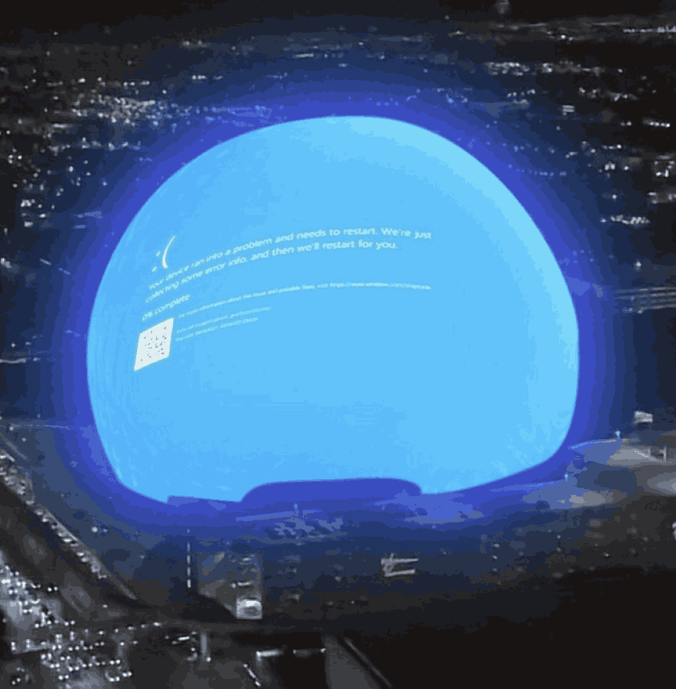
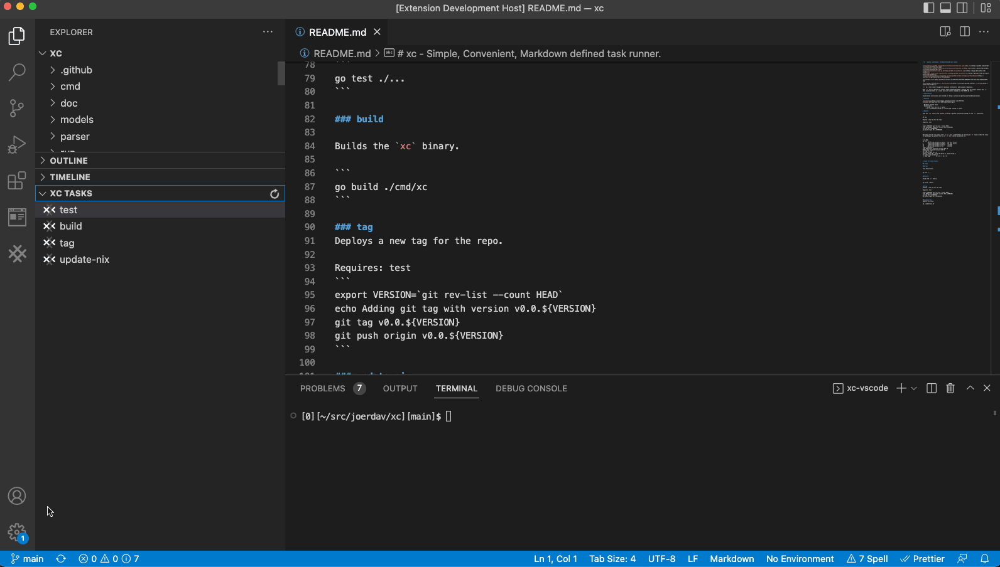
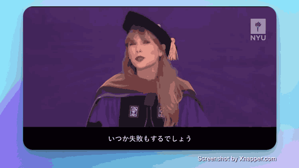

## 封面图 : 拍摄于东京暴雨后，宇宙飞船 😄

## 本周新闻

### 1. 全世界的微软系统都蓝屏了？

上次应该还是 2000 年的 千年虫。

> Ref: [Microsoft Windows users right now](https://x.com/tferris/status/1814198867094872266)

## 效率工具

### 1. 用 Markdown 写 Task Runner

[Task Runner](https://github.com/joerdav/xc) 是一个可以用 Markdown 写的任务的开源工具，有了它，你就可以和 Makefile 等 shell 脚本说再见了。

感觉这是要把程序员的三大美德之一的懒发挥到极致了。😄

作者还贴心的提供了 VS Code 插件。

### 2. Eldora UI

[Eldora UI](https://github.com/karthikmudunuri/eldoraui) 是一个开源的面向设计工程师（Design engineers）的 React UI 组件库。

## 技术知识

### 1. CSS Grid Areas

CSS Grid Areas 是 CSS Grid Layout 的一个重要特性，[这篇文章](https://ishadeed.com/article/css-grid-area/)详细介绍了它的用法。

### 2. 怎么让系统结构图更易懂？

- 系统结构图上不要写产品名称，而是写系统组件的“作用”。
- 区分数据和处理。

> Ref: [わかりやすいシステム構成図の書き方](https://qiita.com/fetaro/items/c8420f5de48f48317391)

## 语言学习

### 1. [日文] 書生論【しょせいろん】

- 意味： 理论或理想化的不考虑现实的讨论。

> 理論や理想に走って、現実をわきまえない議論。

## 生活趣味

### 1. 雷公电母的电是直流电还是交流电？ 😸

答案：雷公电母的电是直流电。 因为老夫老妻基本上不交流。:)

> Image generated by DALL-E in ChatGPT
> Prompt: "雷公电母吵架，生气的样子"

### 2. 当你失意时，不妨看看泰勒·斯威夫特的这个视频

> Ref: [Taylor Swift Speech at NYU](https://x.com/Nicotama222/status/1816583292696903767)
