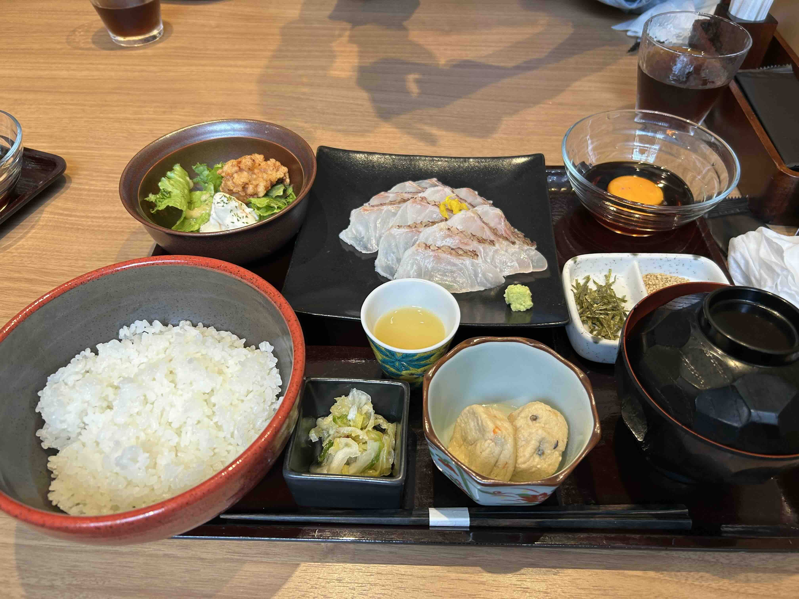
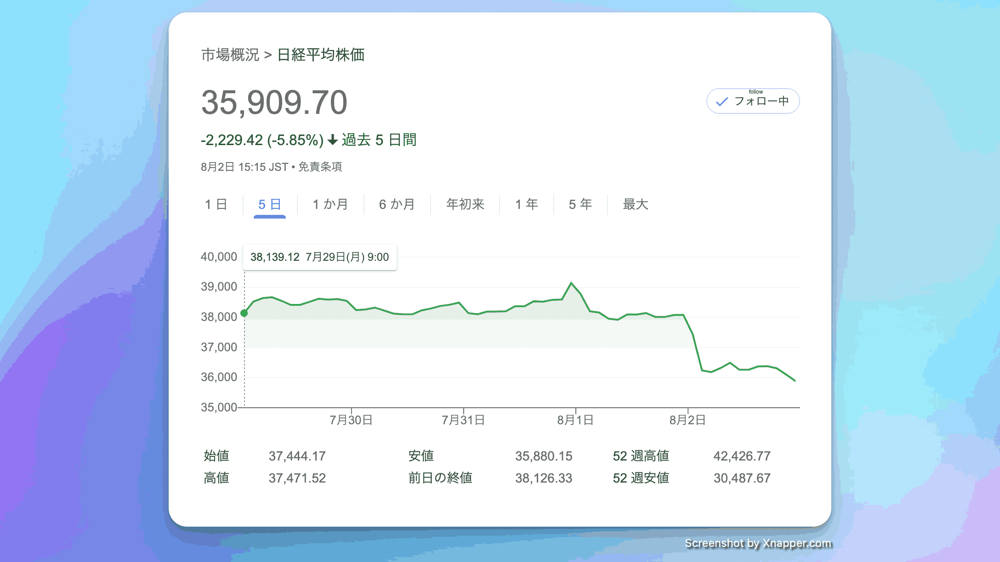
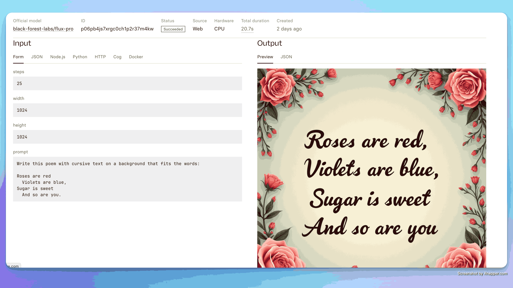
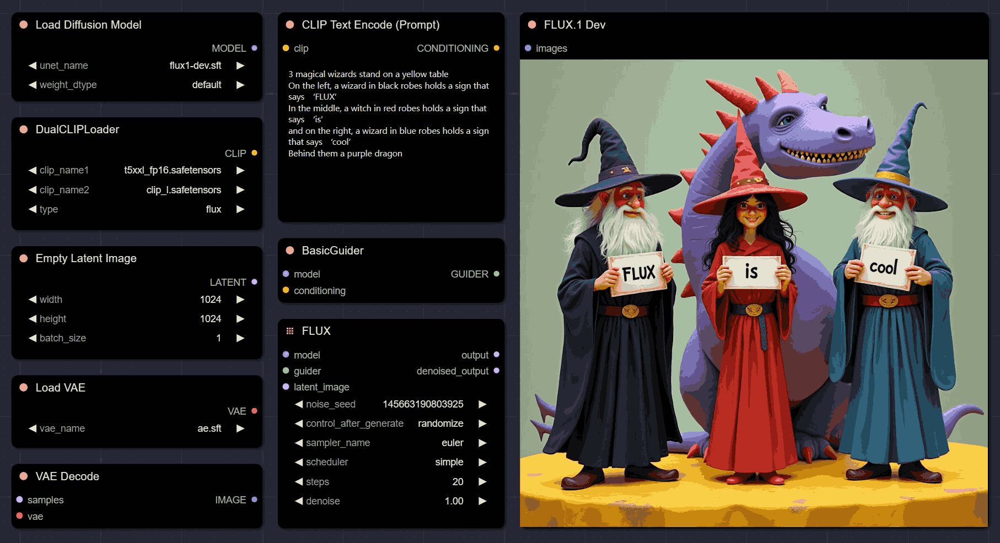
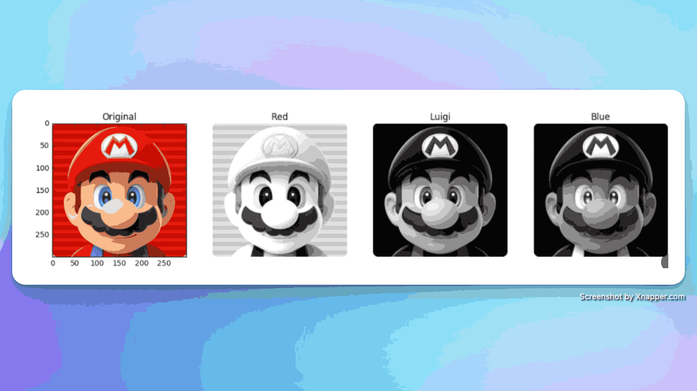
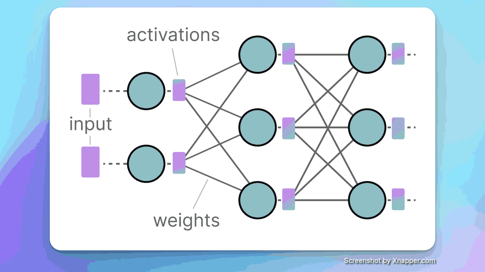
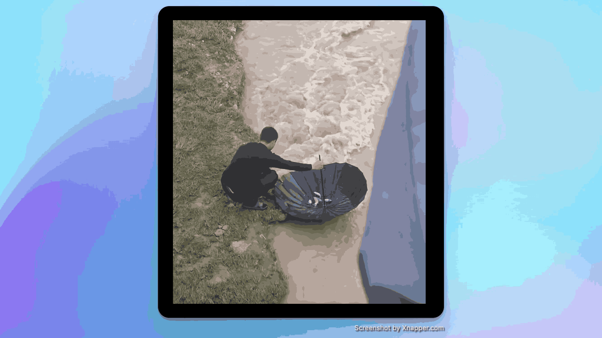

## 封面图 : 东京午餐

在传统的日式餐馆吃的和食午餐，2000 日元，有点小贵。（日本的午餐一般在 1000 左右）

和食午餐的特点是，有很多小菜，每个菜都很精致（小碟 😄）。

## 本周新闻

### 1 日本经济指数暴跌 2000 多日元

主要有 2 个原因吧：

- 美国经济数据不佳，市场担心美国经济增长放缓甚至衰退，美股大幅下跌，日本股市也受到影响。
- 日元可能升值。

## 效率工具

### 1. [AI] flux 这个图片生成模型的文字效果很赞

已经有[网友提供了 ComfyUI 的插件](https://x.com/ZHOZHO672070/status/1819224354019852760)。

### 2. 录屏自动编辑软件: 一键出成片的录屏 Demo 软件: DemoGet

[DemoGet](https://www.demoget.com/) 是一款录屏自动编辑软件，可以一键出成片。

- 自动优化鼠标移动轨迹
  你的鼠标是你展示的注意锚点，鼠标效果后展示效果远胜普通视频！

- 自动放大微操
  密集操作适合自动放大镜头，用过才知道好

- 美化视频背景背景
  支持自动美化背景，让你的视频更加美观

## 技术知识

### 1. [JS] 五彩纸屑效果组件: [canvas-confetti](https://github.com/catdad/canvas-confetti)

### 2. 视频压缩的原理

这是一份循序渐进的[视频技术的介绍](https://github.com/leandromoreira/digital_video_introduction/blob/master/README-cn.md)。

通俗易懂，推荐。

### 3. 可视化大模型/LLM 量化原理指南

[这篇文章](https://newsletter.maartengrootendorst.com/p/a-visual-guide-to-quantization)通过精美的图例演示和教学各种技术！可以学习之后加深和了解 Llama 3.1 微调。

## 生活趣味

### 1 我们这一生

我们这一生，要自己上路，路过踌躇满志，路过困顿怀疑，路过傲慢无礼，路过世俗功利，路过爱与不爱，路过幡然醒悟，路过接受理解，路过自己的一生。

> By 黑塞《悉达多》

### 2. 愿者上伞，靠知识吃鱼 😄

> Ref: [愿者上伞, 靠知识吃鱼](https://x.com/wangxiumei17/status/1819179757650825318)
