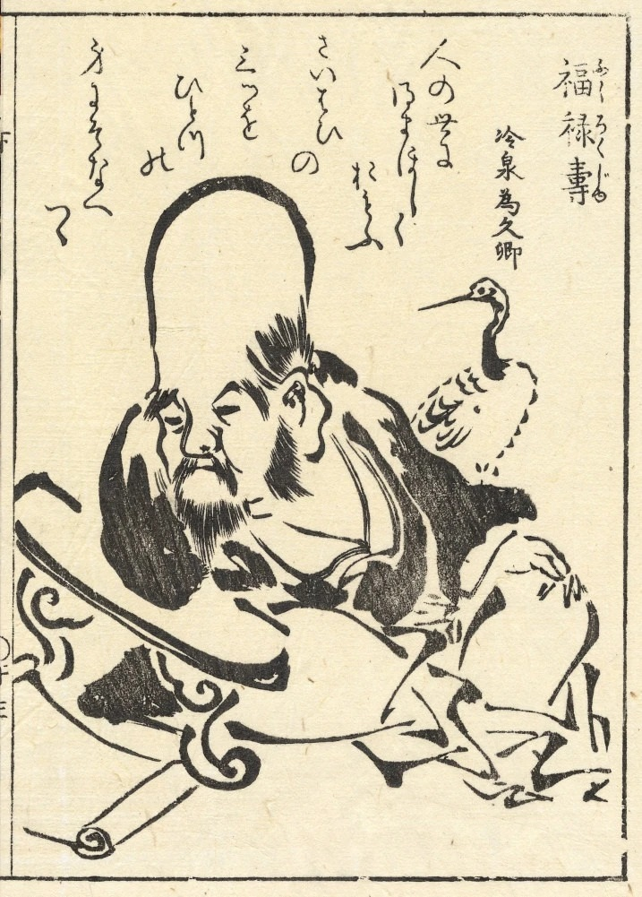
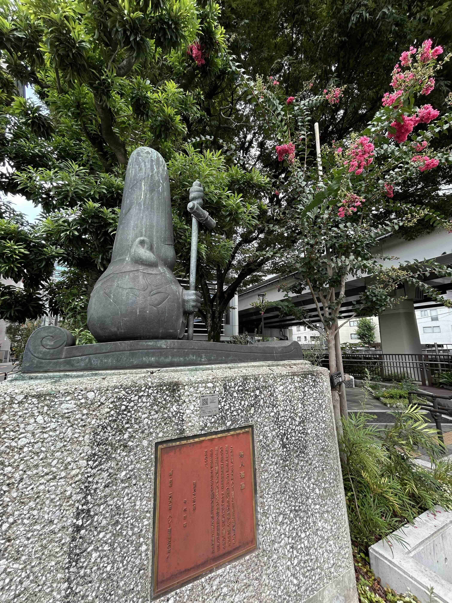
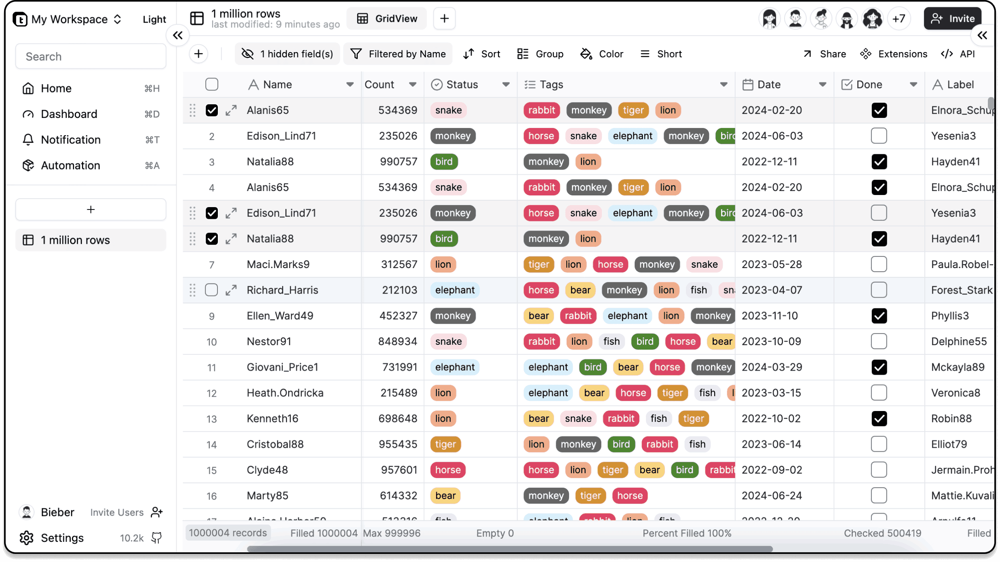
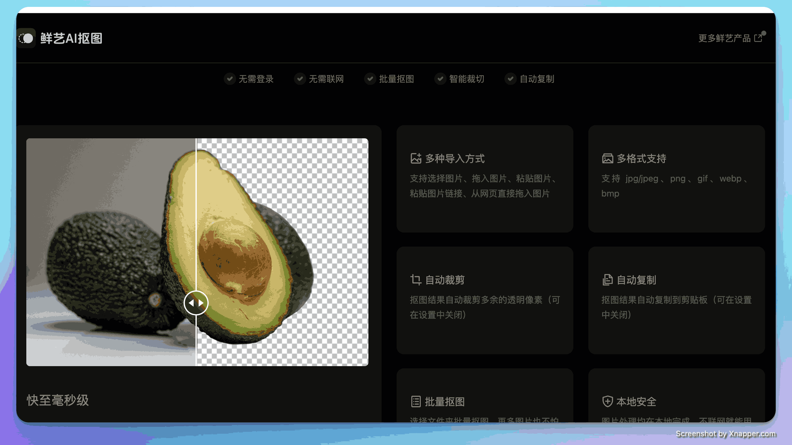
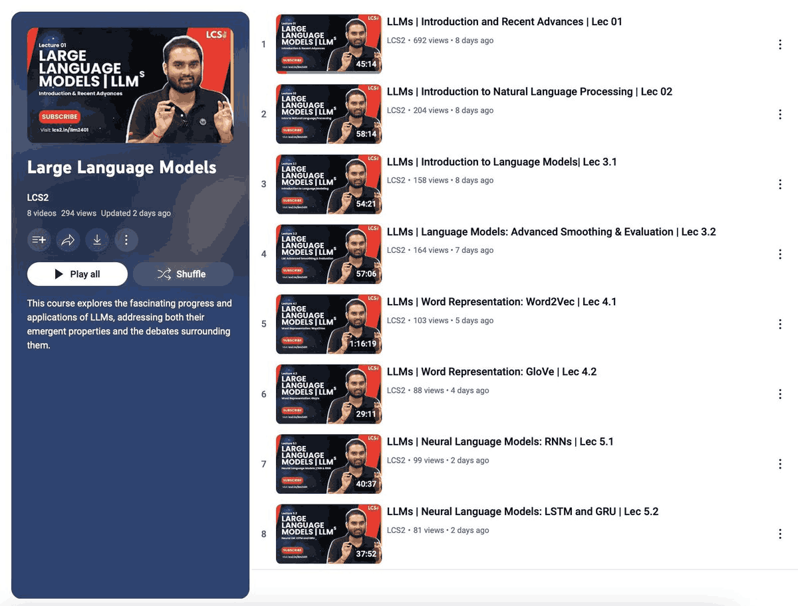
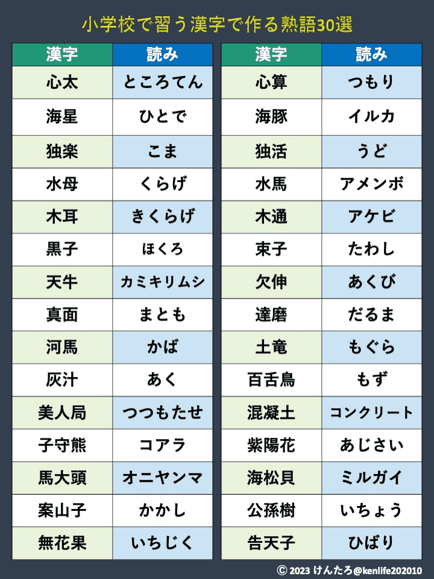

## 封面图 : 拍摄于 東京都千代田区九段北 1-1-1 　俎橋児童遊園

日本有个神叫 [福禄寿](https://ja.wikipedia.org/wiki/福禄寿),

这个雕像是 1986 年为了纪念哈雷彗星接近地球而建立的。

> 寿人遊星

也许设计该雕像的人认为福禄寿神的长寿（还有长脑袋？😄）和哈雷彗星的尾巴很像然后才有了该作品吧。（盲猜 🤣）

哈雷彗星的轨道周期约为 76 年，最近一次接近地球是 1986 年，下一次接近地球是 2061 年。（雕像背后有描述）

关于该雕塑具体可以看看这篇文章（日文）：[俎橋児童遊園にいる寿人遊星は未来につながっていた](https://citywalk2020.hatenablog.com/entry/2024/02/20/100002)

## 本周新闻

### 1. 周一日经指数再次暴 4451 日元，创历史最大单日跌幅，抹去一年多的涨幅

## 效率工具

### 1. 一款无代码搭建数据库应用的工具：Teable

[Teable](https://github.com/teableio/teable) 是 Airtable 的开源替代品，类似操作电子表格一样创建复杂的企业级数据库应用，无需编写代码。

> Ref: [一款无代码搭建数据库应用的工具：Teable](https://x.com/aigclink/status/1821776312819970315)

### 2. 免费且无需联网的 AI 抠图

之前也发过类似的工具，比如[Remove.bg](https://www.remove.bg/) ，这次推荐的是 [AI 抠图工具鲜艺](https://kt.94xy.com/) ，内嵌大模型，快至毫秒级，无需联网，支持批量处理。

## 技术知识

### 1. 从零开始学习 LLM 原理和实战

<iframe width="560" height="315" src="https://www.youtube.com/embed/zMn37YxPD6I?si=2ZSeQtBOHpx0i4ds" title="YouTube video player" frameborder="0" allow="accelerometer; autoplay; clipboard-write; encrypted-media; gyroscope; picture-in-picture; web-share" referrerpolicy="strict-origin-when-cross-origin" allowfullscreen></iframe>

## 语言学习

### 1. 【日语】那些汉字和发音风马牛不相及的单词

> Ref: [難読漢字](https://x.com/kenlife202010/status/1821298305726620065)

## 生活趣味

### 1. 《肖申克的救赎》经典台词

任何一个你不喜欢，又离不开的地方；任何一种你不喜欢，又摆脱不了的生活；这就是监狱。如果你感到痛苦和不自由，希望你心中永远有一团不会熄灭的火焰，不要麻木，不要被同化。

--肖申克的救赎

### 2. 减脂健康早餐菜单

> Ref: [减脂健康早餐菜单](https://x.com/Cryptoeth10w/status/1816989459130515773)
