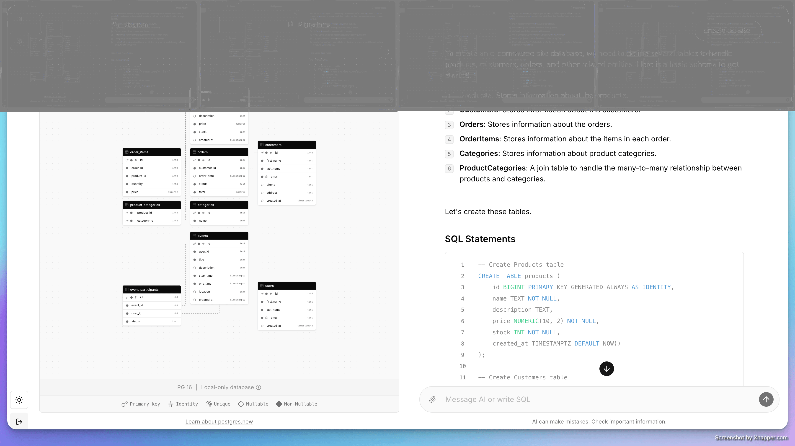

## 封面图 : 台风 🌀 中的百日红

拍摄于东京 2024 年 8 月 16 日（星期五） 梅雨结束了，台风又来了 🌀 （2024 年的第 7 号台风）。

BTW，百日红的日语的名字直译叫：🐒 猴也滑， 因为它的树皮很光滑 🤣。

## 本周新闻

## 效率工具

### 1. 让截图更好看，为截图添加背景的工具

这类工具有很多，之前也介绍过一些，这次介绍的是 [SocialScreenshots](https://socialscreenshots.com/editor) 。

这个工具可以为截图添加背景，而且如其名，保存时可以选择不同的尺寸，适合在社交媒体上分享。

### 2. 对标 Auth0 的开源身份认证系统: Stack Auth

[Stack Auth](https://github.com/stack-auth/stack) 是一个开源的身份认证系统，类似于 Auth0。

### 3. 只需要一张照片即可进行换脸直播: Deep Live Cam

[Deep Live Cam](https://github.com/hacksider/Deep-Live-Cam) 是一个换脸直播的工具，只需要一张照片即可进行换脸直播。

目前只支持 Windows。

> 可以玩玩，但不要用于违法用途哦。

### 4. Supabase 出品的用自然语言生成 SQL 的开源工具： postgres.new

[postgres.new](https://github.com/supabase-community/postgres-new) 是 Supabase 出品的用自然语言生成 SQL 的工具。

它基于用 WASM 写的 [PGLite](https://github.com/electric-sql/pglite), 所以可以直接在浏览器中运行。

## 技术知识

### 1. Google 出品的 Rust 教程: Comprehensive Rust 🦀

[Comprehensive Rust 🦀](https://google.github.io/comprehensive-rust/zh-CN/index.html) 是 Google 出品的 Rust 教程。

除英文版外，还有中文版，日文等语言版本。

### 2. 「多模态语言模型」讲解视频: pytorch-paligemma

「多模态语言模型」讲解视频！🔥 6 小时手把手视频课程 ⚡️

- 每一步都有详细「图文并茂」解释
- 手把手写代码，了解多模态语言模型核心机制
- 教你实现一个「多模态语言模型」

<iframe width="560" height="315" src="https://www.youtube.com/embed/vAmKB7iPkWw?si=MLPuSBzn1fb6gzRA" title="YouTube video player" frameborder="0" allow="accelerometer; autoplay; clipboard-write; encrypted-media; gyroscope; picture-in-picture; web-share" referrerpolicy="strict-origin-when-cross-origin" allowfullscreen></iframe>

> Ref: [多模态语言模型](https://x.com/tuturetom/status/1821727291296366593)

## 语言学习

### 1. [日语] 一些叠字单词

> Reference: [畳語をまとめ](https://x.com/kenlife202010/status/1822747899765440514)
