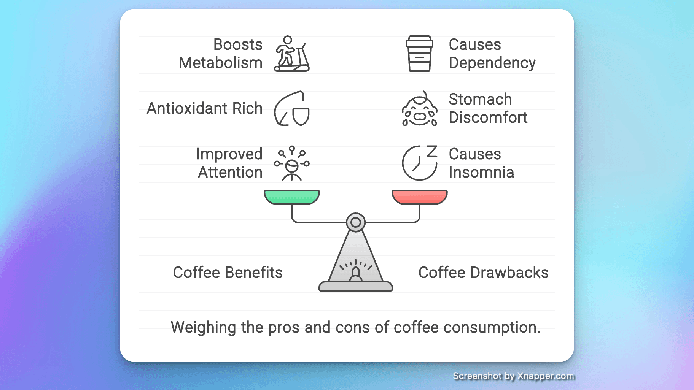

## 封面图 : 拍摄于 WeWork

WeWork 环境不错，16 点以后还提供免费啤酒 🍺，推荐下 😄


## 本周新闻

### 1. 中国 3A 游戏 《黑神话：悟空》 发售

《[黑神话：悟空](https://zh.wikipedia.org/zh-cn/黑神话：悟空)》是一款由游戏科学开发和发行的动作角色扮演游戏，被媒体誉为中国首款“3A 游戏”[5]。游戏的设计灵感源于中国古典神魔小说《西游记》。


## 效率工具

### 1. 【AI 工具】文字生成产品示意图： Napkin.AI

[Napkin.AI](https://www.napkin.ai/) , 是我最近用过的最好的 AI 工具了。

直截了当地举个例子吧。

- 输入：

```markdown
### 喝咖啡的好处

1. 提升注意力和集中力：咖啡因是一种中枢神经系统兴奋剂,可以帮助提高注意力和集中力,减少疲劳感。

2. 富含抗氧化剂：咖啡中含有大量抗氧化剂,有助于对抗体内自由基,降低某些疾病的风险。

3. 促进新陈代谢：咖啡因可以加速新陈代谢,帮助脂肪分解,进而有助于体重管理。

### 喝咖啡的坏处

1. 引起失眠和焦虑：摄入过多的咖啡因可能导致睡眠问题、焦虑和心跳加速。

2. 胃部不适：咖啡中的酸性成分可能刺激胃酸分泌,导致胃部不适或消化问题,特别是空腹饮用时。

3. 依赖性：长期高剂量饮用咖啡可能导致对咖啡因的依赖,戒断时可能会出现头痛、易怒等症状。
```

- 输出（直出，没有手动编辑）：



目前支持中文输入（但不能直接中文输入法，可以拷贝复制到编辑框）， 但输出的结果是英文的。

### 2. SNS 视频下载工具： cobalt

[cobalt](https://cobalt.tools/) 是一个 SNS 视频下载工具，界面清爽没有广告，目前支持以下平台。

- bilibili
- dailymotion videos
- facebook videos
- instagram posts & reels
- loom videos
- ok video
- pinterest (all media)
- reddit videos & gifs
- rutube videos
- snapchat stories & spotlights
- soundcloud
- streamable.com
- tiktok videos, photos & audio
- tumblr video & audio
- twitch clips
- twitter videos & voice
- vimeo
- vine archive
- vk video & clips
- youtube videos, shorts & music

### 3. [AI] 快手出品的可图 AI 试衣

可图虚拟试衣功能来了：可图 AI 试衣
给定人物模特图、选定衣服，即可生成自然美观、保持衣服 SKU 的人物试穿效果

再结合可灵图生视频，生成运动连贯的 AI 试衣短视频，可实现从模特素材图到模特短视频的全流程生成


**特点**：

- 1、保持衣服款式细节 ‍：支持保持上装、长裙多种衣服类型，保留衣服图案、文字花纹细节，实现商品 SKU 服饰同款保持效果

- 2、自然的试穿效果 ‍：支持生成贴合人物的自然试穿效果，就像本人穿衣服拍照一样，支持室内人物、室外街拍多种场景，生成效果符合物理客观规律

- 3、生成能力：支持跨越不同年龄、性别、种族人物模特及背景生成，支持海内外电商模特素材生成需求

Demo：https://huggingface.co/spaces/Kwai-Kolors/Kolors-Virtual-Try-On

Github：https://github.com/Kwai-Kolors/Kolors

> Ref: [可图虚拟试衣功能来了：可图 AI 试衣@aigclink](https://x.com/aigclink/status/1826791947228643556)

### 4. 社交媒体的视频和音频下载工具：Cobalt

[Cobalt](https://cobalt.tools/) 是一个社交媒体的视频和音频下载工具。

可以下载 Twitter、Youtube 等绝大多数社交媒体的视频和音频。

类似的工具很多，主要是它界面简洁没有广告，输入连接即可下载。

## 技术知识

### 1. [Golang] 介绍 Golang Map 的文章

[Go Maps Explained: How Key-Value Pairs Are Actually Stored](https://victoriametrics.com/blog/go-map/) 图解了 Golang Map 的实现原理，非常清晰易懂，推荐。

作者还有其他关于 Golang 的文章，也很不错。有兴趣的可以关注他的 Twitter（X）：[@func25](https://x.com/func25)


## 生活趣味

### 1. 鸭跖(zhí)草

鸭跖草， 小时候看过的一种草，还是通过日文知道了它的名字 😄。

日文名叫 露草（ツユクサ）。 好像是因为它的花朵早晨盛开中午就枯萎，让人联想到晨露，因此被命名为“露水草”。

英文名称“Dayflower”的由来应该也取其意吧。

传统中医学认为，鸭跖草具有行水、清热、凉血、解毒的功效。

现代医学研究显示，鸭跖草中分离出的一些活性成分具有抗高血糖、抗肥胖等作用和对流感的治疗作用，对一些致病菌的抑制作用等。

鸭跖草在艺术创作、纺织印染、植物學研究、重金属污染治理等领域也有较多的用途。

具体看：[鸭跖草@维基百科](https://zh.wikipedia.org/zh-cn/鸭跖草)


> Ref: [照片引用自](https://x.com/KorakuenGarden/status/1826816142692024495)
