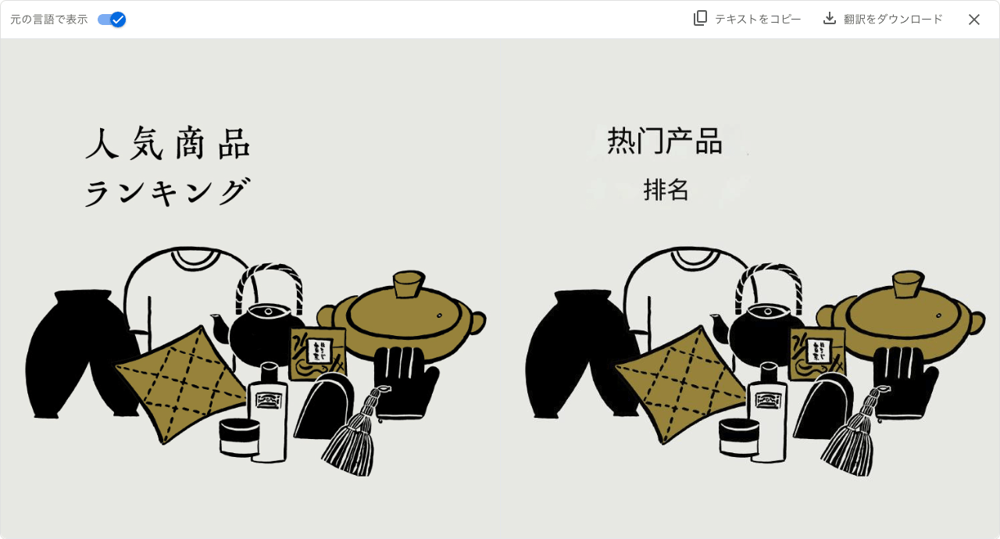

## 封面图片: 拍摄于东京神田

## 效率工具

### 1. Google 图片翻译工具

Google 图片翻译工具是一个可以帮助你直接翻译图片中的文字并生成新图片的工具。

测试了下，效果还是不错的，可以识别出图片中的文字并翻译成你想要的语言。

目前对于中文和日文的识别还是比较准确的，但是对于竖排的日文的翻译结果显示有些问题。

下面是一些测试的图片的效果：

## 技术知识

### 1. [@karpathy](https://x.com/karpathy) 分享了一个基于 Git Diff 快速生成 Commit Msg 的 [代码块(gist)](https://gist.github.com/karpathy/1dd0294ef9567971c1e4348a90d69285)和 CLI 🔥

下次写完代码再也不要为了写 Commit Msg 而烦恼了！

### 2. 用动画+板书讲机器学习 & 矩阵原理

<iframe width="560" height="315" src="https://www.youtube.com/embed/gXbThCXjZFM?si=p82MMuRc8tzTxDrf" title="YouTube video player" frameborder="0" allow="accelerometer; autoplay; clipboard-write; encrypted-media; gyroscope; picture-in-picture; web-share" referrerpolicy="strict-origin-when-cross-origin" allowfullscreen></iframe>

## 生活趣味

### 1. 【旅游】 日本上高地试试摄像头: [4K] 上高地河童橋ライブカメラ KAMIKOCHI KAPPA-BASHI LIVE CAMERA

<iframe width="560" height="315" src="https://www.youtube.com/embed/Iv2VUE_UhRQ?si=5550nu1lHxh2Ibzd" title="YouTube video player" frameborder="0" allow="accelerometer; autoplay; clipboard-write; encrypted-media; gyroscope; picture-in-picture; web-share" referrerpolicy="strict-origin-when-cross-origin" allowfullscreen></iframe>

> Ref: [Youtube](https://www.youtube.com/watch?v=Iv2VUE_UhRQ)

### 2. 焦虑的原因就两条

焦虑的原因就两条：想同时做很多事，又想立即看到效果。

周岭《认知觉醒》
