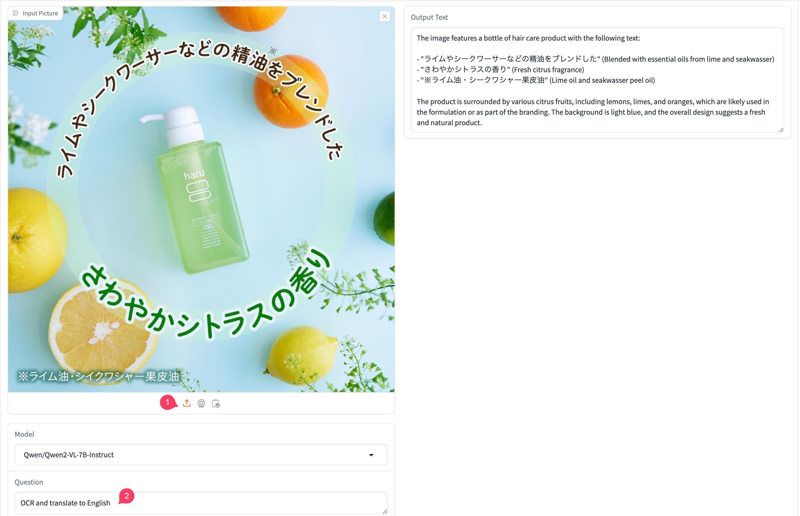
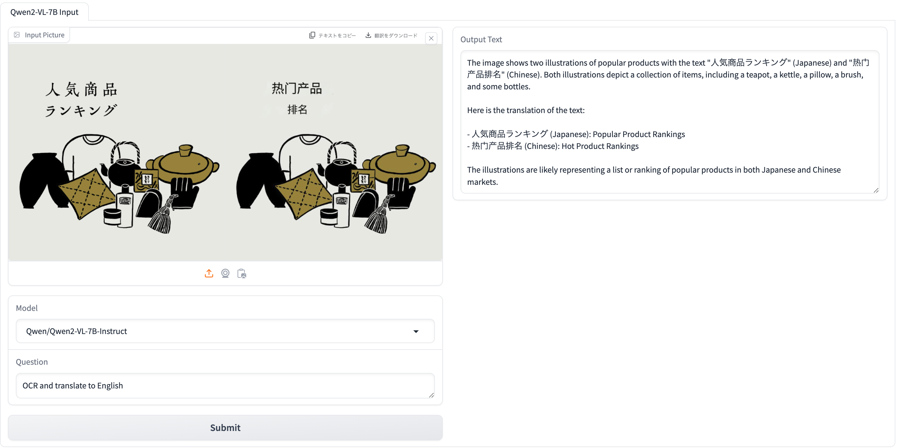
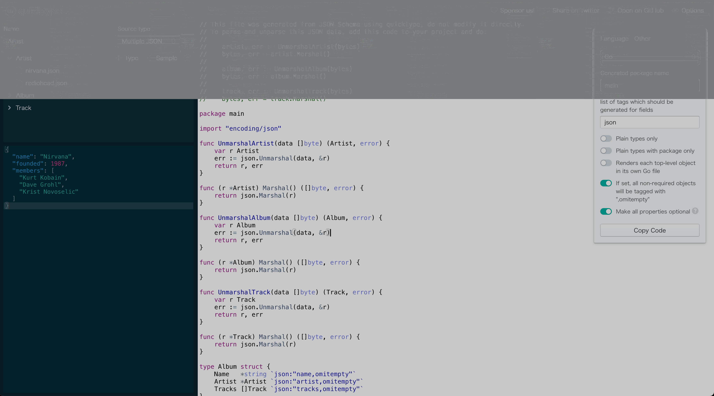
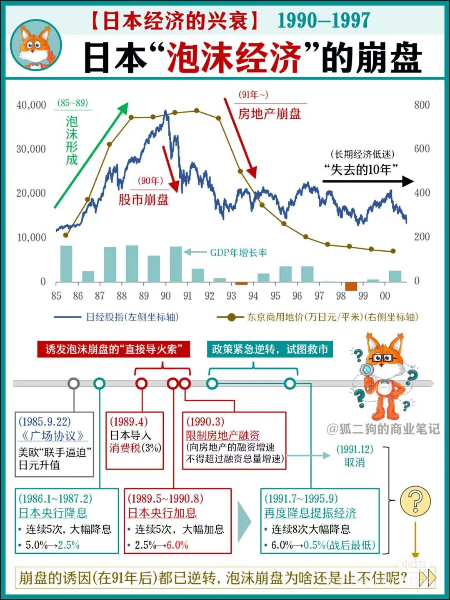

## 封面图 : 图片来自于 [@ハスカップ 07](https://x.com/haskap1017/status/1831252385228042554)

## 效率工具

### 1. 【AI】阿里巴巴发布 Qwen2-VL-7B 模型

阿里巴巴发布了 Qwen2-VL-7B 模型，对图片中的文字识别（OCR）效果很不错。

[Qwen2-VL-7B Demo@HuggingFace](https://huggingface.co/spaces/GanymedeNil/Qwen2-VL-7B)

- 不规则排列的文本识别
  

- 多语言文本识别
  

### 2. JSON 生成代码工具：Quicktype

[Quicktype](https://app.quicktype.io/) 是一个 JSON 生成代码工具，可以根据 JSON 数据生成对应的代码，支持多种语言，而且支持批量文件一次性生成。

## 技术知识

### 1. [AI] Decoder-only 的 LLM 为什么需要位置编码？

[Decoder-only 的 LLM 为什么需要位置编码？](https://kexue.fm/archives/10347)

### 2. [UIUX] 这个确认密码交互不错

> Ref: [这个确认密码交互不错](https://x.com/lencx_/status/1831533552015704350)

## 生活趣味

### 1. 健康管理学习手册

[健康管理学习手册](https://www.yuque.com/yaoyao/health) 是网友整理的一份关于健康管理的学习手册。

对身体健康有兴趣的朋友可以看看。

[把控健康：健康管理手册.pdf](https://drive.google.com/file/d/1YnlpzzE_GmDRqPe7m3qltBESr1Yl-UYM/view)

### 2. 日本泡沫经济的崩盘

来看看当时日本经济的崩盘，我们是不是可以从中学到一些东西呢。

> Ref: [日本泡沫经济的崩盘](https://x.com/laozhangisme/status/1831112928344654051)
