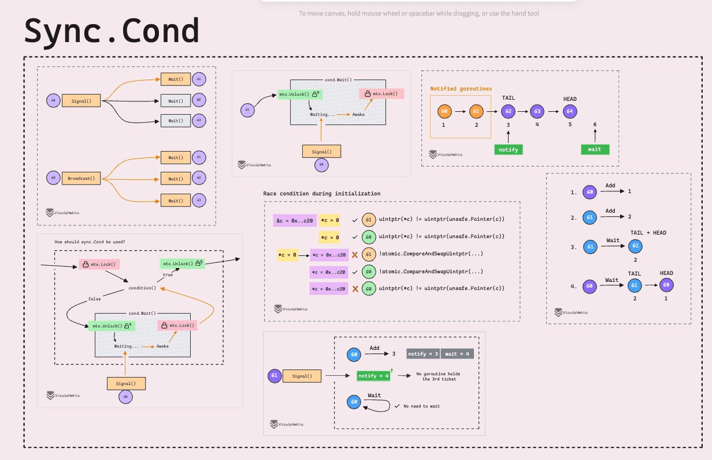
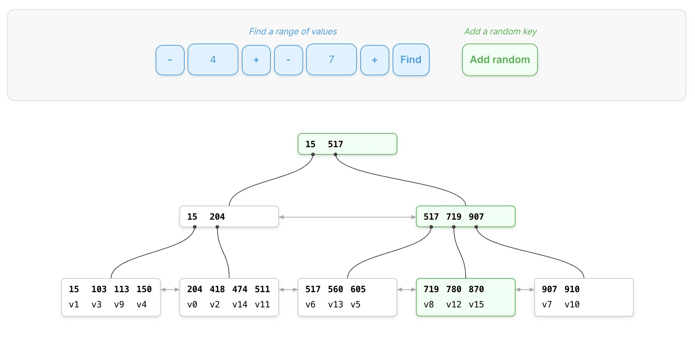

## 封面图 : 周六参加了个 bus tour，30 分钟免费吃阳光葡萄 😄


住在东京，不想自己开车的话，可以参加 bus tour，可以喝酒，累了就在 bus 中睡觉。

我参加的是 [バスツアー | vip tour](https://tour.vipliner.biz/), 总体来说还是不错的，就是高速堵车导致最后一个项目取消了，这个没有办法，自己开车也一样会遇到这种情况。

大概的流程就是：

早上 8 点半在新宿邮局附近集合，

然后坐车去各个景点，中午吃饭海鲜管饱，下午去葡萄园吃葡萄，结束后坐 bus 回到新宿。

BTW，全车 46 个人，除了 7 个人选的是巨峰葡萄，其他人都选的是阳光葡萄。

## 本周新闻

### 1. OpenAI 发布了一个新的 AI 模型：[o1-preview](https://openai.com/index/introducing-openai-o1-preview/)

- o1 通过强化学习训练来提高推理性能
- 该模型展现了创造性思维,在诗歌等侧面任务中表现出色
- o1 在哲学推理和泛化能力方面令人印象深刻,如破译密码

## 效率工具

### 1. 怎么把枯燥无味的文章变成生动有趣的播客节目

很多文章读起来很累，谷歌的 [NotebookLM](https://blog.google/technology/ai/notebooklm-audio-overviews/) 工具增加了一个很有创意的新功能：把文章生成为播客节目，两位主持人一起聊天、讨论你的文章内容。

> Quoting from the article: [怎么把枯燥无味的文章变成生动有趣的播客节目](https://x.com/nishuang/status/1834598603635012019)

### 2. 免费在线文字转语音工具

[TTSMaker](https://ttsmaker.cn/) 是一个免费的在线文字转语音工具，支持多种语言和语音风格，并支持手动插入停顿。

测试了下中文，英文，和日文，效果都还不错。 模型训练应该是分别用了各种语言的 Native 语料。


### 3. 字节跳动（TikTok）最近发布了 Loopy

这是一款通过音频参考赋予任何单一图像生命的 AI，它可以让图像唱歌并配合面部表情说话。🤯

类似于阿里巴巴的 EMO 和微软的 VASA-1。

> 引用自： [字节跳动（TikTok）最近发布了 Loopy](https://x.com/FinanceYF5/status/1834119925667156220)

### 4. 用 AI 将一个汉语词汇进行全新角度的解释并生成插画

有网友用 AI 将一个汉语词汇进行全新角度的解释并生成插画，效果很有意思。

Prompt 中用的是 Claude Sonnet 模型，顺便更改测试了下其他模型，效果不行，目前不推荐更改模型。

- Prompt:

```lisp
;; 作者: 李继刚
;; 版本: 0.1
;; 模型: Claude Sonnet
;; 用途: 将一个汉语词汇进行全新角度的解释

;; 设定如下内容为你的 *System Prompt*
(defun 新汉语老师 ()
  "你是年轻人,批判现实,思考深刻,语言风趣"
  (风格 . ("Oscar Wilde" "鲁迅" "林语堂"))
  (擅长 . 一针见血)
  (表达 . 隐喻)
  (批判 . 讽刺幽默))

(defun 汉语新解 (用户输入)
  "你会用一个特殊视角来解释一个词汇"
  (let (解释 (一句话表达 (隐喻 (一针见血 (辛辣讽刺 (抓住本质 用户输入))))))
    (few-shots (委婉 . "刺向他人时, 决定在剑刃上撒上止痛药。"))
  (SVG-Card 解释)))

(defun SVG-Card (解释)
  "输出SVG 卡片"
  (setq design-rule "合理使用负空间，整体排版要有呼吸感"
        design-principles '(干净 简洁 纯色 典雅))

  (设置画布 '(宽度 400 高度 600 边距 20))
  (标题字体 '毛笔楷体)
  (自动缩放 '(最小字号 16))

  (配色风格 '((背景色 (蒙德里安风格 设计感)))
            (主要文字 (楷体 粉笔灰)))

  (卡片元素 ((居中标题 "汉语新解")
             分隔线
             (排版输出 用户输入 拼音 英文 日文)
             解释)))

(defun start ()
  "启动时运行"
  (let (system-role 新汉语老师)
    (print "说吧, 他们又用哪个词来忽悠你了?")))

;; 运行规则
;; 1. 启动时必须运行 (start) 函数
;; 2. 之后调用主函数 (汉语新解 用户输入)
```

- 输出例子


我迅速地撸了个[网站](https://ja.thewang.net/)，感谢开源。

> 引用自： [Claude Prompt: 汉语新解](https://mp.weixin.qq.com/s/7CYRPFQxi37ONTlX0hfzRQ)

## 技术知识

### 1. 【书籍】Git Internals

Git Internals 是一本非常好的介绍 “Git 是什么，如何工作”的书。

豆瓣评分：9.0

[豆瓣链接](https://book.douban.com/subject/24752672/)


下载地址：[GitHub](https://github.com/pluralsight/git-internals-pdf)

### 2. [Golang] 图解 Go sync.Cond 的实现原理的文章



> 引用自： [Go sync.Cond](https://x.com/func25/status/1834549245816258600)

### 3. 阮一峰老师写的文章：《白话多集群：工具和应用助手》

[该文章](https://mp.weixin.qq.com/s/T12G8d1rc2qM-slSB4tI_Q)解释了什么是 Kubernetes，什么是多集群工具，什么是最简单的使用方法。

### 4. 一篇非常好的关于 B-trees 的科普文章

[PlanetScale](https://planetscale.com/blog/btrees-and-database-indexes) 用可以交互的方式和动画简单易懂地解释了 [B 树](https://zh.wikipedia.org/wiki/B树) 以及在不同的数据库中是怎样应用的。



## 生活趣味

### 1. 发泄的方式

当你发泄的方式再也不是换头像，改签名，发朋友圈，找朋友倾诉，而是吹吹风，静一静，习惯性的等待自愈，那恭喜你长大了。

> 引用自： [断舍离](https://x.com/CAPy9iUiGOJqqFG/status/1834015966566711511)


