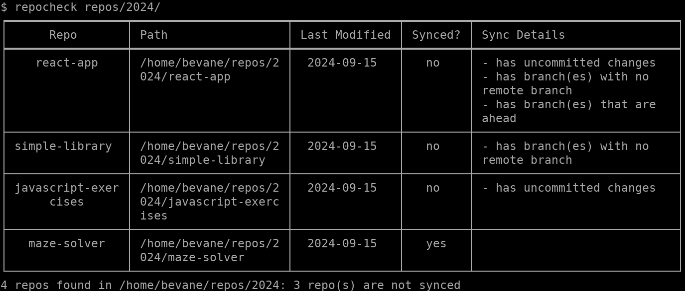
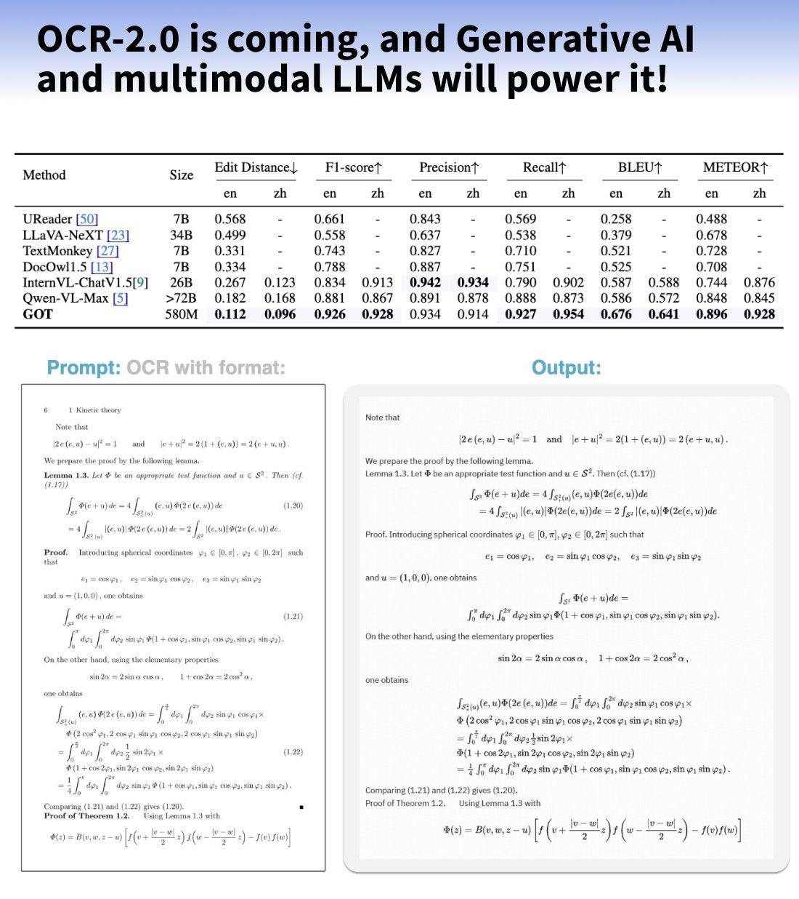
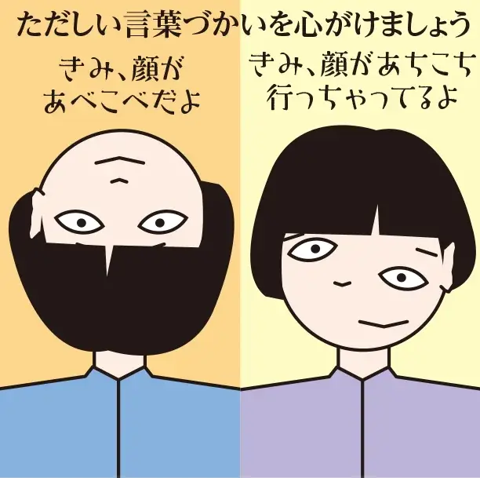
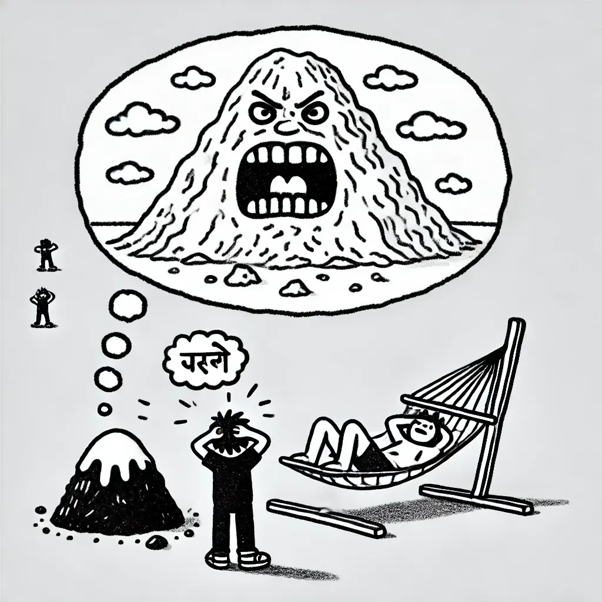
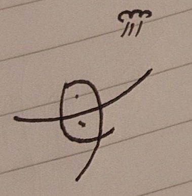
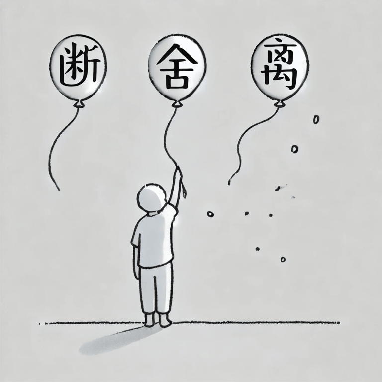

## 封面图 : 满月下的晴空塔

> 图片来自于 [X@haskap1017](https://x.com/haskap1017/status/1836535066568331588)

## 效率工具

### 1. [AI] Seed-Music：统一音乐生成框架

豆包的音乐生成框架，除了支持常规的曲风和歌词生成歌曲，

1）支持克隆人声生成歌曲，输入人声和参考歌曲，克隆人声来唱参考歌曲。
2）支持保持旋律不变，仅修改歌词。

> Reference: [X@Gorden_Sun](https://x.com/Gorden_Sun/status/1836053551828947323)

### 2. [git] 一个命令行工具，列出本地的所有 git 仓库

> Reference: [X@golangch](https://x.com/golangch/status/1835261204060602712)

### 3. 一款自动化剪辑长视频精彩部分并生成短视频的工具

[AI Youtube Shorts Generator](https://github.com/SamurAIGPT/AI-Youtube-Shorts-Generator)这款开源工具可以自动化剪辑长视频精彩部分并生成短视频，支持自定义剪辑时长、添加背景音乐等功能。

它能够一键下载视频、使用 Whisper 转录、利用 GPT-4 提取精彩片段、说话人检测、竖屏剪辑，自动生成全新的短视频。

> Reference: [X@GoJun315](https://x.com/GoJun315/status/1834909482146725924)

### 4. [AI] OCR 识别工具

号称 OCR 2.0，580M 参数的端到端 OCR 模型，拿到了 BLEU 0.972 分数。

在线体验 👉 https://huggingface.co/ucaslcl/GOT-OCR2_0
开源地址 https://github.com/Ucas-HaoranWei/GOT-OCR2.0/

> Reference: [X@tuturetom](https://x.com/tuturetom/status/1835166243323887646)

## 技术知识

### 1. 《大模型应用开发动手做 AI Agent》

这本 2024 年上半年出版的书深入浅出地讲解了 AI Agent 和多智能体系统（MAS）。

作者通过实战项目，帮助读者快速上手 GPT-4、OpenAI API 等前沿技术。

## 语言学习

### 1. [日语] あべこべ (彼辺此辺)

在日语中，あべこべ是一个常用的词，用来表示事物的颠倒、相反。

例如，「あべこべになる」表示事物颠倒、相反。

> 图片引用自: [笑える国語辞典](https://www.waraerujd.com/blank-920)

## 生活趣味

### 1. 人生没有过不去的坎

人生没有过不去的坎，只有过不去的心。能够折磨你的，从来都不是别人，而是你自己的内心。所以你一定要学会自渡。烦躁的时候不要说话，也不要做任何决定，找个安静的地方静一静。你要明白，成年人的烦恼向谁说都不合适。你要学会自我消化，凡事想开点、看淡点、简单点、糊涂点。永远记住一句话，情绪不能解决任何问题。生气有毒，伤人伤己，众生都苦每个人都苦，苦和累自己都熬不过来，挺着过去，自己都搞不定，还有心情，哪有本事管你的事，自己去度吧，自己去度过吧，人生除了生死都是小事，要么生要么死，自己去闯自己的难，苦，自己的苦自己的累，自己去搞定自己一切的事情，过完此生就罢了。

> Reference: [X@Morris_LT](https://x.com/Morris_LT/status/1836731123717845021)

### 2. 跳舞的 "母"

[X 网友](https://x.com/ghost03type/status/1836228468016845153)的妈妈画的跳舞的“母”字（图 1），是不是很像在跳芭蕾的女子（图 2 by AI ）呢，快乐跃然纸上，有没有 😄。

### 3. 断舍离

《断舍离》：无能为力的事，当断。生命中无缘的人，当舍。心中烦欲执念，当离。

