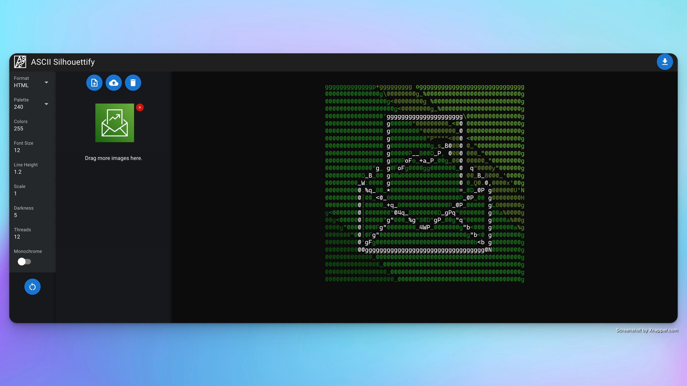
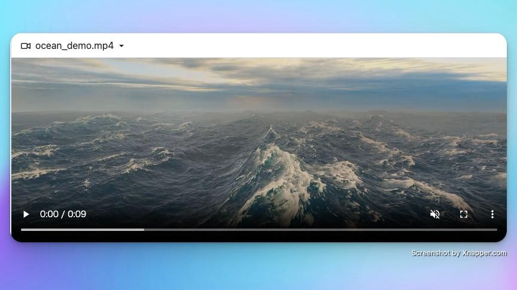
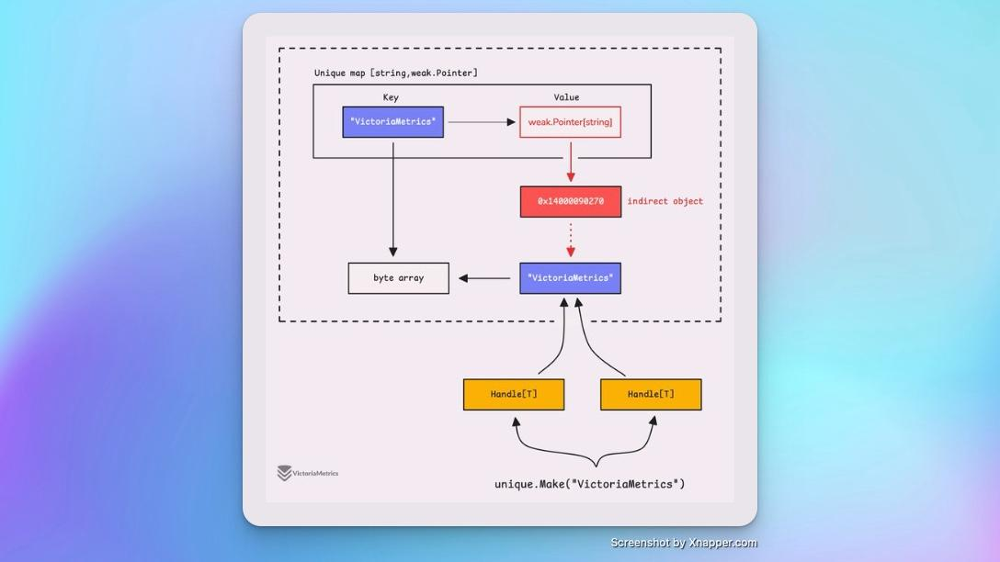
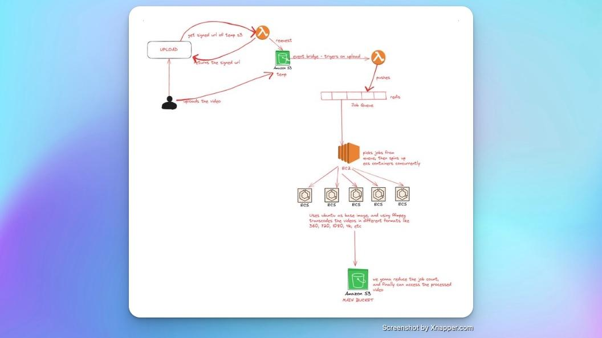

## 封面图 : 长得像葫芦的南瓜 🎃

拍摄于东京超市，日文名字叫「バッターナッツ」，英文 Butternut 的直译。在 wikipedia 中没有找到对应的中文名字。

## 本周新闻

### 1. 特斯拉上海超级工厂出口第 100 万辆汽车

[老马特意发推]((https://x.com/elonmusk/status/1840013427202306416)表示祝贺和感谢！

## 效率工具

### 1. 【图片处理】图片转 ASCII 工具： Silhouettify

[Silhouettify](https://meatfighter.com/ascii-silhouettify/spa/index.html#/) 是一个在线工具，可以将图片转换为 ASCII 轮廓图。

效果很不错，但是不大适用于复杂的图片，或者轮廓不是很清晰的图片。当然这并非该工具的原因，是因为转换成 ASCII 后，图片的细节会丢失从而影响图像的识别度。

### 2. 海浪 🌊 渲染工具：GodotOceanWaves

[GodotOceanWaves](https://github.com/2Retr0/GodotOceanWaves) 是一个基于 FFT 海浪渲染工具，利用方向性海洋波谱的傅里叶逆变换来生成波浪。提供了一套简洁的参数，允许在脚本中实时修改波浪属性，以模拟各种不同的海洋波浪环境。

### 3. 怎样将保存一个完整的网站到本地？

开源库 [SingleFile](https://github.com/gildas-lormeau/SingleFile) 提供各种浏览器插件以及 CLI 工具可以很方便地把网站的保存成一个文件。

## 技术知识

### 1. [Golang] 1.23 版本发布

[Golang 1.23](https://blog.golang.org/go1.23) 版本发布，新增的 `unique` 包是优化资源的绝佳方式。

例如，如果你有很多相同的字符串，比起过去的一遍又一遍地创建完全相同的字符串（或其他值）的副本，

它允许你重用这些值所占用的内存。

> Ref: [The unique package in Go 1.23 is a great way to optimize your resources](https://x.com/func25/status/1839966646435491947)

### 2. [Golang] Clean Architecture 中的 DB transaction 的处理方式

[这篇文章](https://threedots.tech/post/database-transactions-in-go/)简单易懂地介绍了 Clean Architecture 中的 DB transaction 的处理方式。

将需要保持强一致性的数据放在同一个聚合体中，并为该聚合体创建一个 repository。

> Keep the data that needs to be strongly consistent within the same aggregate. Keep a repository for the aggregate.

### 3. [Golang] 如何构建视频转码服务

一个使用 Go 语言、Gin、AWS、Pulumi、MongoDB 和 Redis 构建的可扩展[视频转码开源服务](https://github.com/harsh082ip/Video-transcoder_Go)。

## 生活趣味

### 1. "3D" 照片打印

广州出现照相馆"新创意",10 秒就能完成拍摄，一台扫描，站上去转一圈完成，让纪念不再是平面的。

> Ref: [3D 照片打印](https://x.com/inen1546737/status/1837367484124647682)
