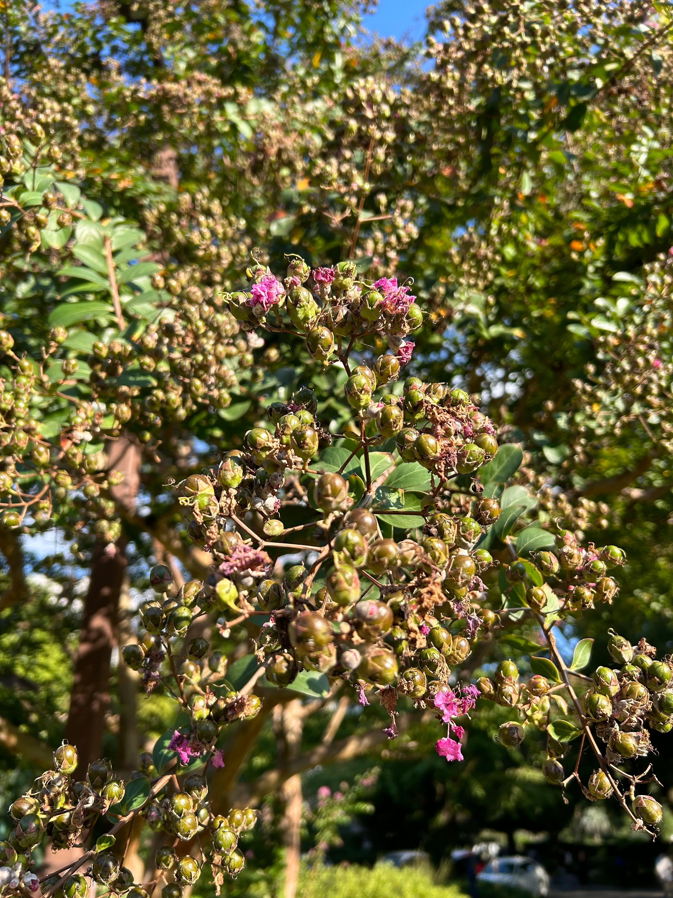
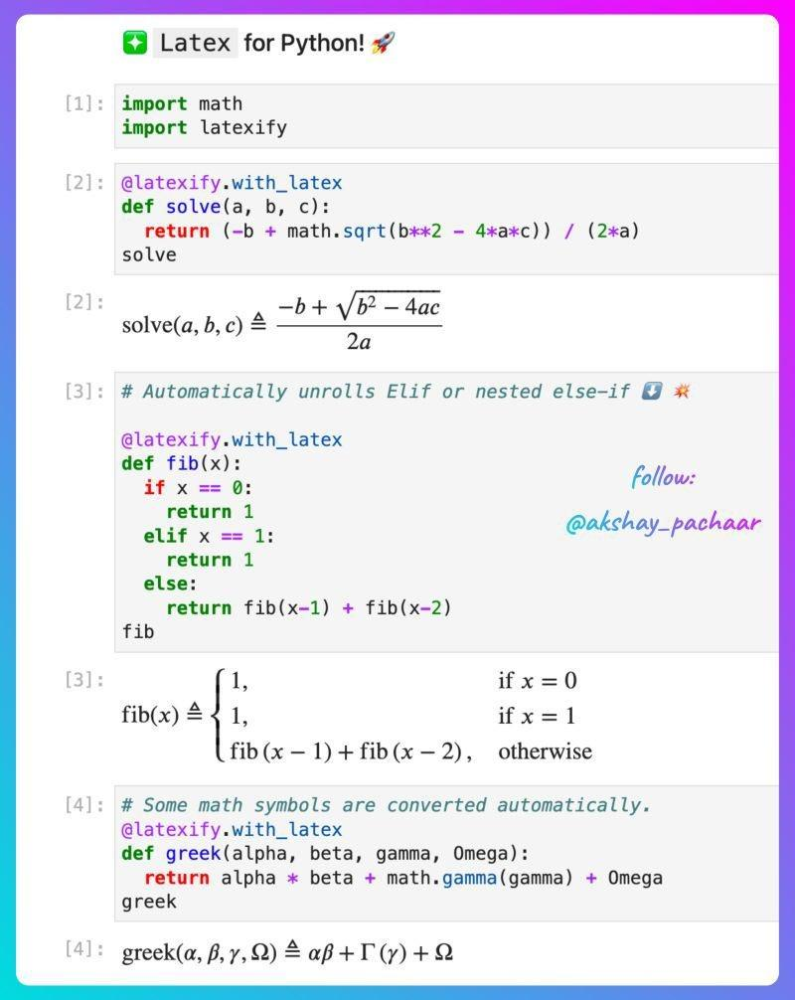

## 封面图 : 百日红也快掉光了，秋天的气息越来越浓了

2024/10/13 拍摄于东京日比谷公园。

## 本周新闻

### 1. 中国股市疯狂的一周

## 效率工具

### 1. 【AI】图片生成视频工具： HailuoAI

我尝试了一下，生成的视频效果还不错，不过现在好像排队人很多，生成需要等待。

- 输入： 一张牵牛花的照片 + prompt（花朵上有只蜜蜂）
- 输出： [生成的视频](https://x.com/wifecooky/status/1844553806639661154)

### 2. 开源的照片管理工具： immich

1. 开源免费，Docker Compose 直接部署到 Nas 上
2. 纯本地运行，没有隐私风险
3. 安卓 iOS 的客户端都挺好用，完美解决多平台照片备份、同步、浏览问题
4. AI 识图能力非常非常强，特别是人物识图能力强的夸张
5. 对 Live 图、和视频都支持的很好
6. 地图模式也非常好用
7. 照片的时间线、和照片搜索功能也都做的很完善

> Reference: [备份完了几百 G 的照片，再次感叹下 immich 的体验太棒了](https://x.com/pengchujin/status/1843865848559350064)

## 技术知识

### 1 【Python】Latex for Python: LateXify

`latexify` 是一个 Python 库，可以将 Python 代码转换为 LaTeX 格式的数学公式。

只需要在对象函数上加上 `@latexify.with_latex` 装饰器，就可以将函数转换为 LaTeX 格式的数学公式。

### 2. 【书籍】卡内基梅隆大学 《无限深入纯数学》

作者的目标是帮助读者从数学「消费者」变为数学《生产者》，从学习计算导数转为从导数定义推导链式法则。

免费下载地址 👉 https://infinitedescent.xyz/dl/infdesc.pdf

## 生活趣味

### 1. 得不到, 德不到

尝试让 ChatGPT 图片翻译了一下，很不错！

1. “得不到，德不到”：如果你得不到某样东西，那是因为你的德行不足。
2. “得到了，德到了”：如果你得到了某样东西，说明你的德行达到了应有的水平。
3. “德大于得”：德行比所获得的东西更加重要。
4. “得必有所失”：每一次的获得，都伴随着某种失去。

这段话表达了一种哲学观念，强调德行的重要性，获得和失去之间存在平衡。即使获得了某些东西，也可能会失去其他东西。整体上是提醒人们，在追求获得的过程中，不要忽视德行和道德的修养。

### 2. 神经元在聊天

思想思维本质上物质？ 在视频中可以看到神经元之间是如何交流的。

> Reference: [神经元在聊天](https://x.com/TaNGSoFT/status/1843272097403134458)
