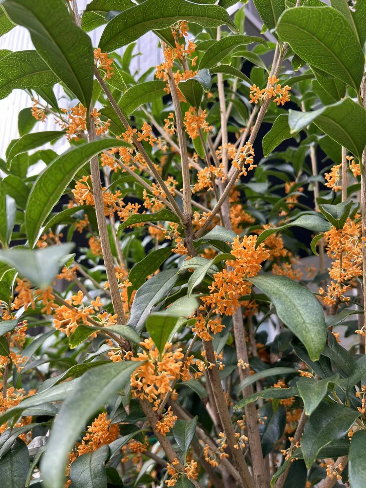
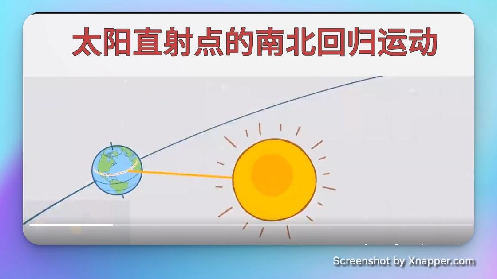

## 封面图 : 家门口的金桂满开了

## 效率工具

### 1. 一款开源且强大的文档 OCR 工具：[Surya](https://github.com/VikParuchuri/surya)

- 在 90 种语言的基准测试中，OCR 的表现优于云服务
- 任何语言的行级文本检测
- 布局分析（表格、图像、标题等检测）
- 表格识别（检测行/列）

尝试了下比 Tesseract OCR 的效果好很多，推荐！

## 技术知识

### 1. Anthropic AI 开源的 Anthropic Quick start

Anthropic AI 开源了 2 个快速开始的项目，可以帮助你快速上手使用他们的模型。

- [Customer Support Agent](https://github.com/anthropics/anthropic-quickstarts/tree/main/customer-support-agent): 一个基于 Anthropic AI 的客服机器人，可以帮助你快速搭建一个客服机器人。
- [Financial Data Analyst](https://github.com/anthropics/anthropic-quickstarts/tree/main/financial-data-analyst): 一个基于 Anthropic AI 的金融数据分析模型，可以帮助你快速搭建一个金融数据分析模型。

### 2. 开发者的认证与用户管理解决方案 Hanko

[Hanko](https://github.com/teamhanko/hanko) Clerk 和 Auth0 的开源替代品。#Golang

专注于将登录过程超越传统密码的开源身份验证和用户管理解决方案，并且可以在今天实现 100%部署。

### 3. 双语书制作工具：bilingual_book_maker

[bilingual_book_maker](https://github.com/yihong0618/bilingual_book_maker) 双语书制作者是一个使用 ChatGPT 辅助用户创建多语言版本的 epub/txt/srt 文件和书籍的人工智能翻译工具。

## 语言学习

### 1. [日语] ガーベラ

ガーベラ (Gerbera) , 非洲菊，属于菊科，是一种多年生草本植物。

昨天在奈飞看电影 “[余命一年の僕が余命半年の君と出会った話](https://www.netflix.com/title/81581946)”时看到的一个单词。

女主出口夏希演技和颜值都很惊艳，查了下[她的资料](https://ja.wikipedia.org/wiki/%E5%87%BA%E5%8F%A3%E5%A4%8F%E5%B8%8C)，原来出生于中国，加油！

## 生活趣味

### 1. 追求极致的性价比背后的时间沉默成本

不要让几块钱毁掉你的人生，追求极致性价比就是“病态”的！ #消费陷阱

> Ref: [追求极致的性价比背后的时间沉默成本](https://x.com/Blind___Gamer/status/1846797013628981339)

### 2. 容嬷嬷教你“太阳直射点的南北回归运动”

这年头的视频解说要是没点噱头都不行 😄， 视频本身做得也很清晰易懂，可以给小学生朋友学习用。

> Ref: [太阳直射点的南北回归运动](https://x.com/JZhen72937/status/1845041423240003619)

### 3. [Books] 从心理学的角度把决策的本质讲透了的一本书

