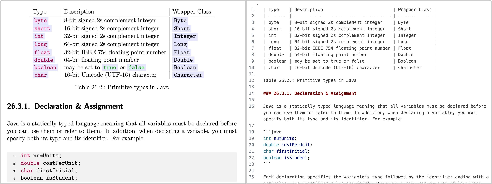

## 封面图 : 深夜散步随手拍的花

日文叫 [ランタナ](https://ja.wikipedia.org/wiki/ランタナ)（Lantana），中文好像叫[馬纓丹, 五色梅, 七色梅 等等](https://zh.wikipedia.org/wiki/馬纓丹)，之前好像也拍过。

## 本周新闻

### 1. Anthropic AI 发布新的 Claude 3.5 Sonnet 模型

升级后的 Claude 3.5 Sonnet 在各个方面都比其前代产品有了提升，尤其是在编码方面。

新版本的模型在编码方面的表现比之前的版本更好，同时还推出了一项革命性的新功能：[使用计算机](https://www.anthropic.com/news/3-5-models-and-computer-use)。

今天，这项功能已在 API 中可用，开发者可以指导 Claude 像人类一样使用计算机——查看屏幕、移动鼠标、点击按钮和输入文本。

Claude 3.5 Sonnet 是首个在公开测试版中提供计算机使用的前沿 AI 模型。

个人的使用体验如下：

- 很智能!
  例如，如果指示 “使用用户名和密码信息登录”，它会自动从 QR 码登录切换到相应的选项卡并登录!
  还有，网页页面跳转，只需指示“跳转到 aaa/bbb”即可。
- 从指示到反应比较花时间，大约需要 5-10 秒。
- 由于使用的是容器 Linux，因此无法使用 chrome（只能用 Firefox）
- 大约 10 次左右的对话就达到了 rate limit。

如果不想借助 Docker 容器的话，有人打包成了 Electron 应用: [Agent.exe](https://github.com/corbt/agent.exe) 。

### 2. 特斯拉财报超预期，股价暴涨 20%多

特斯拉发布了第三季度财报，营收和利润均超出预期，股价暴涨 20% 多。

不过我又卖飞了 😄

## 效率工具

### 1. Markdown to Slides: Marp

[Marp](https://github.com/marp-team/marp) 是一个 Markdown 到幻灯片的开源工具，支持[多种主题](https://github.com/marp-team/awesome-marp#themes)，可以导出为 PDF 或者 HTML。

它还提供了很多插件，比如

- [Marp for VS Code](https://marketplace.visualstudio.com/items?itemName=marp-team.marp-vscode)。
- [Marp CLI](https://github.com/marp-team/marp-cli) : 将 Markdown 转换为各种格式，监视文件变化，启动服务器以进行即时转换，并自定义核心引擎。
- [Marpit](https://github.com/marp-team/marpit) : 将 Markdown 和 CSS 主题转换为由 HTML/CSS 组成的幻灯片演示文稿的框架。

> Ref: [サッと Markdown でスライドを書いて GitHub で自動的に HTML と PDF を公開する方法](https://zenn.dev/koharakazuya/articles/1abe9cb8d8f936)

### 2. OCR 工具：Zerox

[Zerox](https://github.com/getomni-ai/zerox) 是一个 OCR 工具，

支持 PDF、Docx、图像等文件，先将文件统一转换为图像，再利用 gpt-4o-mini 轻松识别图像信息，并返回 Markdown 格式文件。

### 3. Android 手机投屏电脑工具：QtScrcpy

[QtScrcpy](https://github.com/barry-ran/QtScrcpy) QtScrcpy 可以通过 USB / 网络连接 Android 设备，并进行显示和控制。无需 root 权限。

同时支持 GNU/Linux ，Windows 和 MacOS 三大主流桌面平台。

### 4. 从音视频中分离人声和伴奏：demucs

[demucs](https://github.com/facebookresearch/demucs) 是一个音视频处理工具，可以从音视频中分离人声和伴奏。

## 技术知识

### 1. shadcn/ui 新出了个 Sidebar 组件

[shadcn/ui](https://ui.shadcn.com/docs/components/) 是一个基于 React 的 UI 组件库，最近新出了一个 [Sidebar 组件](https://ui.shadcn.com/docs/components/sidebar)。

[这种第三方](https://github.com/salimi-my/shadcn-ui-sidebar)的好像也可以替换掉了。

## 生活趣味

### 1. 无用的有趣知识： 怎么区分浣熊、小熊猫、狸猫、獾和果子狸？

