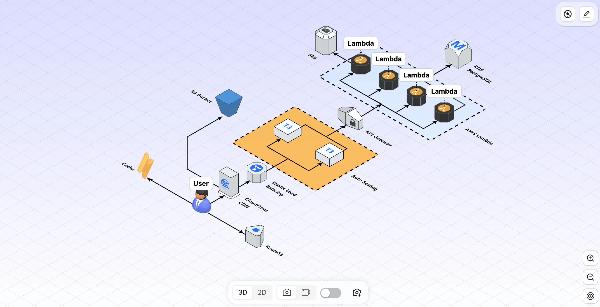
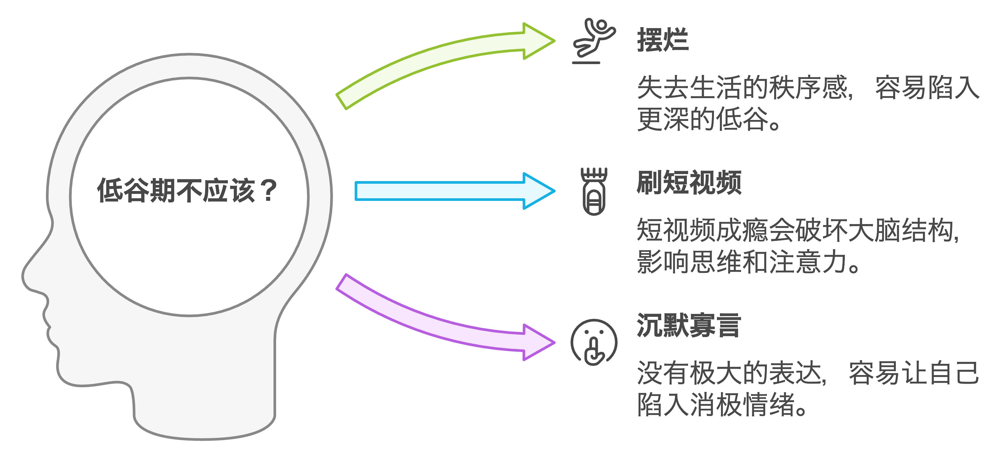
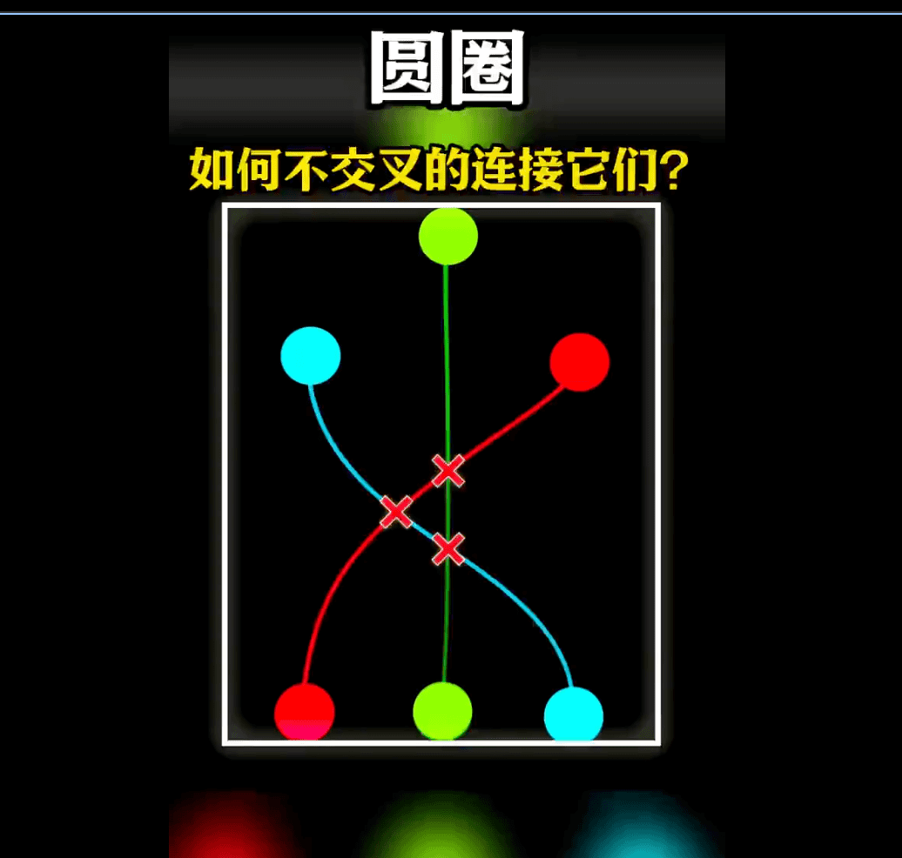
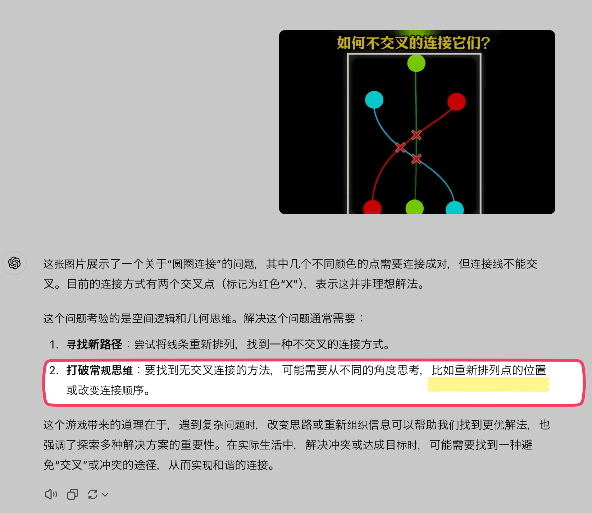

## 封面图 : 芙蓉花，拍摄于别人家门口 😄

这家人总是把家门口打扮的很漂亮，还会放一些季节性的花。 每次路过都会被吸引。

## 效率工具

### 1. 绘制 3D 架构图的工具； iCraft

[iCraft](https://icraft.gantcloud.com/) 是一个在线绘制 3D 架构图的工具，支持多种 3D 图形元素，可以帮助你绘制出更加直观的架构图,

并且还支持 2D 切换和动画回放功能，可以让你更加直观的了解整个架构的运行过程。

### 2. AI 证件照制作工具：HivisionIDPhotos

[HivisionIDPhotos](https://idphotos.hivision.com/) 是一个 AI 证件照制作工具。

HivisionIDPhoto 可以做到：

- 轻量级抠图（纯离线，仅需 CPU 即可快速推理）
- 根据不同尺寸规格生成不同的标准证件照、六寸排版照
- 支持 纯离线 或 端云 推理
- 美颜
- 智能换正装（waiting）

## 技术知识

### 1. [Golang] 一篇介绍 sync.Once 语言的文章

`sync.Once` 是 Go 语言中的一个同步工具，可以保证某个函数只会被执行一次。这篇文章介绍了 `sync.Once` 的使用方法和原理。

[原文链接: Go sync.Once is Simple... Does It Really?](https://victoriametrics.com/blog/go-sync-once/)

## 语言学习

“逻辑”一词源自希腊语的 logos，意思是“言语、思想、理性”或“理论”。

在古希腊，哲学家亚里士多德是逻辑学的奠基者之一，他用“logos”来指代分析和思考的过程。随着逻辑思想的传播，这一词汇逐渐传入其他文化和语言中。

日本的户外品牌 logos 也是也是来自于这个词汇。

## 生活趣味

### 1. 人在低谷期的时候，有三件事情不能做。

1.千万不要摆烂，一定要保持生活的秩序感。

2.千万不要经常刷短视频，因为短视频成瘾会破坏你的大脑结构。

3.千万不要沉默寡言，要用公共的表达时刻保持信心和能量。

> Reference: [人在低谷期的时候，有三件事情不能做](https://x.com/jiamimaodashu/status/1851643023677071809)

### 2. 2 个披萨的规则

由 Amazon 首席执行官 Jeff Bezos 倡导 2 个披萨的规则，即一个团队的成员不应该超过能吃掉两个披萨（8 到 10 人）的数量，否则团队过大，沟通效率会降低。

### 3. 锻炼思维的小游戏; 不交叉的连接点

尝试让 ChatGPT 分析了下，ChatGPT 直接给出了答案，还是比较牛的。

> Reference: [不交叉的连接点](https://x.com/igeekbb/status/1851865636282228908)
