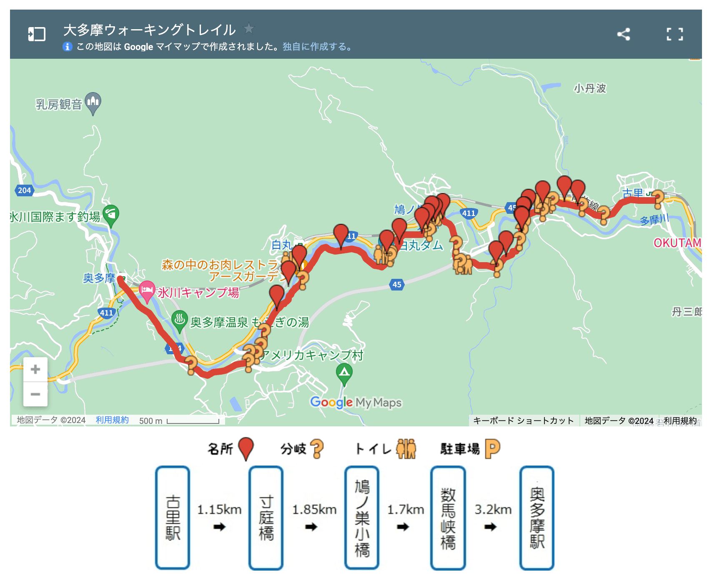
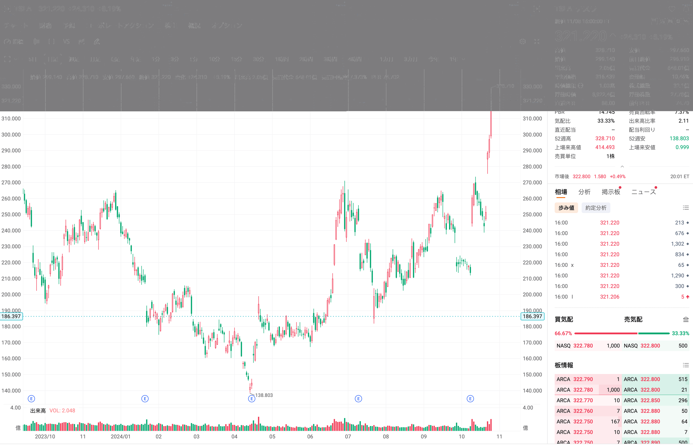
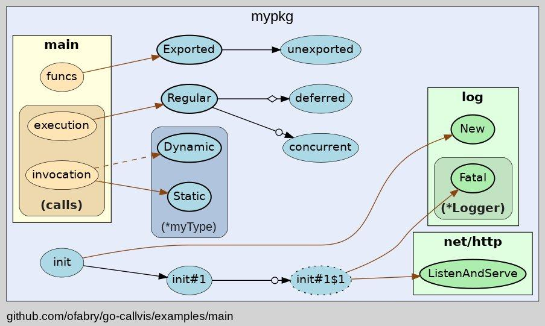
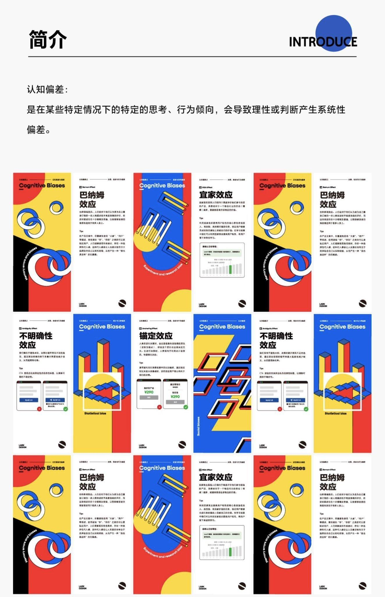

## 封面图 : 上周末拍摄于奥多摩

住在东京喜欢户外徒步的朋友可以试试 古里-奥多摩 这条徒步线路。现在还不是红叶季，可以到 12 月份的时候去看看奥多摩的红叶，很美。

具体可以看奥多摩官网提供的资料（[PDF](https://www.okutama.gr.jp/site/map/pdf/ohtama.pdf)）

## 本周新闻

### 1. 特朗普击败哈里斯，将于 2025 年 1 月 20 日成为美国第 47 任总统

特斯拉的股票也因此大涨。

## 效率工具

### 1. [golang] Visualize call graph of a Go program using Graphviz

 是一个 Go 语言的工具，可以将 Go 程序的调用图可视化。

## 技术知识

### 1. 字节跳动飞书设计团队出品的《认知偏差知识手册》

电商网站有纸质版售卖，以下链接是线上版。

[线上版链接](https://s75w5y7vut.feishu.cn/docs/doccn3BatnScBJe7wD7K3S5poFf)

### 2. 系统设计面试：内幕指南（中文翻译）

原名：《System Design Interview: An Insider’s Guide》
[中文翻译链接](https://learning-guide.gitbook.io/system-design-interview)

### 3. 应该是解释 LLM 相关的最好的视频了吧 by 3B1B

[How might LLMs store facts @ Youtube](https://www.youtube.com/watch?v=9-Jl0dxWQs8)
