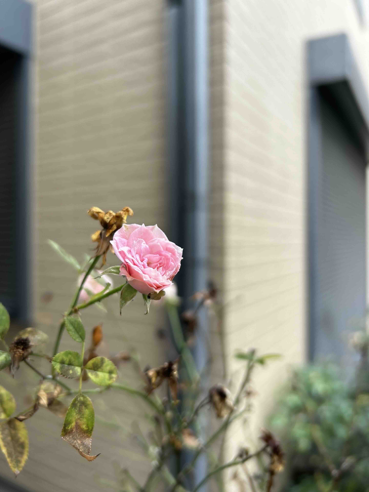
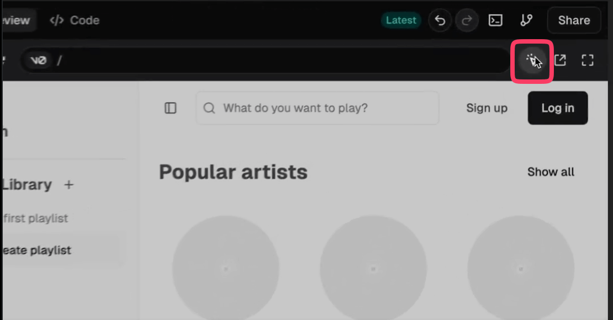
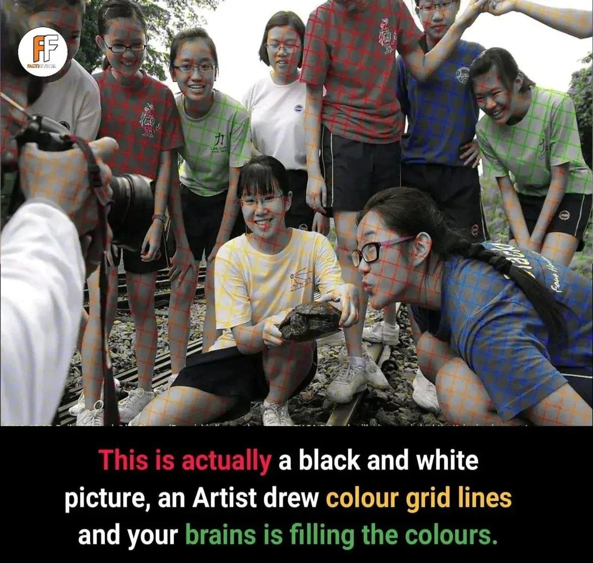
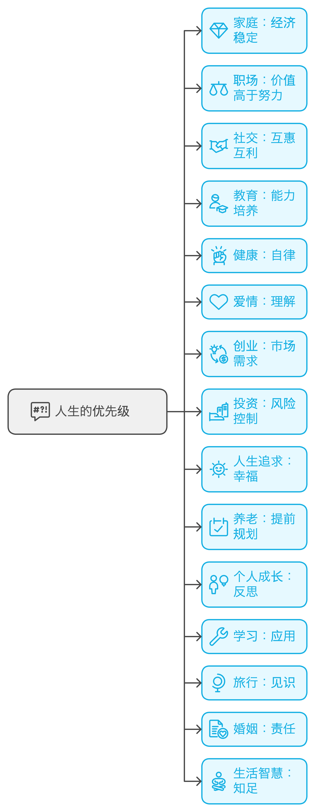

## 封面图 : 自己养的月季花

这月季花买来后就一直放在门口，夏天的时候给浇浇水，其他时候就基本没在管，还是长得很好，开花也很漂亮。



## 本周新闻

## 效率工具

### 1. 一款高性能非结构化数据提取工具：extractous

[extractous](https://github.com/yobix-ai/extractous) 是一款高性能非结构化数据提取工具，支持多种数据源，包括 Office、PDF、网页、图片、电子书、邮件等多种格式。

尝试了下，也支持 PDF 中的图片 OCR，用手头的商品出口 invoice PDF 文件试了下， 效果不能说完美吧，但是已经很不错了，而且因为是 Rust 编写的，所以速度很快。#OCR

- 安装

```shell
pip install extractous
```

- 使用

```python
from extractous import Extractor, TesseractOcrConfig

extractor = Extractor().set_ocr_config(TesseractOcrConfig().set_language("eng")) # Set OCR language to English
result, metadata = extractor.extract_file_to_string("./data/test.pdf") # Replace with your file path

print(result)
print(metadata)
```

### 2. 修复老照片的 ComfyUI Workflow: Old Photo Restoration XL

[Old Photo Restoration XL](https://openart.ai/workflows/datou/old-photo-restoration-xl/vKtihSX1DGBiBjAovlSP) 是一款修复老照片的 ComfyUI Workflow，可以帮助你修复老照片，让老照片焕发新生。

看作者贴的图片效果很不错，可以给黑白照片上色，还能修复破损的照片，去除折痕瑕疵等。后者其实很多工具都不行，值得一试。


### 3. v0 现在可以选择 UI 生成的特定部分进行更改



具体可以看官方的 X 的[演示动画](https://x.com/v0/status/1859801609863299502)。

### 4. Suno4.0 制作音乐

看到一首用 Suno4.0 制作的[一首中文说唱](https://x.com/hanqing_me/status/1859579668455883124)，效果好像很不错。

用 Suno4 对 中文、粤语、爵士、流行摇滚个风格的一些测试，各位可以看看这篇公众号文章: [我用 Suno4.0 写了这些歌，听听看我们离 AI 音乐自由还有多远？](https://mp.weixin.qq.com/s/j7pjt9RHzM2dhqDy09KK-w)

## 技术知识

### 1. RAG 技术超全全景图：从基础到高级实践

[这张全景图](https://miro.com/app/board/uXjVNimscLw=/)为我们提供了 RAG 技术的完整技术栈, 从基础架构到高级应用, 再到评估方法, 非常系统和全面。

## 生活趣味

### 1. 人的眼睛的错觉

这是一张黑白照片，但是你咋看就像是彩色的。

图片的作者只是在黑白照片上加了一层彩色的网格，我们的大脑就会自动的把这个网格的颜色填充到黑白照片上。



> Ref: [I didn't believe it until I zoomed in](https://x.com/TaraBull808/status/1859658034441552357)

### 2. 人生的优先原则

很多人忙碌一生,却不明白真正的优先级是什么,分享这是人生原则给你：

家庭的核心是经济,而不是感情。

职场的准则是价值,而不是努力。

社交的关键是利益互换,而不是单纯的友谊。

教育的目的是培养能力,而不是追求分数。

健康的要素是自律,而不是医疗。

爱情的基础是理解,而不是激情。

创业的要点是市场需求,而不是个人喜好。

投资的原则是风险控制,而不是高回报。

人生的追求是幸福,而不是成功。

养老的保障是提前规划,而不是依赖子女。

成长的动力是反思,而不是经历。

学习的意义是应用,而不是积累知识。

旅行的收获是见识,而不是拍照打卡。

婚姻的支撑是责任,而不是浪漫。

生活的智慧是知足,而不是无尽的欲望。



> 整理自: [很多人忙碌一生，却不明白真正的优先级是什么，分享这是人生原则给你 @Morris_LT](https://x.com/Morris_LT/status/1859775711277629725)
