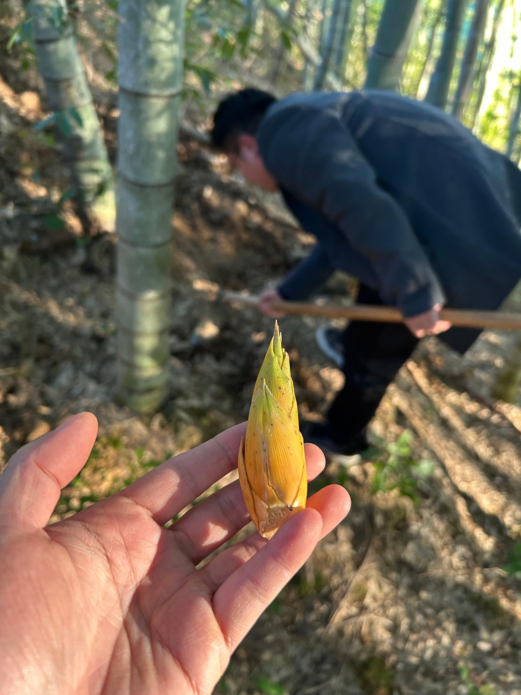
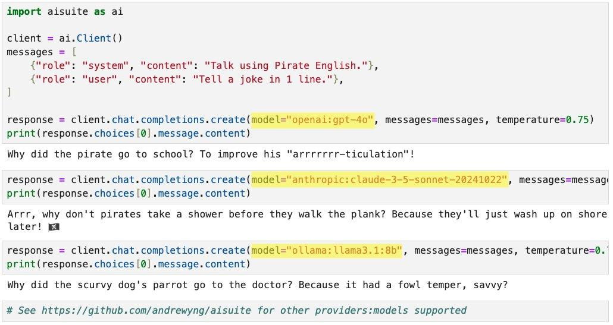
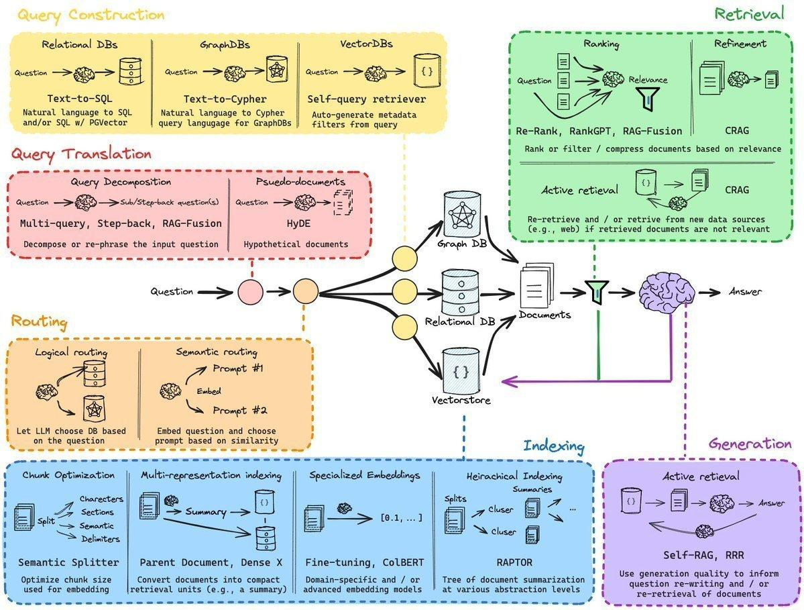

## 封面图 : 回老家看看爸爸妈妈，顺便到竹园挖个冬笋 😄

## 效率工具

### 1. Podcastfy: Google NotebookLM 播客功能的开源替代方案

Podcastfy 是一个开源 Python 工具，能够将网页、PDF、图片等多模态内容智能转换成引人入胜的多语言播客对话，可以作为 Google NotebookLM 播客功能的开源替代方案。

> Ref: [Podcastfy](https://x.com/shao__meng/status/1860474696187412559)

## 技术知识

### 1. [Python] 对应多家厂商大模型的包 aisuite by @AndrewYNg

在构建应用程序时，集成多个大模型提供商是一件麻烦事。

[Aisuite](https://github.com/andrewyng/aisuite) 允许您通过更改一个字符串来选择大模型，

例如 openai:gpt- 40， anthropic:claude-3-5-sonnet-20241022, ollama:llama3.1:8b 等。

### 2. RAG 技术现状

> Ref: [RAG 技术现状](https://x.com/seclink/status/1860604940424826950)

## 生活趣味

### 1. 邓超真的是用生命在演戏 😄

> Ref: [邓超自己看是什么感觉 😀](https://x.com/JZhen72937/status/1860908790725624168)
