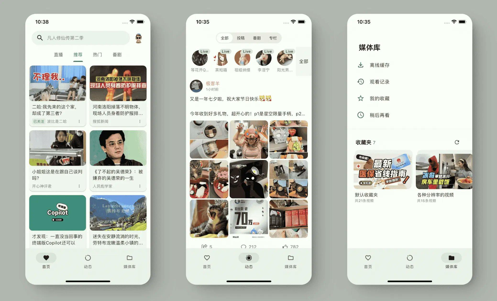
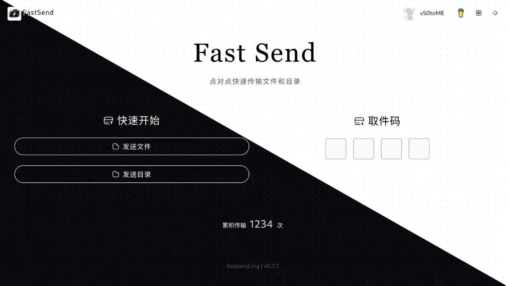
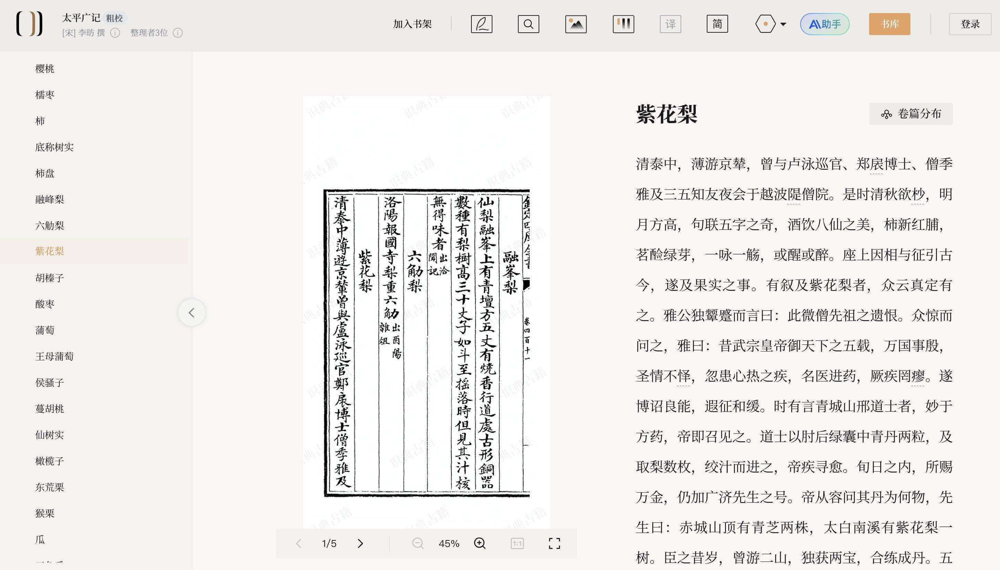
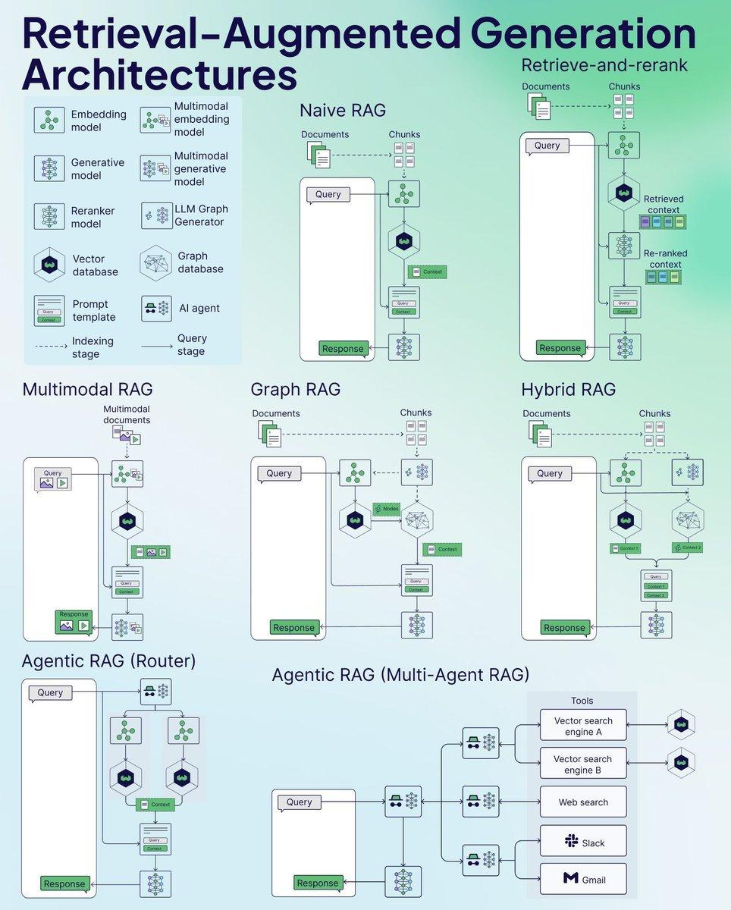

## 封面图 : 拍摄于杭州鼓楼附近的店门口

晚上带女儿出去散步，楼上有个小姐姐坐着在吃零食，我提醒女儿不要过去打扰人家，可能被她听到了，然后就主动跟我们打招呼，说她在吃零食，问我们要不要尝尝。

多次拒绝未果，就让女儿拿了一片，小姐姐还坚持让我也拿一片。

这种小小的善意，还是让我感到很温暖的。😄

## 本周新闻

### 1. 谷歌发布 Gemini 2.0 版本

支持共享屏幕与其直接对话。
具体可以看这个推特：[谷歌昨天用令人震撼的 Gemini 2.0 实时演示震撼了整个互联网](https://x.com/FinanceYF5/status/1867413831208907153)

## 效率工具

### 1. 开源的项目管理工具 Plane

[Plane](https://github.com/makeplane/plane) 是一个开源项目管理工具，可以跟踪问题，运行 sprint 周期，管理产品路线图，而无需管理工具本身的混乱。🧘‍♀️

### 2. 使用 Flutter 开发的第三方 Bilibili 开源客户端

[PiliPala](https://github.com/guozhigq/pilipala) 是使用 Flutter 开发的 BiliBili 第三方客户端，支持 Android 和 iOS 平台。

功能包括推荐视频列表、热门直播、动漫系列、离线缓存、回复评论、子弹聊天和搜索功能，好评的是还支持画中画，目前已有 8k star。

### 3. 基于 WebRTC 技术的点对点文件传输工具: FastSend

[FastSend](https://github.com/ShouChenICU/FastSend) 是一个开源的基于 WebRTC 技术的点对点文件传输工具，支持快速的目录同步和文件传输。通过浏览器即可实现安全、高效的文件共享。

### 4. 北大和字节跳动做的识典古籍文献检索系统

[识典古籍](https://www.shidianguji.com/) 是由北大和字节跳动合作开发的古籍文献检索系统，支持古籍文献的检索、阅读、分析等功能，涵盖了大量的古籍文献资源。

## 技术知识

### 1. RAG 架构图解：从基础到高级的 7 种模式

1. **Naive RAG**：这是最基础的架构，包括简单的文档检索、处理和生成响应的流程，适合初级信息检索任务。

2. **Retrieve-and-rerank**：在基础 RAG 架构上增加了重排序步骤，优化检索结果的相关性，提升了查询与结果匹配的准确度。

3. **Multimodal RAG**：扩展了传统 RAG 的能力，能够处理包括图像在内的多种数据类型，不再局限于纯文本输入。

4. **Graph RAG**：通过引入图数据库增强知识连接，能够理解文档之间的关系，更适合复杂知识图谱构建和查询任务。

5. **Hybrid RAG**：结合了图结构和传统检索方法，充分发挥多种技术的优势，实现更强大的信息检索与知识整合能力。

6. **Agentic RAG Router**：使用 AI Agent 来智能路由和处理查询，能够根据需求选择最适合的处理路径，提高任务执行效率。

7. **Agentic RAG Multi-Agent**：通过多个专门的 AI Agent 协作完成任务，可以灵活调用不同工具（如向量搜索、网页搜索、Slack、Gmail 等），实现复杂任务的分工与整合。

> Ref: [RAG 架构图解：从基础到高级的 7 种模式](https://x.com/shao__meng/status/1866626166079230355)

## 生活趣味

### 1. 一镜到底完美展现父女之间 12 年的成长变化，这条曾让无数父亲感动落泪的铁路广告…

看完了有些唏嘘啊 😄
一方面希望孩子永远不要长大，另一方面又希望孩子快点长大，这是父母的矛盾心理。

视频地址在这里：[一镜到底完美展现父女之间 12 年的成长变化](https://x.com/Morris_LT/status/1867368980333367791)

### 2. 从“性格决定命运”到“系统升级”：重塑命运的关键

在重复博弈的过程中，均值回归是不可避免的，因此一个人的命运并不会被一两次的选择决定，而是由其整体的“系统”所塑造。

这种系统可以被理解为一个人的性格、思维方式和行为模式，正所谓“性格决定命运”。

财富状况同样是系统配置的结果。如果一个人缺钱，并不是因为运气不好，而是其内在系统并未支持其迈向富有。

因此，想要真正改变命运，必须先进行“系统升级”，也就是说，调整和优化自己的思维方式与行为策略，使之与成功的目标相匹配。

> Ref: 整理自[这个推特](https://x.com/fuzzyface/status/1866976061256503697)
