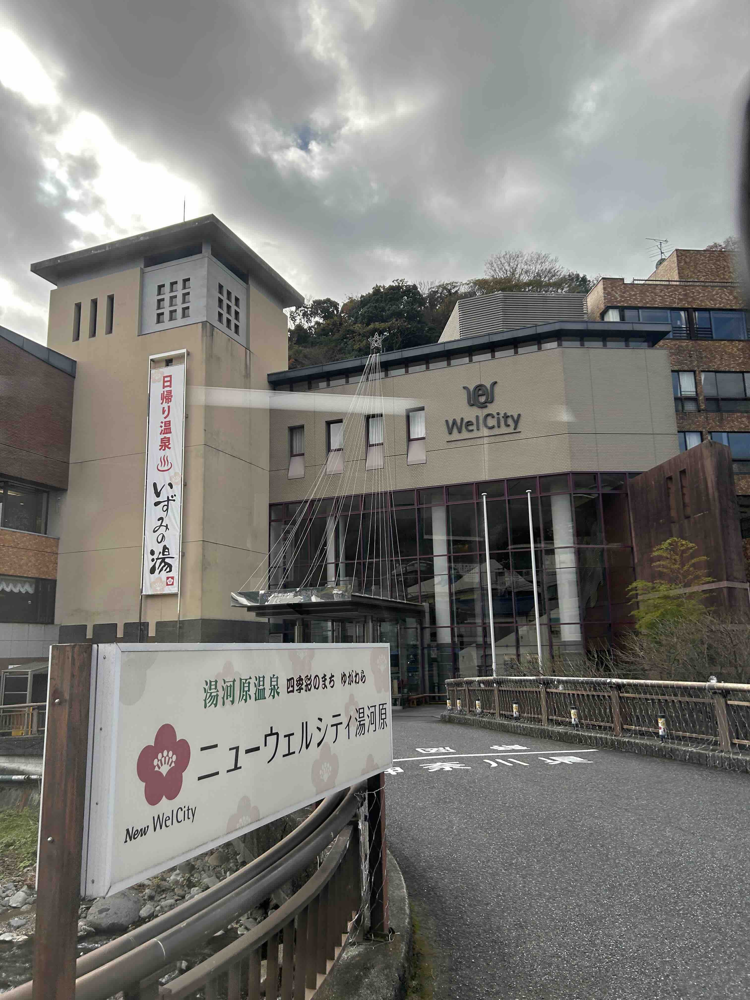

## 封面图 : 公司合宿 @湯河原

## 本周新闻

### 1. VSCode 推出 GitHub Copilot 的全新免费计划

您只需要一个 GitHub 帐户，即可访问：
✨ 每月 2000 次代码完成
✨ 每月 50 条聊天消息
✨ Claude 3.5 Sonnet 或 GPT-4o 等模型

> Ref: [Announcing a free GitHub Copilot for VS Code](https://code.visualstudio.com/blogs/2024/12/18/free-github-copilot)

## 效率工具

### 1. 语音转博客工具：Robo Blogger

这个工具可以把你的想法轻松转化成一篇完整的博客文章，还能自动添加参考资料。

如果你在走路或开车时突然冒出一个好点子，可以用语音转文字工具记录下来，然后把内容输入给它，它会帮你梳理文章结构，并生成一篇专业的文章。

它支持引用参考文献或相关文档，适配多种博客模板，还能根据需求自定义博客结构，特别适合利用碎片化时间进行高效写作。

> Github: [RoboBlogger-Assistant for voice-to-blog writing](https://github.com/langchain-ai/robo-blogger)

### 2. 生成式物理引擎：Genesis

可以生成基于真实物理的 4D 动态世界，面向机器人和物理 AI 的通用模拟平台
四个主要能力：
1、物理引擎：可以模拟现实世界的各种物理现象，包括刚体、关节体、液体、气体、可变形物体、薄壳物体和颗粒材料等，这些物理现象可以在统一框架下相互作用
2、机器人仿真平台：轻量级、超快速、Python 化、用户友好
3、渲染系统：可生成照片级真实的画面
4、生成式数据引擎：可以根据文字描述自动生成各类数据

> Ref: [Genesis 牛 B，一经开源 GitHub 上已飙升到 4k+ star！](https://x.com/aigclink/status/1869665429465235965)

### 3. [@labsdotgoogle](https://x.com/labsdotgoogle) 中推出最新一代的 AI 实验工具 Whisk

Whisk 允许您使用图像进行提示，而不是使用长而详细的文本提示生成图像。只需拖入图像，然后开始创建。

> Ref: [Today, we’re launching our newest gen AI experiment in @labsdotgoogle](https://x.com/Google/status/1868781358635442359)

### 4. Leffa：Meta 开源的 AI 试衣模型

效果非常好，可以媲美可灵的 AI 换衣效果。支持 AI 换衣或者调整人物动作。

- 在线体验：https://huggingface.co/spaces/franciszzj/Leffa
- Github：https://github.com/franciszzj/Leffa
- 模型：https://huggingface.co/franciszzj/Leffa
- 在线体验：https:// huggingface.co/spaces/franciszzj/Leffa
- Github：https:// github.com/franciszzj/Leffa
- 模型：https:// huggingface.co/franciszzj/Leffa

> Ref: [Leffa：Meta 开源的 AI 试衣模型](https://x.com/Gorden_Sun/status/1868603513888202916)

## 技术知识

### 1. 远程工作的相关资料

[这个 repo](https://github.com/greatghoul/remote-working) 收集了大量关于远程工作的相关资料，包括工作保障、财务税务问题、团队管理问题等等。

## 生活趣味

### 1. [Books] 亚马逊畅销榜 top1——《中年觉醒》

本书由肯尼迪学院与哈佛商学院的 Arthur Brooks 撰写，他是该领域中极具影响力的资深研究者。

对于身处人生中段、感到迷茫的人来说，这本书提供了多种思考维度与实践路径，引领读者突破瓶颈，迈向人生的第二增长曲线。

无论此刻是“轻舟已过万重山”般的顺境，还是“逆风飞扬”般的挑战，中年所积淀的阅历与成熟度，足以成为进一步发展的坚实后盾。

同时，年轻读者也能从中汲取策略与洞察，更好地提升自身竞争力，提前为未来的发展奠定基础。
