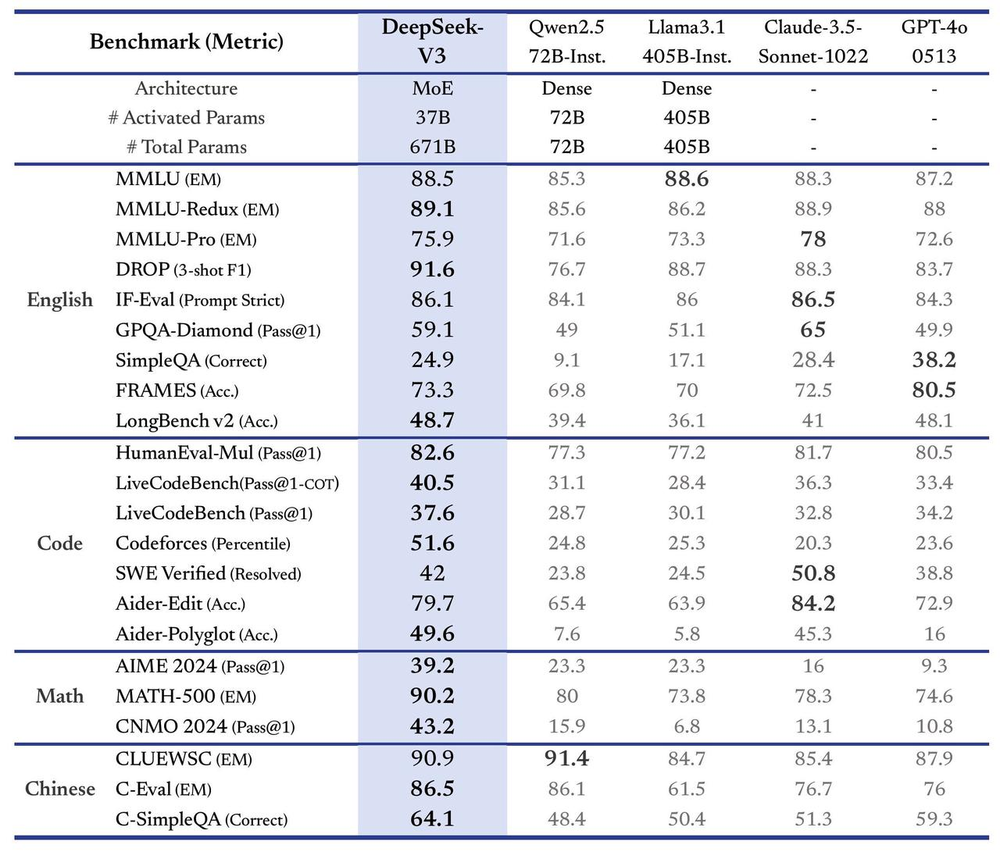
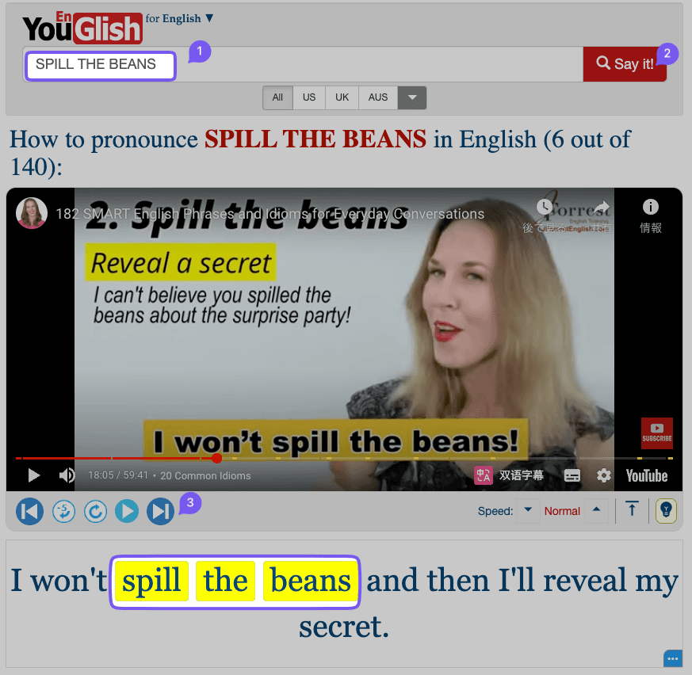
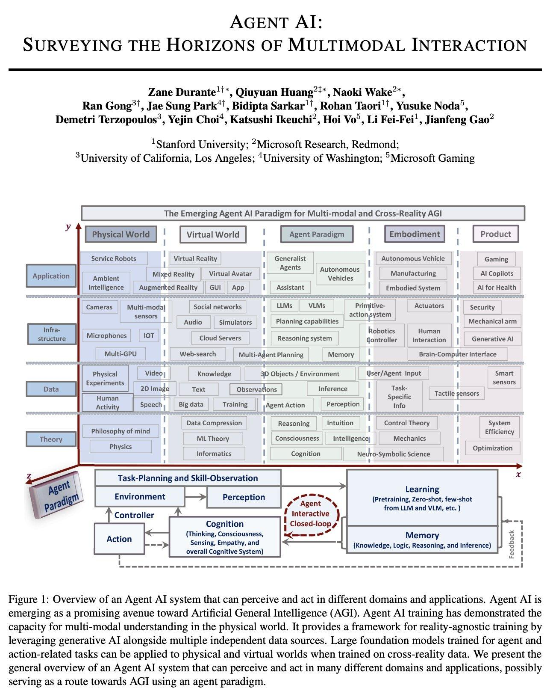
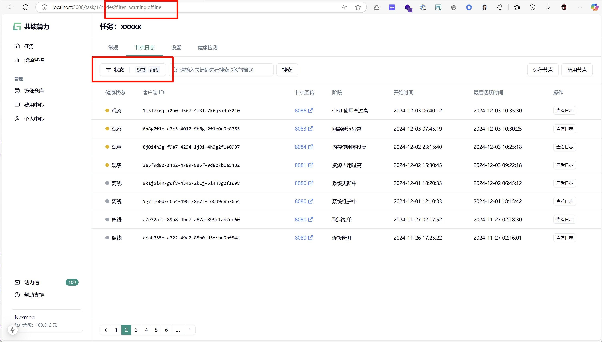
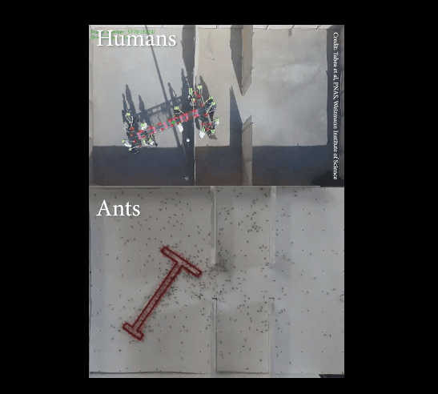
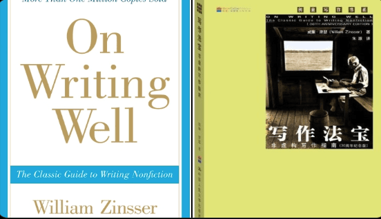

## 封面图 : 好像是第一次有日本人请我吃星巴克 😄 感谢 🙏

## 本周新闻

### 1. DeepSeek-V3 Released

- ⚡ 60 tokens/second (3x faster than V2!)
- 💪 Enhanced capabilities
- 🛠 API compatibility intact
- 🌍 Fully open-source models & papers

> Ref: [🚀 Introducing DeepSeek-V3!](https://x.com/deepseek_ai/status/1872242657348710721)

## 效率工具

### 1. 微软开源的 Windows 系统工具集 PowerToys

[PowerToys](https://github.com/microsoft/PowerToys) 是微软开源的 Windows 系统工具集，提供了一些实用的工具，

比如窗口置顶、颜色选取、ORC 文本提取、批量文件重命名、裁剪锁定、窗口布局、图片批处理等等。

### 2. 从 YouTube 视频中搜索单词或句子的工具： Youglish

**强烈推荐 YouGlish 这个神级网站！**  
[YouGlish](https://youglish.com) 是一个可以让你随时随地纠正发音的小助手。

只需输入一个单词，它就会从 YouTube 上精准定位到包含这个单词的发音片段。

## 技术知识

### 1. 李飞飞《AGENT AI》

您要了解 AI Agent，这本书(论文)是每个人绕不过去的必读之物。李飞飞《[AGENT AI](https://arxiv.org/pdf/2401.03568)》，这是我今年看过最具爽感和未来方向的书籍，并且全文理解不难，没有深邃的专业术语和算法逻辑，值得每一个普通人读一读。

> Ref: [AGENT AI](https://x.com/Rocky_Bitcoin/status/1872181440818921977)

### 2. [Reactjs] 优雅的 URL 参数状态管理库: nuqs

[nuqs](https://nuqs.47ng.com/) 是一个 React 应用的 URL 参数状态管理库，它可以帮助你在 URL 中存储和同步状态。

## 生活趣味

### 1. Ants Vs Humans: Problem-solving skills

看看蚂蚁 🐜 和人类解决问题是不是有相似之处呢？

> 动画@X：[Ants Vs Humans: Problem-solving skills](https://x.com/PicturesFoIder/status/1871961703832756318)

### 2. [Books] 《On Writing Well》

非小说类写作指南。

纽约时报评价，它是一本指导写作的圣经，任何想让要自己文章写得简洁的人，都应该拿出来读一读。

> Ref: [On Writing Well](https://x.com/ailiangzi/status/1872108707284459908)

### 3. 投资是每个人的终极职业

