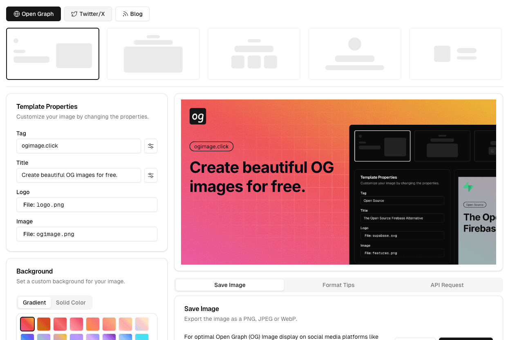
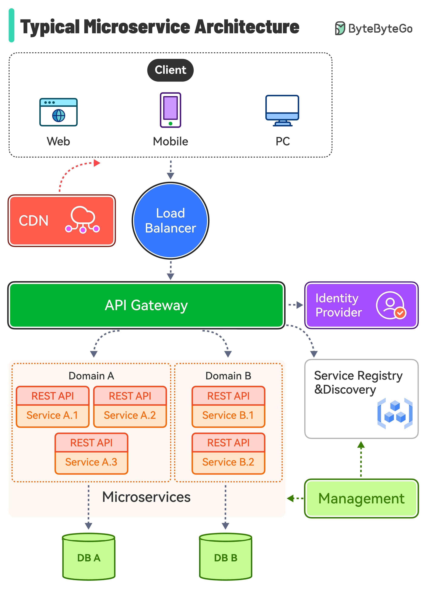
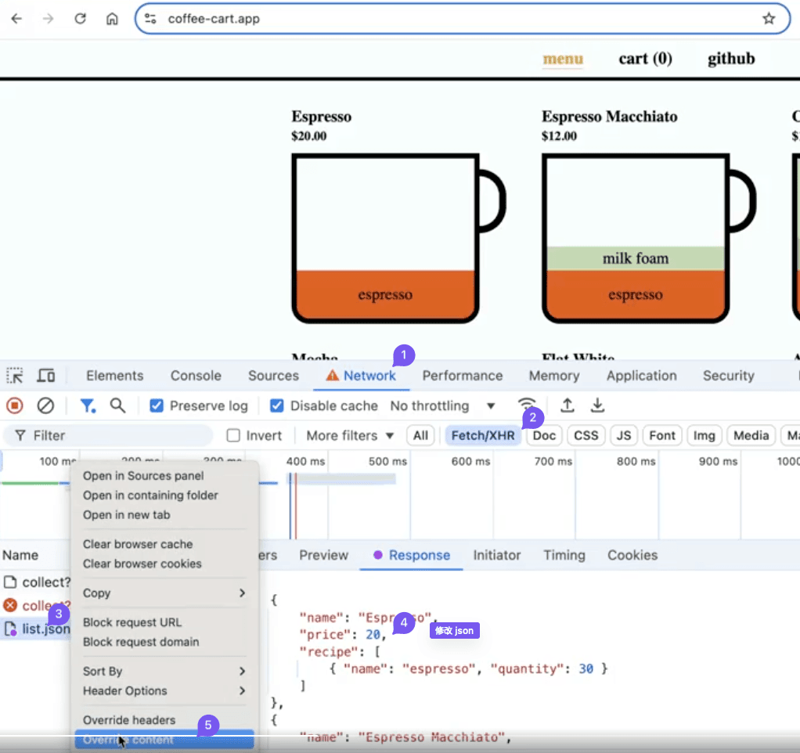
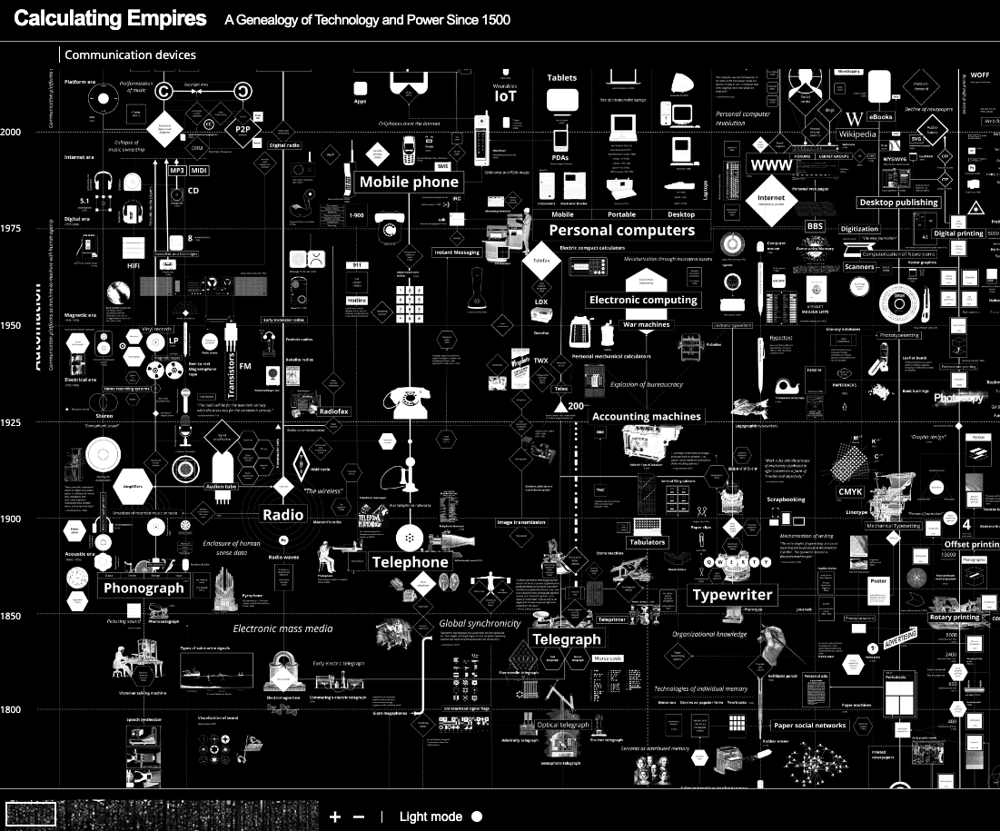

## 封面图 : 2025 年的第一期周刊, 祝大家新年快乐！🎉

照片拍摄于东京，图片有点压缩过头了。😄

## 效率工具

### 1. 开源的 Free OG Image Generator

[Free OG Image Generator](https://ogimage.click/?v=1) 是免费的 OG 图像生成器，并且支持 API 调用。
作者还把它[开源](https://github.com/weijunext/ogimage-click)了。

## 技术知识

### 1. 典型的微服务架构是什么样的？

> Ref: [What does a typical microservice architecture look like?](https://x.com/bytebytego/status/1875411940132188483)

### 2. 使用 Chrome DevTools 可以直接改写 Fetch/XHR 请求的内容

## 语言学习

### 1. 英语单词学习网站：WordsFunny

[WordsFunny](https://wordsfunny.com/BeiShiGaoZhong_4/words) 是一个英语单词学习网站，涵盖了北师大、新东方、外研社、雅思、人教版以及真题高频等词汇。可在线播读单词，并提供翻译、同义词、例句等内容。

目前网站的代码[已经开源](https://github.com/SteveSuv/remix-words-funny)，可自行部署学习。

> Ref: [发现一个全栈英语单词学习网站](https://x.com/GitHub_Daily/status/1873338735913509321)

## 生活趣味

### 1. 用一张图展示 1500 年以来的技术演化和他们的关系

[这个网站](https://calculatingempires.net/)用一张图展示了 1500 年以来的技术演化和他们的关系，非常有趣。

纵坐标是时间横坐标是技术分类，四个主题：通信、计算、分类和控制。

### 2. 未被表达的情绪永远不会消失，它只是被活埋了

> NOTE：图片用 Claude 生成的
