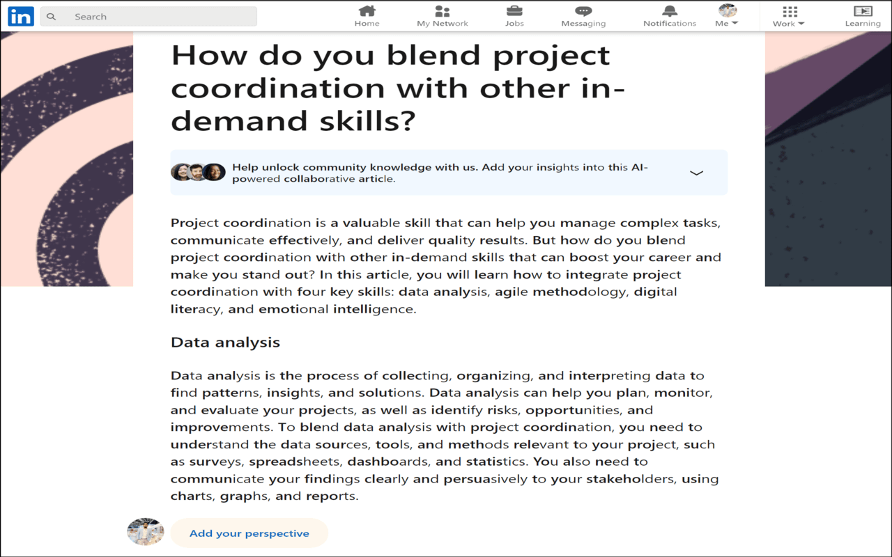
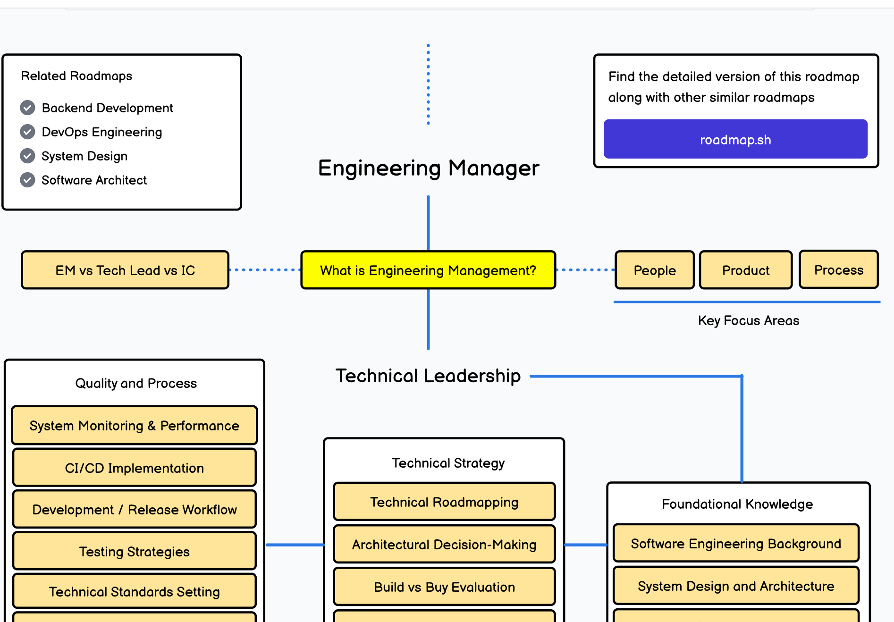
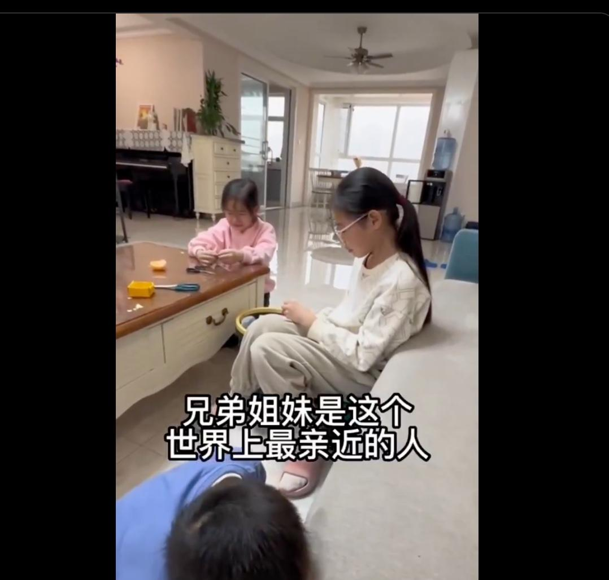

## 封面图 : 拍摄于公司：远眺富士山 🗻

## 本周新闻

### 1. 加州因为火灾一夜之间成废墟 😭

连马斯克都来吃瓜转发了视频。

> Reference: [加州因为火灾一夜之间成废墟](https://x.com/elonmusk/status/1877048844996735214)

## 效率工具

### 1. 推荐一款 Shell Prompt 定制工具 Starship 的主题：Gruvbox Rainbow Preset

不想折腾 shell 的颜色配置，可以直接使用[Starship](https://starship.rs/presets/gruvbox-rainbow)的这个主题，效果很好。

### 2. 帮你快速阅读英语文章的 Chrome 插件：ADHD Reading Help

[ADHD Reading Help](https://chromewebstore.google.com/detail/adhd-reading-help/hhhkpidlaeengejelinhblaibbfgkhih) 旨在帮助多动症（ADHD）以及其他神经多样性群体改善他们的阅读体验。这个浏览器扩展为网页文本提供了独特的增强可读性功能，使阅读更加便捷、舒适。

类似的工具还有： [Half Bold Chrome Extension](https://chromewebstore.google.com/detail/half-bold-chrome-extensio/ndgbjebkdbfehipdojkdldkddgggbdoj) 等，可以根据自己的需求选择。

感觉中文汉字在这方便就有阅读效率的优势，不需要这样的工具。
于是顺便问了下 GPT，果然从已有的脑成像研究（如功能性核磁共振 fMRI、正电子发射断层扫描 PET 等）来看，阅读中文和阅读拼音文字（如英文、法文等）时，大脑的确会呈现出某些不同的激活模式。

英语等拼音文字与语音之间关联紧密，阅读时对语音转换与字母拼写规则的处理更为重要，大多主要依赖 **颞叶（包括威尔尼克区）** 和与语言处理相关的部分脑区。

中文是表意文字，字形结构复杂，与语音的对应关系相对松散，阅读时往往需要处理字形、字音与字义之间的映射，也会更多动用视觉空间加工、形态整合等功能，且在某些研究中发现，中文阅读可能会调动双侧半球参与识字处理。

### 3. 免费录屏工具里的效率神器： Cursorful

如果你正在寻找一款能够快速、高效完成录屏的工具，那么 [Cursorful](https://cursorful.com/) 值得一试。

它在录制时可**自动跟随鼠标移动**，**智能缩放并平移画面**，将注意力集中于光标和关键操作上，让视频呈现更直观、聚焦的效果。

这种自动化处理方式不仅突出演示重点，还能大幅减少后期编辑的时间成本。

无论是录制教程、在线讲解，还是教学授课、答疑解惑，都能借助 Cursorful 的智能功能提升效率，让你的录屏工作事半功倍。

## 技术知识

### 1. 开源书籍《大语言模型》

[《大语言模型》](https://github.com/LLMBook-zh/LLMBook-zh.github.io) 是一本关于大语言模型的开源书籍，作者：赵鑫，李军毅，周昆，唐天一，文继荣。

### 2. Engineering Manager 成长的 Roadmap

[Roadmaps](https://roadmap.sh/) 技术学习路线图网站上有一个关羽 [Engineering Manager](https://roadmap.sh/engineering-manager) 需要具备和学习的一些技能，

技术管理相比纯粹的技术研发应该要省心不少，中高年的码农朋友可以可以了解下 😄。

## 生活趣味

### 1. 最近段永平在浙大的一段讲话很火，总结如下

1. **看对本质比勤奋更重要**

   - 投资中最关键的是洞察本质而非勤奋付出。因为做再多也可能白费，只有看对方向、做对事情才最有效。
   - 不要因怕犯错而不去行动，但对明知是错的事要果断拒绝或停止。

2. **投资要远离低毛利行业，重视商业模式**

   - 好赛道通常拥有较高的毛利率，低毛利往往意味着商业模式差、产品差异化不足。
   - 投资要关注商业模式和未来现金流，在确认能挣钱、逻辑通顺后才敢投。

3. **重视长远思维，不贪快钱**

   - 有些人缺钱是因为想赚“快钱”，结果频繁踩雷。
   - 做事情要长远规划，避免把重要的事情变成紧急的事情。找到好公司并坚定持有，才可以长期获得愉快的投资体验。

4. **创新与模仿并不冲突**

   - 创新本质是在弥补需求的不足，差异化不只是形式上的不同，而要切实满足用户需求。
   - 没有哪一种创新不是从模仿开始的，两者可以融合进行。

5. **信息差对于投资帮助有限**

   - 投资并非零和游戏，但信息差更多体现在零和博弈。用信息差提前交易或许道德存疑，也难成为主要的投资优势。

6. **要有纠错和自律意识**

   - 发现错误要立即改正，不要犹豫。买错股票应及时抛掉，不要因过去的投入而继续犯错。
   - 不要用必需的钱去赌不必要的钱，避免因博弈心态损害正常生活。

### 2. 中国妈妈如何化解孩子之间的矛盾。How Chinese mothers resolve conflicts between their children.

> Reference: 视频来源：[中国妈妈如何化解孩子之间的矛盾](https://x.com/tnglngx480156/status/1876944939889709459)
