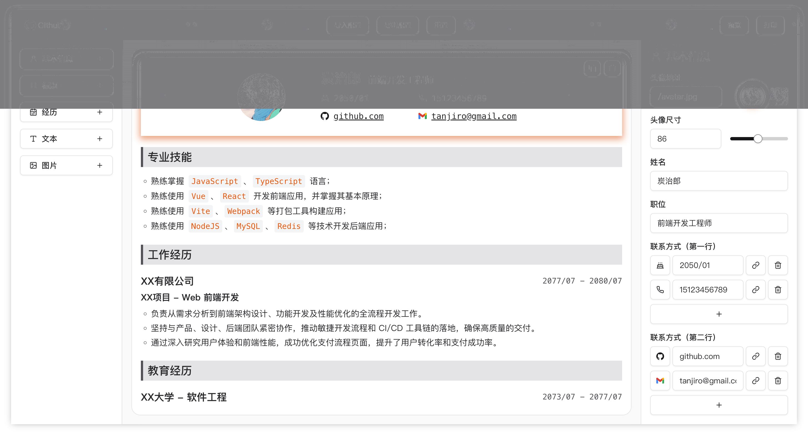
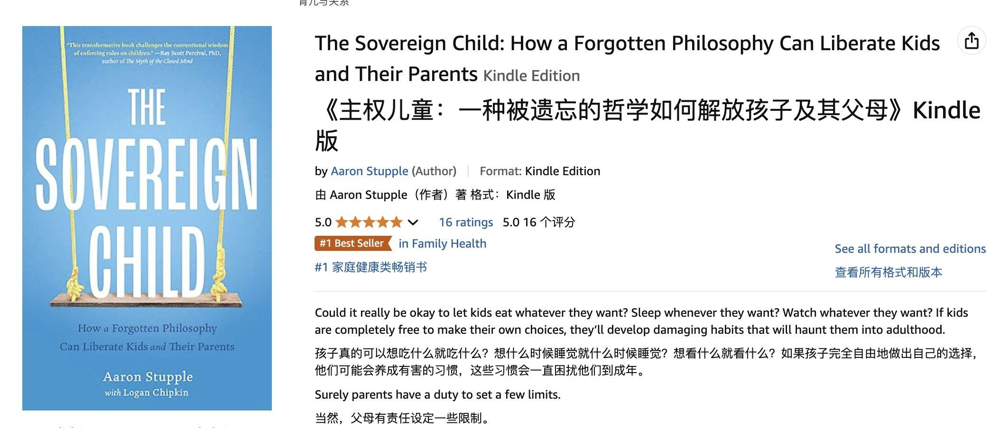
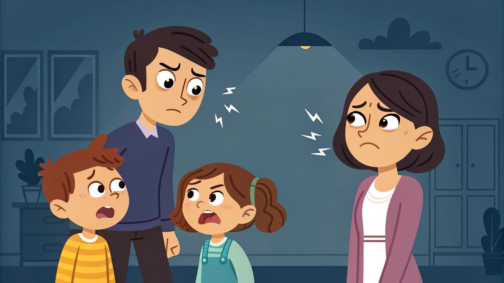

## 封面图 : 和阿里的年轻朋友们游太湖

可以为了拍落日坐游轮 2 次，年轻（体力）真好 😄

## 本周新闻

由于 TikTok 可能被美国政府禁止，很多 TikTok 难民（Refugee） 表示抗议转用小红书。😄

小红书也因此成了 X 上的日本热门话题。

## 效率工具

### 1. Resume Builder： 开源的在线简历生成工具

[Resume Builder](https://github.com/Arman19941113/dnd-resume） 是一个开源的在线简历生成工具，支持拖拽式编辑，支持导出 PDF 格式。

### 2. 33 台词 - 通过台词找影片素材

[33 台词](https://33.agilestudio.cn/invite?userCode=ecJZZS9c)可以根据句子找影片，可以在线截图和剪切电影片段。

可以用我的邀请链接注册，我和和你都会获得 100 积分。

### 3. 腾讯推出了 AI 生成小程序

阮一峰的博客上有一篇文章 [AI 搞定微信小程序](https://www.ruanyifeng.com/blog/2025/01/tencent-cloud-copilot.html)，详细地介绍了该功能。

## 技术知识

### 1. 斯坦福 CS229 的视频和课件：揭秘从 GPT-3 到 ChatGPT 的完整工程实践（Introduction to Building LLMs）

原始视频和课件：

- [油管视频](https://www.youtube.com/watch?v=9vM4p9NN0Ts)
- [谷歌网盘课件资料](https://drive.google.com/file/d/1B46VFrqFAPAEj3kaCrBAtQqeh2_Ztawl/view)

顺便推荐下这篇中文的解读文章 [大语言模型工程实践：解读斯坦福 CS229 前沿讲座](https://mp.weixin.qq.com/s/bbslEvdCFtoI1ZaSjmE1Cg)

## 生活趣味

### 1. 纳瓦尔推荐的育儿书： 《主权儿童》

「这是我读过的最重要的一本关于育儿的书。 它写得很好，论证得很好，有坚实的哲学基础，并且完全违背了整个现行体系。」——纳瓦尔

### 2. “树冠羞避”现象

这个视频摄于新西兰大陆以南 500 公里的最偏远 rata 树林，由摄影师乔治拍摄，展现了令人惊叹的“树冠羞避”（crown shyness）现象。

这一现象仅在某些树种中可观察到，树冠互不遮挡，形成一种沟状的空隙。

通常，这种现象在同种树之间最为常见，但有时也会出现在不同树种之间。

> Ref: [树冠羞避现象](https://x.com/HotmailfromSH/status/1878283379373904106)

### 3. 父母可以贫穷，但绝不应暴躁

父母可以贫穷，但绝不应暴躁。易怒的父母可能会成为孩子一生的噩梦。

这种情绪上的不稳定，容易让孩子产生自卑、胆小、怯懦的性格，导致他们不敢表达自己，害怕给别人添麻烦，也不敢为自己争取应有的利益。

甚至有时候，孩子吃了亏也不敢或者不好意思说出来，唯恐与他人发生冲突。

> Ref: [父母可以贫穷，但绝不应暴躁](https://x.com/Morris_LT/status/1878306666158109171)
