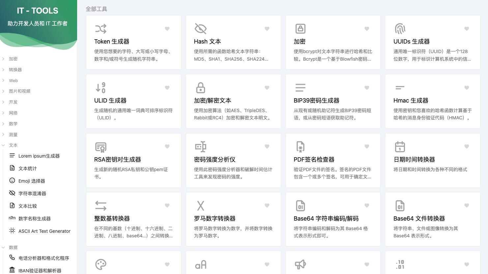

## 封面图 : 拍摄于杭州河坊街

## 本周新闻

### 1. Tailwind.css 发布 4.0 版本

[Tailwind CSS v4.0](https://tailwindcss.com/blog/tailwindcss-v4) 是该框架的全新版本，针对性能和灵活性进行了优化，重新构想了配置和自定义体验，并充分利用了网络平台的最新进展。

## 效率工具

### 1. 视频下载工具 - `Douyin_TikTok_Download_API`

[Douyin_TikTok_Download_API](https://github.com/Evil0ctal/Douyin_TikTok_Download_API) 批量解析及下载无水印视频或图集，支持抖音、快手、TikTok、B 站等平台。

并且支持 API 调用。

### 2. 一个专为开发人员打造的实用在线工具库：IT-Tools

[IT-Tools](https://github.com/CorentinTh/it-tools) 是一个专为开发人员打造的实用在线工具库，包含了各种常用的工具，如 JSON 格式化、时间戳转换、正则表达式测试、二维码生成、图片压缩等。

可直接在线使用，也可以通过 Docker 一键部署到自己服务器上。

## 技术知识

### 1. 日语实时语音语音对话对话 AI 模型 J-Moshi

[J-Moshi](https://nu-dialogue.github.io/j-moshi/) 是一个日语实时语音对话 AI 模型，可以实现日语对话的实时语音识别和生成。

> Reference: [日本語(にほんご)リアルタイム音声(おんせい)対話(たいわ)モデル J-Moshi を公開(こうかい)しました](https://x.com/atsumoto_ohashi/status/1882633871176630595)

### 2. Next.js 视频教程

[Next.js 15 Tutorial - Beginner to Advanced](https://www.youtube.com/playlist?list=PLC3y8-rFHvwhIEc4I4YsRz5C7GOBnxSJY)

- 项目结构，各种路由
- 元数据、组件封装和参数获取
- 加载动画，异常处理
- API 编写，中间件实现
- CSR、SSR、流式传输讲解
- 客户端、服务端数据获取

## 生活趣味

### 1. 万斯的投资组合 ，适合美国中产

> Reference: [万斯的投资组合](https://x.com/yuyy614893671/status/1883532165977399402)

### 2. 斯坦福教务长教你如何培养孩子

《如何让孩子成年又成人》这本书由斯坦福大学教务长撰写，探讨了一个值得深思的主题——过度养育。

作者以敏锐的观察力剖析了这一现象，并结合真实案例，深入探讨其影响。

阅读这本书，不仅能帮助你理解“过度养育”的问题，还能带来新的启发。

真正的养育目标，是让孩子学会掌控自己的人生，并为自己的选择负责。

> Reference: [斯坦福教务长教你如何培养孩子](https://x.com/jsd200j/status/1883192248445374466)

### 3. 为什么穷人家的孩子，大多都很难成功？

为什么穷人家的孩子，大多都很难成功？

只有自己单枪匹马的奋斗，尝尽了人世间的辛苦，父母给的经验太少，没有赚钱能力，又不懂人情世故，大事无法把握，中事难以明辨，小事不断纠缠。

—余华《我们活在巨大的差距里》

### 4. 分镜拍摄教学

https://x.com/Qpigpig/status/1882072854491238812
