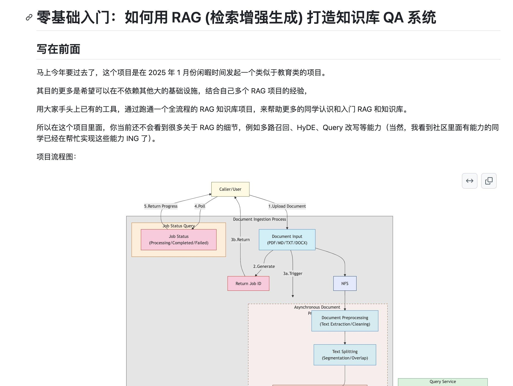
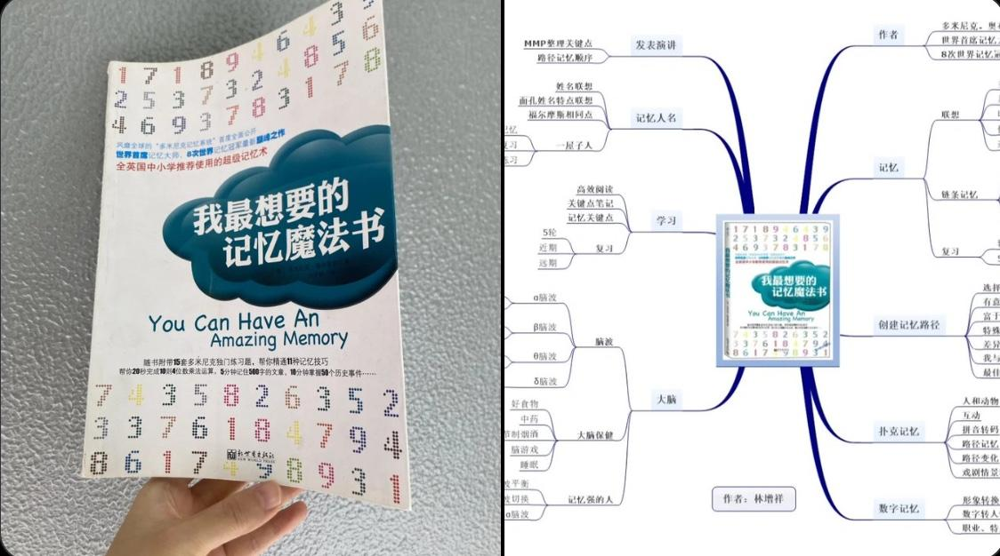

## 封面图 : 大家 2025 春节快乐

这次就用这个拜年视频作为封面吧，祝大家 2025 春节快乐！

视频见：[这里@X](https://x.com/geekbb/status/1884213835009310923)

## 效率工具

### 1. js 汉字拼音转换库 pinyin-pro

[pinyin-pro](https://github.com/zh-lx/pinyin-pro) 是一个专业的 js 汉字拼音转换库，功能丰富、准确率高、性能优异。

🎨 特色功能

- 支持拼音/声母/韵母/首字母/音调/全部信息
- 支持人名姓氏模式
- 支持文本和拼音匹配
- 支持自定义拼音
- 支持获取带拼音汉字的 HTML 字符串
- 支持获取汉字的所有拼音
- 支持拼音输入转换
- 极致的性能和极高的拼音识别准确率

### 2. 手机投屏电脑工具：Escrcpy

[Scrcpy](https://github.com/viarotel-org/escrcpy) 是一款开源的手机投屏电脑工具，支持 Windows、MacOS 和 Linux 系统。

不仅画质清晰，而且延迟非常低，完全开源免费，轻松实现在电脑上操作手机。支持 USB 和 WiFi 两种连接方式，以及支持同时连接多部手机实现群控。

## 技术知识

### 1. 零基础入门：如何用 RAG (检索增强生成) 打造知识库 QA 系统

[这个项目](https://github.com/rag-web-ui/rag-web-ui/blob/main/docs/tutorial/README.md)通过跑通一个全流程的 RAG 知识库项目，来帮助更多的同学认识和入门 RAG 和知识库。

## 生活趣味

### 1. 记忆力差可能是你没用对方法！

《我最想要的,记忆魔法书》是一本关于记忆力的书籍，作者是世界首席记忆大师、8 次世界记忆冠军多米尼克。

书中介绍了他的超级记忆术“多米尼克系统”，即是将需要记忆的信息转化成对自己更有意义的图像记忆之后，就会将这些信息记入长时记忆之中，使其超出短时记忆的局限。

> Reference: [记忆力差可能是你没用对方法！](https://x.com/jsd200j/status/1884107565757522119)
