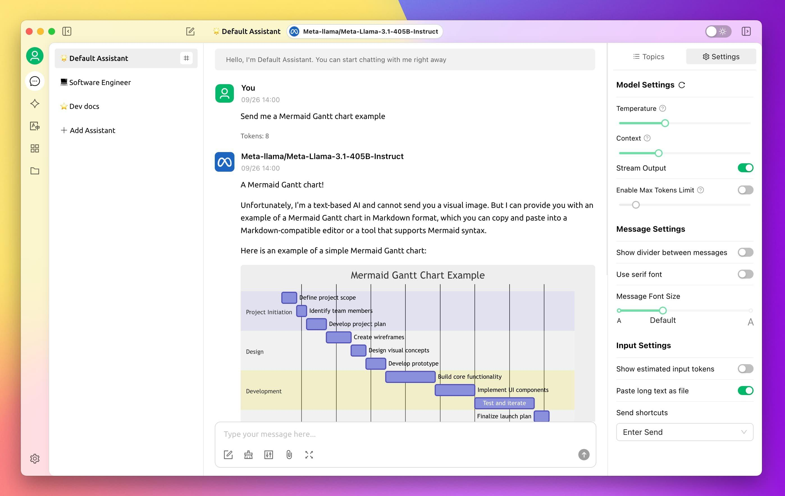
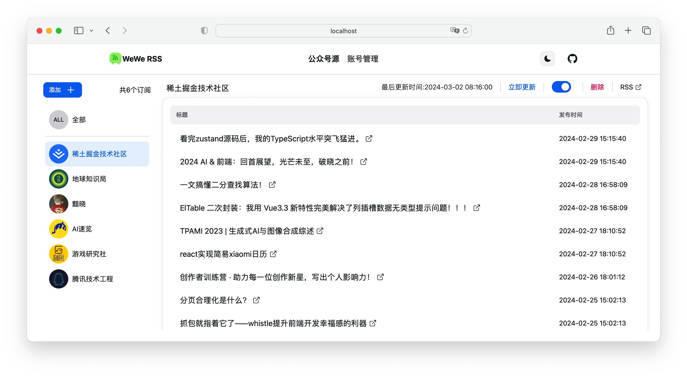
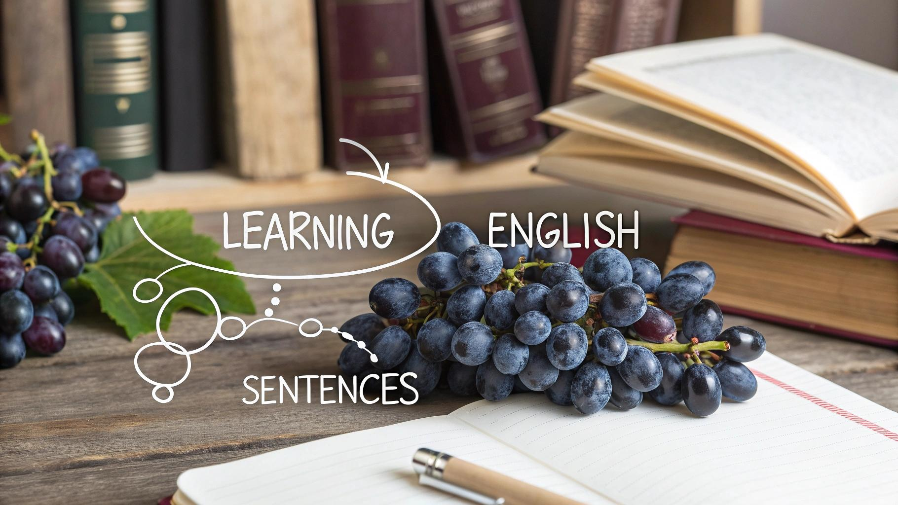

## 封面图 : 国内的早餐 @杭州

## 本周新闻

## 效率工具

### 1. 一个开源的跨平台 AI 聊天客户端软件：Cherry Studio

[Cherry Studio](https://github.com/CherryHQ/cherry-studio/blob/main/docs/README.zh.md) 是一款开源、跨平台的 AI 聊天客户端，集成了多个 LLM，并支持 Ollama 本地模型部署。

💡 **核心功能亮点：**

- **丰富的 AI 助手**：内置 300+ 预设 AI 助手，涵盖编程、写作等领域，支持自定义助手，可同时与多个 AI 对话，对比不同 AI 的回答。
- **强大文件处理能力**：直接处理 Word、PDF、图片等文件，支持 WebDAV 文件管理与数据备份。
- **智能可视化支持**：Mermaid 图表渲染、代码高亮显示，让数据展示更直观。
- **高效的聊天管理**：支持聊天记录搜索、对话分类管理，内置翻译功能，提升沟通效率。
- **跨平台兼容**：支持 Windows、Mac、Linux，开箱即用，无需繁琐配置。

### 2. 一款更优雅的微信公众号订阅工具：WeWe RSS

WeWe RSS 基于微信读书，实现微信公众号订阅的 RSS 生成，支持自动定时更新，并可输出完整内容。

🚀 **核心特点：**

- **微信公众号 RSS 订阅**：轻松将公众号文章转换为 RSS，随时随地追踪更新。
- **自动定时同步**：无需手动刷新，最新内容自动送达。
- **全文内容输出**：完整呈现文章，无需跳转，阅读更顺畅。
- **便捷私有化部署**：支持一键部署至 Docker、Railway、HuggingFace 等平台。

🔗 **GitHub**：[WeWe RSS 项目地址](https://github.com/cooderl/wewe-rss)

## 语言学习

### 1. 学英语的最小单位是句子

学英语的最小单位是句子
有完整的意义，促进理解，降低了认知负担
以句子为学习单位，好比提起一串葡萄
以单词为学习单位，难以抓起一串散葡萄

> Reference: [学英语的最小单位是句子@x](https://x.com/ReynoldDai/status/1885186202829283412)

## 生活趣味

### 1. 老年人的生活视频剪辑方式？

一开始以为是低质量的老年人教学，结果发现教学质量极高，成品质量也非常出色，疑似是学校宣传片的剪辑方式。

> Reference: [老年人的生活视频剪辑方式@x](https://x.com/daxiongmao1234/status/1887132317807992960)

### 2. 3D 动画看芯片的制造原理

芯片的制造原理，3D 动画看从砂子到芯片的完整过程。

> Reference: [3D 动画看芯片的制造原理@x](https://x.com/crazy_historyx/status/1885607520191873243)

### 3. 「医学科普：痛风（Gout）」

> Reference: [「医学科普：痛风（Gout）」视频 @x](https://x.com/HotmailfromSH/status/1885557451979899304)
