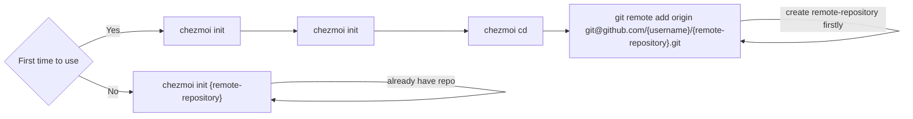
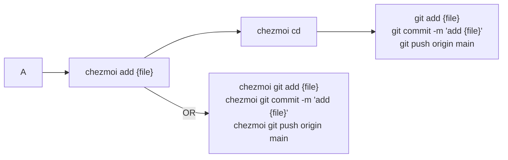
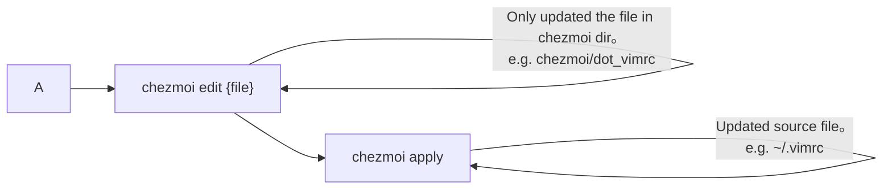

## 0. Background

When changing computers,
you need to migrate some configuration files from the old computer to the new one,
such as `.zshrc`, `.vimrc`, `.gitconfig`, and so on.

Some files may not necessarily be located in the home directory,
such as `.ssh/config`, `.config/.starship.yaml`.
It's a bit of a hassle to migrate these files manually.

Therefore, you need a tool to manage these configuration files.

## 1. Requirements

* Support multiple platforms, such as macOS, Linux, Windows.
* Support version management, such as git.
* Support templates.

I did a little research and found that there are several tools that can manage dotfiles:
* [chezmoi](https://www.chezmoi.io/)
  * Golang written
  * Github Star 10.2k
* [dotbot](https://github.com/anishathalye/dotbot)
  * Python written
  * Github Star 6.5k

`chezmoi` meets my requirements,
and it's written in `Golang` without any dependencies, so I decided to use `chezmoi`.

## 2. Install

```bash
sh -c "$(curl -fsLS get.chezmoi.io)"
```

You could find more installation methods [here](https://www.chezmoi.io/install/)

## 3. Usage

### 3.1 Initialize



:::tip

After initialization, a `~/.local/share/chezmoi` directory (local repository) will be generated in the `home` directory to store `chezmoi` configuration files.
You can enter the directory with the `chezmoi cd` command.

:::

### 3.2 Add files



### 3.3 Update files



:::tip

After updating the file, remember to commit to the remote repository. You can refer to the previous section.

:::

### 3.4 Fetch files from remote repository

Fetch files from remote repository and apply them.

```bash
chezmoi update
```

It's equivalent to

```bash
chezmoi git pull origin main
chezmoi apply
```

### 3.5 Extend usage

#### 3.5.1 Templating

`chezmoi` supports [templates](https://www.chezmoi.io/reference/templates/),which can generate different configuration files for different hosts and so on.

For example, I want to configure different account names for different computers, I can do this:

* Create `~/.account.json` file, the content is as follows:

```json title="~/.account.json"
{
  "name": "thewang"
}
```

* Configure the `data` field in `~/.config/chezmoi/chezmoi.toml`.

```toml title="~/.config/chezmoi/chezmoi.toml"
[data]
  name = "thewang"
```

* Add file with `--autotemplate` flag.

```bash
chezmoi add --autotemplate ~/.account.json

{
  "name": "{{ .name }}"
}
```
