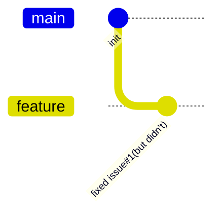
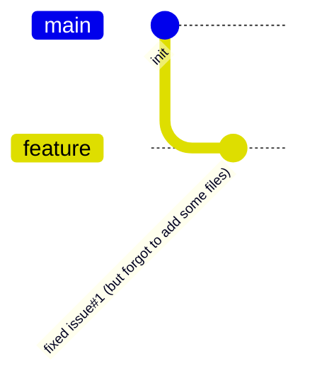

## `git commit --amend --no-edit`

When you think you have fixed an issue, but you were not able to fix it completely in one go (perhaps there were just some typos);



**OR**

When you really have fixed an issue, but you forgot to add some files,



You can use this:

```bash
git add .
git commit --amend --no-edit # --no-edit 选项表示不修改 commit message。
git push -f # 如果你已经 push 过了，需要添加 -f  来强制 push。
```

:::note

Maybe I just wrote this article to experience the gitGraph feature of mermaidjs 😄.

And BTW the commit message of gitGraph is rotated by default.

If you want to change it to horizontal, you need to add the following configuration in docusaurus.config.js:

```js
+      mermaid: {
+        options: {
+          gitGraph: { rotateCommitLabel: false },
+        },
+      },
:::
