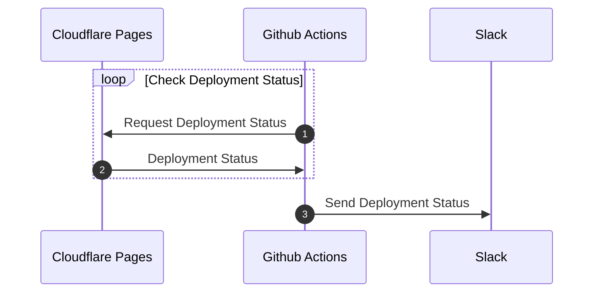
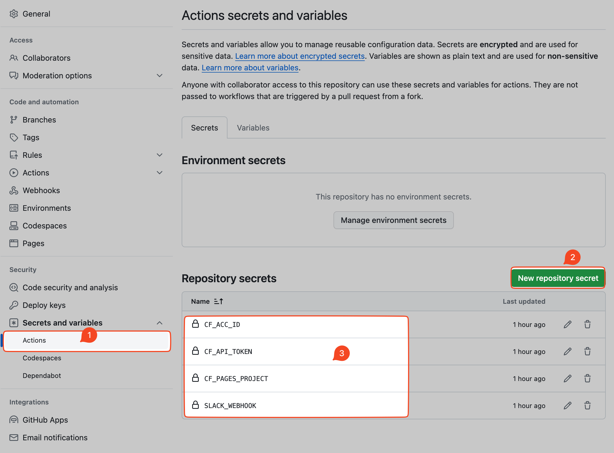
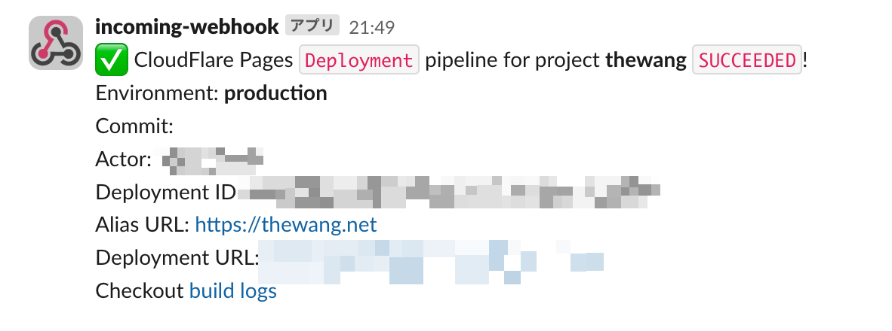

## 0. Background

My blog is hosted on Cloudflare Pages and the source code is on Github.

But Cloudflare Pages does not provide deployment status notification, so I thought of using Github Actions to implement this function.

## 1. Prerequisites

- Already created your website's repository on Github
- Already set up your Github repository on Cloudflare Pages
  - For example, I set it to deploy automatically when the `main` branch is updated

## 2. The idea



## 3. Implementation

[arddluma/cloudflare-pages-slack-notification] 这个 Github Action 已经实现这个了我们所要的功能。

[arddluma/cloudflare-pages-slack-notification](https://github.com/arddluma/cloudflare-pages-slack-notification) Github Action has already implemented the function we want.

So we only need to prepare the variables used in this Github Action.

```yaml
- name: Await CF Pages and send Slack notification
  uses: arddluma/cloudflare-pages-slack-notification@v4
  with:
    # Cloudflare API token
    apiToken: ${{ secrets.CF_API_TOKEN }}
    # CloudFlare account ID
    accountId: ${{ secrets.CF_ACC_ID  }}
    # CloudFlare Pages project name
    project: ${{ secrets.CF_PAGES_PROJECT  }}
    # Create Slack Incoming webhook and add as variable https://hooks.slack.com/...
    slackWebHook: ${{ secrets.SLACK_WEBHOOK  }}
    # Add this if you want to wait for a deployment triggered by a specfied commit
    commitHash: ${{ steps.push-changes.outputs.commit-hash }}
```

### 3.1 Get variables

- 1️⃣ **apiToken**:
  - Cloudflare API token. ([How to create Cloudflare API token](https://dash.cloudflare.com/profile/api-tokens))
- 2️⃣ **accountId**:
  - CloudFlare account ID. ( Access the [dashboard of Cloudflare](https://dash.cloudflare.com/) and you'll find the account ID in the URL)
- 3️⃣ **project**:
  - CloudFlare Pages project name. (You can find it here `https://dash.cloudflare.com/{your_account_id}/workers-and-pages` )
- 4️⃣ **slackWebHook**:
  - Create Slack Incoming webhook. ([How to create Slack Incoming webhook](https://api.slack.com/messaging/webhooks))

1️⃣ 2️⃣ 3️⃣ are the parameters that Github Actions needs to get the deployment status through the `Cloudflare Pages` API.
4️⃣ is the webhook URL that Github Actions needs to send messages to `Slack`.

### 3.2 Set variables

In your website's Github repository, click `Settings` -> `Secrets and variables` -> `New repository secret`, and then set the variables above.



## 4. Github Actions code

```yaml {19-33} title="github/workflows/cloudflare-pages.yml" showLineNumbers=true
name: Detect Cloudflare pages deployment status and notify to Slack
on:
  push:
    branches:
      - main
    paths-ignore:
      - .github/**
  pull_request:
    branches:
      - main
    types: [closed]
    paths-ignore:
      - .github/**
  workflow_dispatch:
jobs:
  build:
    runs-on: ubuntu-latest
    steps:
      - uses: actions/checkout@v3
      - name: Await CF Pages and send Slack notification
        id: cf-pages
        uses: arddluma/cloudflare-pages-slack-notification@v4
        with:
          # Clouodflare API token
          apiToken: ${{ secrets.CF_API_TOKEN }}
          # CloudFlare account ID
          accountId: ${{ secrets.CF_ACC_ID  }}
          # CloudFlare Pages project name
          project: ${{ secrets.CF_PAGES_PROJECT  }}
          # Create Slack Incoming webhook and add as variable https://hooks.slack.com/...
          slackWebHook: ${{ secrets.SLACK_WEBHOOK  }}
          # Add this if you want to wait for a deployment triggered by a specfied commit
          commitHash: ${{ steps.push-changes.outputs.commit-hash }}
```

## The screenshots

- Github Action Build Progress:
  

- Slack notification:
  

## Reference

[Setup Cloudflare Pages Slack notifications](https://ardd.cloud/setup-cloudflare-pages-slack-notifications)
