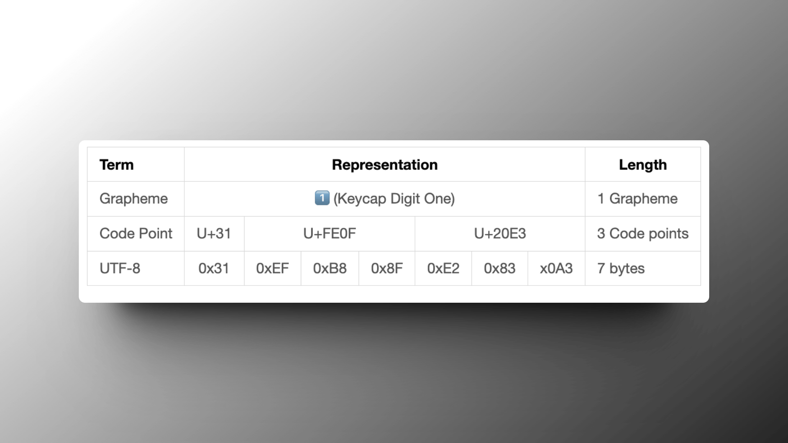

## Problem

It's a common problem to count the number of (visible) characters in a string.

In Golang, we can use [`utf8.RuneCountInString()` function](https://golang.org/pkg/unicode/utf8/#RuneCountInString) to count the number of characters in a string.

It works well for most cases, including multi-byte characters like Chinese.

### Code example

```go
package main

import (
    "fmt"
    "unicode/utf8"
)

func main() {
    str := "abc世界"
    fmt.Println(utf8.RuneCountInString(str)) // 5
}
```

But if the string contains emoji characters like 👉🏻, then in some cases this function will not calculate correctly.

```go
package main

import (
    "fmt"
    "unicode/utf8"
)

func main() {
    emojiWorld := "🌍"
    fmt.Println(utf8.RuneCountInString(emojiWorld)) // 1  ✅ no problem

    emojiHand := "👉"
    fmt.Println(utf8.RuneCountInString(emojiHand)) // 1  ✅ no problem

    emojiHandBlack := "👉🏿"
    fmt.Println(utf8.RuneCountInString(emojiHandBlack)) // 2 ❌ Got 2, expected 1.

    emojiOne := "1️⃣"
    fmt.Println(utf8.RuneCountInString(emojiOne)) // 3 ❌ Got 3, expected 1.
}
```

> You can copy the emoji from here [emojipedia](https://emojipedia.org/backhand-index-pointing-right).

## Why

This is because some emoji are composed of multiple unicode characters (Code Points), while the `utf8.RuneCountInString()` function only counts the number of unicode characters.

For example, 1️⃣ this emoji is composed of 3 Code Points, which are:



> Rendered by [Markdown Table](https://marketplace.visualstudio.com/items?itemName=TakumiI.markdowntable)

:::tip
Emoji Code Points can be found here [emojipedia](https://emojipedia.org/keycap-digit-one#technical).
:::

## Solution

So we need to count the number of Grapheme Clusters instead of Code Points.

### Use third-party library [rivo/uniseg](https://github.com/rivo/uniseg)

```go
package main

import (
    "fmt"

    "github.com/rivo/uniseg"
)

func main() {
    emojiWorld := "🌍"
    fmt.Println(uniseg.GraphemeClusterCount(emojiWorld)) // 1  ✅ 没有问题

    emojiHand := "👉"
    fmt.Println(uniseg.GraphemeClusterCount(emojiHand)) // 1  ✅ 没有问题

    emojiHandBlack := "👉🏿"
    fmt.Println(uniseg.GraphemeClusterCount(emojiHandBlack)) // 1  ✅ 没有问题

    emojiOne := "1️⃣"
    fmt.Println(uniseg.GraphemeClusterCount(emojiOne)) // 1  ✅ 没有问题
}
```

:::tip
Actually, there are not only emoji, but also some Thai and Arabic characters are composed of multiple unicode characters.
:::

## Reference

[Go で文字数をカウントする 在 Go 中计算字符数](https://ema-hiro.hatenablog.com/entry/2021/01/19/141854)

[文字数をカウントする 7 つの方法](https://engineering.linecorp.com/ja/blog/the-7-ways-of-counting-characters)

[Go: Unicode と rune 型](https://zenn.dev/masaruxstudy/articles/52632501e4ca41)
