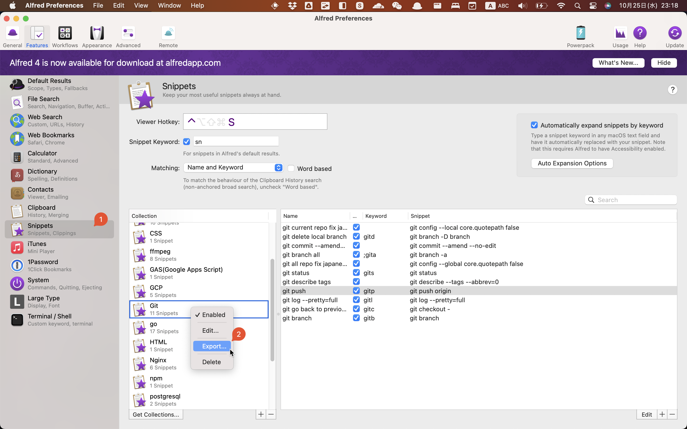

## 0. 背景

私はこれまで`macOS`のlauncherとして[Alfred 3](https://www.alfredapp.com/)を使っていました。
スニペット機能は有料オプションでしたが、課金して使っていました。

最近、[Raycast](https://www.raycast.com/)というlauncherを見つけました。
`Raycast`のスニペット機能は無料で、しかもオープンソースで、自分でカスタマイズできます。

なので、`Alfred`を`Raycast`に移行することにしました。
しかし、`Alfred`のスニペットファイルのフォーマットは`Raycast`のスニペットファイルのフォーマットと異なるため、`Alfred`のスニペットファイルを`Raycast`のスニペットファイルに変換する必要があります。

## 1. Migrate Alfred Snippets to Raycast


### 1.1 Get Alfred Snippets Files

Alfred 3 の collections は一括でエクスポートすることができないので、以下のように一つずつエクスポートする必要があります。:dog:



### 1.2 Convert Alfred Snippets to Raycast Snippets

エクスポートした`Alfred`のスニペットファイルを新しいフォルダに入れます。
以下の内容で`convert-alfred-snippets-to-raycast-snippets.sh`ファイルを作成します。

<details><summary>convert-alfred-snippets-to-raycast-snippets.sh</summary>

```bash
#!/bin/sh -e
# Script for converting Alfred snippets to Raycast snippets
# Usage: chmod +x convert-alfred-snippets-to-raycast-snippets.sh; ./convert-alfred-snippets-to-raycast-snippets.sh
# NOTE: Install jq before running this script

# List up all *.alfredsnippets files and rename them to *.zip
for file in *.alfredsnippets; do
    mv "$file" "${file%.alfredsnippets}.zip"
done

# Unzip all *.zip files and get the folders name
for file in *.zip; do
    unzip -o "$file" # -o: overwrite existing files without prompting
done


# Merge all *.json files to one file for Raycast snippets
jq -s 'map(.alfredsnippet | {name, keyword, text: .snippet})' *.json > ./output.json

# Clean up all files except output.json
for file in *.json; do
    if [ "$file" = "output.json" ]; then
        continue
    fi
    rm "$file"
done

for file in *.zip; do
    rm "$file"
done

for file in *.plist; do
    rm "$file"
done

# You can now import the output.json file to Raycast

echo "Done! 🎉 You can now import the output.json file to Raycast -> Import Snippets"
```
</details>

[Github gist](https://gist.github.com/wifecooky/399dd58809778286c857566d8c93b937)からもDL可能です。

:::note
このスクリプトを実行するには、コマンドラインのJSON処理ツールである`jq`をインストールする必要があります。

Macの場合、Homebrewを使って`jq`をインストールすることができます。コマンドは`brew install jq`です。
詳しくは[公式サイト](https://stedolan.github.io/jq/download/)を参照してください。
:::

以下のコマンドを実行します。

```bash
chmod +x convert-alfred-snippets-to-raycast-snippets.sh
./convert-alfred-snippets-to-raycast-snippets.sh
```

実行すると、現在のディレクトリに`output.json`ファイルが生成されます。

### 1.3 Import Raycast Snippets

`Raycast` を開き、`Import Snippets`をクリックします。
先ほど生成した`output.json`ファイルを選択して、`Raycast`にスニペットをインポートします。

## Reference

[Migrating Alfred Snippets to Raycast](https://xavd.id/blog/post/migrating-alfred-snippets-to-raycast/)
