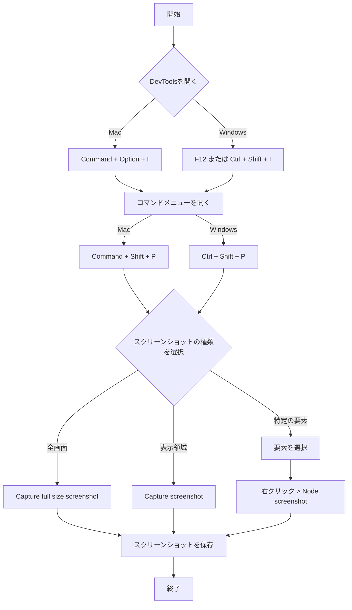

## はじめに

- Chrome ブラウザには強力なスクリーンショット機能が内蔵されています
- 外部ツールやプラグインを使わずに、様々なタイプのスクリーンショットが撮れます
- この記事では、Mac と Windows の両方のユーザーに対応した操作方法を説明します

## 概要

以下のフローチャートは、Chrome DevTools を使用してスクリーンショットを撮影する基本的な手順を示しています：

## DevTools を開く方法

以下のいずれかの方法で Chrome DevTools を開くことができます。

1. Mac: Command + Option + I
   Windows: F12 または Ctrl + Shift + I
2. ブラウザウィンドウ内で右クリックして「検証」を選択
3. Chrome メニュー > その他のツール > デベロッパーツール

## スクリーンショットの種類と撮影方法

### 1. 全画面スクリーンショット

- Mac: Command + Shift + P
  Windows: Ctrl + Shift + P
- "Capture full size screenshot" と入力し、Enter

### 2. 表示領域のスクリーンショット

- 同上のコマンドを開き、"Capture screenshot" を選択

### 3. 特定の要素のスクリーンショット

- DevTools の左上にある要素選択ツール（カーソルアイコン）をクリック
- ページ上で目的の要素をクリック
- 要素を右クリックして「Node screenshot」を選択

### 4. レスポンシブデザインのテスト

- DevTools 上部のデバイスツールバーアイコンをクリック（または Mac: Command + Shift + M / Windows: Ctrl + Shift + M）
- デバイスの種類や画面サイズを選択
- 上記の方法でスクリーンショットを撮影

## キーボードショートカット（Mac / Windows）

- DevTools を開く: Command + Option + I / F12 または Ctrl + Shift + I
- コマンドメニューを開く: Command + Shift + P / Ctrl + Shift + P
- デバイスモードの切り替え: Command + Shift + M / Ctrl + Shift + M

## まとめ

- Chrome DevTools はスクリーンショット撮影に十分な機能を持つ
- Mac と Windows の両方のユーザーが簡単に利用可能
- ウェブ開発者だけでなく、一般ユーザーにも有用なツール
